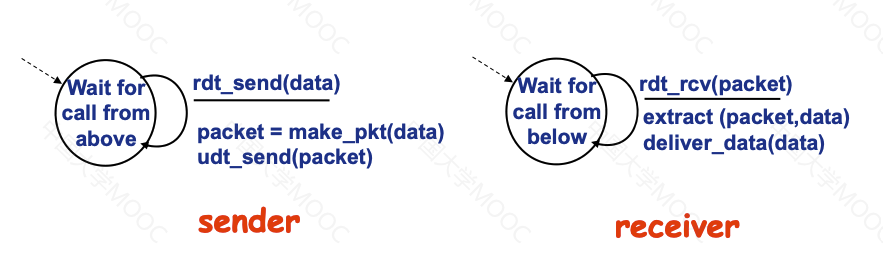

[toc]

# 概述

## 计算机网络

计算机网络是**通信技术**和**计算机技术**紧密结合的产物

计算机网络是**互连**（通过通信链路互通）、**自治**（无主从关系）的计算机集合

### Internet

全球最大的互联网络。由计算设备，通信链路，分组交换设备构成

服务：1）为网络应用提供通信服务的通信基础设施。2）为网络应用提供应用编程接口（API）

## 网络协议

计算机网络中的数据交换必须遵守事先定好的**规则**

网络协议是为进行网络中的数据交换而建立的规则、标准或约定，规范了网络中所有信息发送和接收过程

协议规定了通信实体之间所交换的消息的**格式**、**意义**、**顺序**以及针对消息所采取的**动作**

互联网中的协议通常以**RFC文档**形式存在，由互联网工程任务组（IETF）进行管理

### 三要素

1. **语法**：数据与控制信息的结构和格式
2. **语义**：规定需要发出何种控制信息，完成何种动作以及做出何种响应
3. **时序**：定义事件顺序和速度匹配

## 网络结构

常见的组成部分：网络边缘，接入网络/物理介质，网络核心

### 网络边缘

由主机（端系统）构成，运行网络应用程序

应用模型：1）客户/服务器模型；2）对等（P2P）模型

### 接入网络

将网络边缘接入网络核心

类别：1）住宅接入网络；2）机构接入网络；3）移动接入网络

带宽：传输速率，每秒传输的比特数

### 网络核心

**关键功能**：路由和转发

路由：确定分组从源到目的传输路径

转发：将分组从路由器的输入端口交换至正确的输出端口

## 数据交换

### 电路交换

电话网络是最典型的电路交换网络，是一种**资源独占**性的网络

三个阶段：1）建立连接；2）通信；3）释放连接

电路交换适用于**实时**数据流传输

### 多路复用

将链路/网络资源划分为资源片，将资源片分配给各路呼叫

常见的技术

1. **频分多路复用（FDM）**：每个用户占用不同的频率
2. **时分多路复用（TDM）**：将时间划分为等长的时分复用帧
3. **波分多路复用（WDM）**：光的频分复用
4. **码分多路复用（CDM）**：为每个用户分配唯一的**码片序列**，用户使用该序列对数据编码。**各用户的码片序列相互正交**。广泛应用于无线链路共享

### 报文交换

**报文**：源主机发送信息整体

源主机将整个报文作为一个整体发送给目的主机

### 分组交换

**分组**：报文分拆出来的一系列相对较小的数据包

**统计多路复用**：并没有事先定好，而是**按照需求共享链路**，即按照报文所需带宽动态分配

报文交换与分组交换都采用**存储-转发**交换方式

分组交换适用于**突发**数据传输网络，但可能产生拥塞（分组延迟和丢失）

**排队延迟是影响分组交换速率最主要的因素**

### 区别

**传输延迟**：（分组）报文传输完成所需要的时间开销

报文交换对于路由器的缓存要求比分组交换更高， 因为需要存储整个报文

报文交换所需时间比分组交换更长，因为中间路由器需要收到整个文件才能发送给下个路由器（**串行**）

分组交换允许更多用户同时使用网络，实现网络资源充分共享

## 网络性能

性能指标

1. **速率/数据率/比特率**：单位时间（秒）内传输信息（比特）量。速率往往是额定速率或标称速率
2. **带宽**：数字信道所能传送的最高数据率
3. **延迟/时延**：从源节点传输到目标节点所需的时间

​	分组延迟：1）结点处理延迟：差错检测，确定输出链路；2）排队延迟：等待链路可用；3）传输延迟：传输	过程所需的时间；4）传播延迟：物理介质传播的时间

4. **时延带宽积**：传播时延与带宽的乘积，表示整个链路中可存的比特数，也被称为以比特为单位的链路长度
5. **丢包率**：丢包量占总发送分组的比例。当缓存已满后，接下来的分组就会被丢弃
6. **吞吐量**：表示在发送端和接收端之间传送数据速率。取决于端到端之间的瓶颈链路（最小值）

## 体系结构 - 分层结构

每层完成一类特定服务或功能。每层依赖底层提供的服务，并且通过层内动作完成相应功能

每层遵循**网络协议**完成本层功能

计算机网络体系结构是计算网络的歌层及其协议的集合

### 为什么采用分层

1. 结构清晰，有利于识别复杂系统的部件及其关系
2. 模块化的分层易于系统更新、维护
   * 任何一层服务实现的改变对于其他层是透明不可见的
3. 有利于标准化

### 基本概念

实体表示任何可发送或接收信息的硬件或软件进程

协议是控制两个**对等实体**进行通信的规则的集合，因此**协议是水平的**

每一层实体需要使用**下层服务**，遵循本层协议，实现本层功能，向上层提供服务，因此**服务是垂直的**

同系统的相邻层通过**接口**进行交互，通过服务访问点SAP（Service Access Point），交换**原语**，指定请求的特定服务

### OSI参考模型

目的是支持异构网络系统的互联互通

**7层**参考模型（从上向下）：应用层，表示层，会话层，传输层，网络层，数据链路层和物理层。**前四层为端到端层次**

通信过程：主机包含所有7层结构，中间系统只包含最下面三层（网络层，数据链路层和物理层）

数据封装：增加控制信息，构造协议数据单元（PDU）。控制信息包含地址，差错检测编码，协议控制

#### 应用层

支持用户通过用户代理或网络接口使用网络服务。主要的应用层服务：文件传输（FTP），电子邮件（SMTP），Web服务（HTTP）

#### 表示层

处理两个系统间交换信息的语法与语义问题。主要实现功能包含数据表示转化（转化为主机独立的编码），加解密和压缩与解压缩

实际情况中不独立存在

#### 会话层

负责对话管理，控制（建立和维护对话）和同步（设置同步点，从而保证数据恢复只需从最近同步点开始）

实际情况中不单独存在

#### 传输层

负责端到端进程之间的完整报文传输。主要实现功能包含分段与重组，SAP寻址，逻辑连接控制，流量控制和差错控制

#### 网络层

负责源主机到目的主机数据**分组**交付。主要实现功能包含逻辑寻址（逻辑地址**全局唯一**），路由（路径选择）和分组转发

#### 数据链路层

负责结点之间的数据传输，以**帧**作为数据单元进行传输。主要实现功能包含组帧，物理寻址，流量控制，差错控制和访问控制

#### 物理层

在物理介质上实现单一比特的传输。主要实现功能包含比特编码，数据率和比特同步

传输模式：1）单工：只能单向传输；2）半双工：**交替**双向传输；3）全双工：可**同时**双向传输

### TCP/IP参考模型

**4层**参考模型：应用层，传输层，网际层和网络接口层

### 综合（5层）参考模型

综合OSI和TCP/IP的优点，构建了**5层**参考模型：应用层，传输层，网络层，数据链路层和物理层

应用层：各种网络应用

传输层：进程之间的数据传输

网络层：源主机到目的主机的数据分组路由和转发

数据链路层：相邻网络元素之间的数据传输

物理层：比特传输

# 网络应用

## 网络应用的体系结构

客户机/服务器结构（C/S）：按照功能划分为服务器和客户机。

服务器特点：1）7*24提供服务；2）永久性访问地址/域名；3）利用大量服务器实现可扩展性

客户机特点：1）与服务器通信，使用提供的服务；2）间歇性接入网络；3）可使用动态IP；4）不会与其他客户机直接通信

点对点结构（P2P）特点：1）没有永远在线的服务器；2）任意节点之间可以直接通讯；3）节点间歇性接入网络且可能改变IP地址

相比于C/S结构，P2P结构高度可伸缩，但更难管理

混合结构：混合使用两种结构。文件传输使用P2P，文件搜索使用C/S

## 网络应用进程通信

两种不同的网络进程：**客户机进程**：发起通信的进程和**服务器进程**：等待通信请求的进程

进程间通信利用套接字socket实现发送/接收消息

### 寻址

不同主机的进程通信，每个进程都必须有**标识符**

标识符包含IP地址（主机）和端口号（进程）

### 协议

网络应用需要遵循应用层协议

可分为**公开协议**（由RFC定义，允许互操作）和**私有协议**

内容包含消息类型（请求/响应消息），消息语法格式（字段信息），字段语义和规则

## 网路应用需求

不同方面的需求：数据丢失/可靠性，时间/延迟，带宽和安全性

### Internet提供的传输协议

TCP服务（面向连接且可靠）和UDP服务（无连接，不可靠）

## Web应用 

网页包含多个对象（HTML文件，图片，视频，动态脚本）

URL（Uniform Resource Locator）统一资源定位器标识对象，可以用作对象寻址

### HTTP协议

HTTP（超文本传输协议），采用**C/S**结构，使用**TCP**传输服务，采用请求/响应交互模式

HTTP协议是**无状态**协议，即服务器不维护任何有关客户端过去所请求的信息

### HTTP连接类型

非持久连接：每个TCP连接最多允许传输一个对象（早期TCP）

持久连接：每个TCP连接允许传输多个对象。又可分为无流水（客户端只有收到响应后才发送新的）和流水（无需等待响应）的持久连接

RTT：从客户端发送一个很小的数据包到服务器并返回所经历的时间

### HTTP消息格式

请求消息由请求行（包含方法，URL，协议版本等信息），头部行和消息体组成

响应消息由状态行（包含协议版本，状态码等信息），头部行和消息体组成

#### HTTP方法

HTTP定义多种请求方法，以表明要对资源执行的操作类型。HTTP/1.0定义了GET，POST，HEAD三种请求方式，而剩下的方式的则在HTTP/1.1中定义

1. **GET**：请求指定的资源。
2. **POST**：向指定资源提交数据进行处理请求（例如表单提交）。
3. **PUT**：更新指定资源。
4. **DELETE**：删除指定资源。
5. HEAD：获取报文首部，不返回报文主体。
6. OPTIONS：查询服务器支持的请求方法。
7. PATCH：对资源进行部分更新。

#### HTTP状态码

HTTP中共有5类状态码，分别以1，2，3，4，5作为开头。其中以1开头的状态码起到提示信息的作用，表示当前协议处理的中间状态，还需要后续的操作。

以2开头的表示成功状态，表明报文已收到并被正确处理：

1. 200(OK)是最常见的成功状态，表示一切正常。在非HEAD请求中，服务器的响应报文将带有返回的body数据
2. 201(Created)表示请求已被成功处理，并且创建了新的资源
3. 204(Not Content)与200基本相同，但响应报文中不含有body数据
4. 206(Partial Content)则应用于HTTP分块下载和断点续传，表示目前收到的body数据只是一部分

以3开头的表示重定向，即资源不处于原本位置，需要客户端用新的URL重新发送请求：

1. 301(Move Permanently)表示永久重定向，说明请求资源不存在，需要用新的URL重新请求资源
2. 302(Found)表示临时重定向，说明资源还在，只是需要暂时用新的URL访问
3. 304(Not Modified)表示资源没有被修改，不具有跳转的含义，而是重定向至已存在的缓存文件

以4开头的表示客户端错误，即请求报文有错，服务器无法处理：

1. 400(Bad Request)表示客户端发送的请求报文有错误，例如请求语法错误、无效请求消息格式或者欺骗性请求路由
2. 401(Unauthorized)表示客户端发送的请求需要身份验证
3. 403(Forbidden)表示服务器禁止访问资源，而非客户端出错
4. 404(Not Found)代表请求的资源在服务器上不存在或者没找到，无法提供响应

以5开头的表示服务器错误，即服务器在处理请求时内部发生了错误：

1. 500(Internal Server Error)表示服务器端错误的响应状态码，意味着所请求的服务器遇到意外的情况并阻止其执行请求，但并不知道错误的具体原因
2. 501(Not Implemented)表示客户端请求功能还未实现，暂不支持
3. 502(Bad Gateway)通常为服务器作为网关或者代理时返回，表示当前服务器工作正常，但是访问后续服务器出现问题
4. 503(Service Unavailable)表示当前服务器很忙，暂时无法响应客户请求

### Cookie技术

网站为了辩护用户身份，进行**session**跟踪而存储在用户**本地终端**上的加密数据

组件：1）HTTP响应消息的Cookie头部行；2）HTTP请求消息的Cookie头部行；3）Cookie文件保存在客户端主机，由浏览器管理；4）Web服务器端后台数据库

### 缓存/代理技术

在不访问服务器的前提下满足客户端的HTTP请求

优点：1）缩短客户请求的响应时间；2）减少机构/组织的流量；3）在大范围内实现有效的内容分发

#### CDN

CDN（Content Delivery Network）又称为内容分发网络，是一种分布式网络服务，通过将内容存储在分布式的服务器中，使得用户能够从距离较近的服务器获取所需的内容，从而加速互联网上的内容传输。同时CDN节点还会缓存静态资源，比如图片，样式表等。当用户请求访问这些资源时，CDN会首先检查是否已经有相应的缓存，如果能找到缓存，则直接返回；如果没有缓存，则从源服务器获取资源，并将资源缓存下来，以便后面的请求。另外，当某些节点出现问题，例如超载等情况，用户请求还可以被重定向到其他健康节点。总的来说CDN加速了请求响应过程，减少了对源服务器的请求，减轻了负载，同时也降低了网络传输所带来的开销

## Email应用

构成组件：1）邮件客户端；2）邮件服务器（通过**消息队列**存储等待发送的email）；3）SMTP协议

SMTP使用TCP传输服务，采用命令/响应模式

SMTP协议采用持久性连接，要求消息必须由7位ASCII码构成

### 消息格式

1. 头部行：To， From， Subject等字段
2. 消息体：消息本身

MIME：多媒体邮件扩展。通过在邮件头部增加额外的行（包含MIME版本，数据编码方法，多媒体数据类型等信息）声明MIME的内容类型

### 邮件访问协议

POP3：包含认证过程和事务阶段，采用下载并删除模式或下载并保持模式

IMAP：所有消息统一保存在服务器，允许利用文件夹组织消息，支持跨会话的用户状态

另外HTTP协议也可以当作一种邮件访问协议

## DNS应用

DNS（域名解析系统）：解决主机/路由器的识别问题。**多层**命名服务器构成的**分布式**数据库。使用UDP传输服务

DNS服务：1）将域名翻译成IP地址；2）提供主机，邮件服务器别名；3）负载均衡

### DNS查询过程

1. 首先我们需要检查本地的DNS缓存，如果缓存中有对应的IP地址，则直接返回结果
2. 如果没有相应缓存的话，就需要向本地的DNS服务器（一般是由互联网服务提供商提供）发送一个DNS查询请求。如果本地DNS解析器中有对应的IP地址，则直接返回结果
3. 如果本地DNS服务器中也没有对应缓存，那么它会向根DNS服务器发送查询请求。根DNS服务器会返回一个响应，告诉本地DNS服务器应该向哪一个顶级域（.com/.net/.cn/.org）的DNS服务器继续查询
4. 本地DNS解析器会向指定的顶级域DNS服务器再次发送查询请求，而顶级域DNS服务器也会返回一个响应，告诉本地DNS服务器应该向哪一个权威DNS服务器继续查询
5. 最后本地DNS解析会向给出的权威DNS服务器发送查询请求，权威DNS服务器收到请求，会查找所对应的IP地址，并将其返回本地DNS服务器
6. 本地DNS解析器将收到的IP地址返回给浏览器，并将域名解析结果缓存在本地，加速下次查询过程

### DNS记录与消息

**资源记录**：类型A：主机域名。类型NS：某个权威域名解析服务器的主机域名。类型CNAME：真实域名及别名；类型MX：邮件服务器

DNS采用查询/回复模式，消息包含消息头部和消息体

## P2P应用

常见于文件分发系统，例如BitTorrent

### BitTorrent

每个chunk为**256KB**

获取chunk（稀缺优先）：节点定期查询每个邻居所持有的chunk列表，然后发送请求获取缺失的chunk

发送chunk（tit-for-tat）：选择正在向自己发送chunk，并且速率最快的多个节点发送自己有的chunk，并且每隔一段时间更新发送列表

### 索引

P2P系统的索引：信息到节点位置（IP地址+端口号）的映射

**集中式索引**：1）在节点加入时，通知中央服务器；2）请求文件时首先向中央服务器发送请求；3）向其他拥有文件的客户请求文件

**洪泛式查询（完全分布式）**：1）每个节点只对它共享文件进行索引；2）查询消息通过已有的TCP连接发送；3）收到消息的节点转发查询消息；4）查询命中后利用反向路径将文件发回查询节点

**层次式覆盖网络**：将节点划分为普通节点和超级节点，连接只存在于超级节点之间和节点与超级节点之间

## Socket编程

### 应用编程接口API

应用程序控制权和操作系统控制权进行转换的一个系统调用接口

### Socket API

Internet网络应用最典型的API接口，采用C/S的通信模型

标识通信端点（对外）：IP地址+端口号

操作系统管理套接字（对内）：套接字描述符

当应用进程创建套接字时，操作系统分配一个数据结构存储该套接字相关信息，返回套接字描述符

### 函数

`socket()`：创建套接字，返回套接字描述符。参数列表：`protofamily` （协议族），`type` （套接字类型） `proto` （协议号）

套接字类型：`SOCK_STREAM`  流式套接字（面向TCP），`SOCK_DGRAM` 数据包套接字（面向UDP）， `SOCK_RAW` 原始套接字（面向网络层）

`closesocket()`：关闭套接字，如果多个进程共享一个套接字，引用计数变为0才会关闭。参数列表：`socket`（套接字描述符）

`bind()`：绑定套接字的本地端点地址。参数列表：`socket`（套接字描述符），`localaddr`（端点地址）

`INADDR_ANY`：地址通配符，常用于服务器使用 `bind` 函数时作为IP地址，表示主机任意IP地址均可，解决了多网卡出现多个IP地址时的地址绑定问题

`listen()`：置**服务器**的**流套接字**处于监听。参数列表：`socket`（套接字描述符），`queuesize`（连接请求队列大小）

`connect()`：**客户端**使用，进行连接。参数列表：`socket`（套接字描述符），`saddr` （服务器地址）

`accept()`：**服务器**从处于监听状态的流套接字的请求队列中取出一个请求，并创建新套接字

`send()` / `recv()`：发送/接收数据（TCP或调用 `connect` UDP）

`sendto()`/ `recvfrom()`：发送/接收数据（未调用 `connect` UDP）

`setsockopt()`：设置套接字的选项参数

`getsockopt()`：获取任意类型，任意状态套接口的选项当前值

### 工作流程

### 客户端软件设计

**TCP流程**

1. 确定服务器**IP地址**与**端口号**
2. 创建套接字
3. 分配本地端点地址（IP地址**+**端口号）
4. 连接服务器（套接字）
5. 遵循应用层协议进行通信
6. 关闭/释放连接

**UDP流程**

1. 确定服务器**IP地址**与**端口号**
2. 创建套接字
3. 分配本地端点地址（IP地址**+**端口号）
4. 指定服务器端点地址，构造**UDP**数据报
5. 遵循应用层协议进行通信
6. 关闭/释放套接字

### 服务器软件设计

**4种**基本服务器：循环无连接，循环面向连接，并发无连接，并发面向连接

**循环**：一次只能接受一个客户请求；**并发**：一次可以响应多个请求（开启多线程）

**循环无连接流程**

1. 创建套接字
2. 绑定端点地址（`INADDR_ANY` + 端口号）
3. **反复**接收来自客户端的请求
4. 遵循应用层协议，构造响应报文，发送给客户端

**循环面向连接流程**

1. 创建（主）套接字，并绑定熟知端口号；
2. 设置（主）套接字为被动监听模式，准备用于服务器
3. 调用 `accept()` 函数接收下一个连接请求（通过主套接字），创建新套接字用于与该客户建立连接；
4. 遵循应用层协议，反复接收客户请求，构造并发送响应**(**通过新套接字**)**；
5. 完成为特定客户服务后，关闭与该客户之间的连接，返回步骤3.

**并发无连接流程**

主线程1：创建套接字，并绑定熟知端口号；

主线程2：反复调用 `recvfrom()` 函数，接收下一个客户请求，并创建**新线程**处理该客户响应；

子线程1： 接收一个特定请求；

子线程2： 依据应用层协议构造响应报文，并调用 `sendto()` 发送；

子线程3： 退出(一个子线程处理一个请求后即终止)

**并发面向连接流程**

主线程1： 创建（主）套接字，并绑定熟知端口号；

主线程2： 设置（主）套接字为被动监听模式，准备用于服务器；

主线程3： 反复调用 `accept()` 函数接收下一个连接请求（通过主套接字），并创建一个**新的子线程**处理该客户响应；

子线程1： 接收一个客户的服务请求（通过新创建的套接字）；

子线程2： 遵循应用层协议与特定客户进行交互；

子线程3： 关闭/释放连接并退出（线程终止）

# 传输层

传输层协议为运行在不同主机上的**进程**提供了一种**逻辑通信机制**

Internet传输协议：TCP（可靠，按序的交付服务）和UDP（不可靠的交付服务）

## 多路复用和分用

接收端进行多路**分用**：传输层根据头部信息将收到的报文段交给正确的进程

无连接分用套接字用二元组（目的IP地址+目的端口号）标识，面向连接分用套接字用四元组（源IP地址+源端口号+目的IP地址+目的端口号）标识

发送端进行多路**复用**：从多个socket接收数据，为每块数据封装头部信息，交给网络层

## UDP协议

基于Internet IP协议，实现了简单的错误校验

提供尽力而为（best effort）的服务，因此可能出现数据包丢失，乱序达到等现象

### UDP为什么存在

1. 无需建立连接，减少延迟
2. 实现简单，无需维护连接状态
3. 头部开销少
4. 没有拥塞控制，可更好控制发送时间和速率

### UDP实现可靠传输

UDP它不属于连接型协议，因而具有资源消耗小，处理速度快的优点，所以通常音频、视频和普通数据在传送时使用UDP较多，因为它们即使偶尔丢失一两个数据包，也不会对接收结果产生太大影响。传输层无法保证数据的可靠传输，只能通过**应用层**来实现了。实现的方式可以参照tcp可靠性传输的方式，只是实现不在传输层，实现转移到了应用层。关键在于两点，从应用层角度考虑：

1. 提供超时重传，能避免数据报丢失。
2. 提供确认序列号，可以对数据报进行确认和排序。

本端：首先在UDP数据报定义一个首部，首部包含确认序列号和时间戳，时间戳是用来计算RTT(数据报传输的往返时间)，计算出合适的RTO(重传的超时时间)。然后以等-停的方式发送数据报，即收到对端的确认之后才发送下一个的数据报。当时间超时，本端重传数据报，同时RTO扩大为原来的两倍，重新开始计时。

对端：接受到一个数据报之后取下该数据报首部的时间戳和确认序列号，并添加本端的确认数据报首部之后发送给本端。根据此序列号对已收到的数据报进行排序并丢弃重复的数据报

### UDP检验和（checksum）

目的：检测UDP端在传输中是否发生错误

校验和：发送方将段内容视为16-bit整数，然后求和，最后将得到的值按位取反。最高位进位也会被加进去

## 可靠数据传输原理

信道的不可靠特性决定了可靠数据传输协议（rdt）的复杂性

### rdt1.0

底层信道完全可靠，即不会发生错误，不会丢弃分组

发送方和接收方的有限状态机

### rdt2.0

产生位错误的信道，即可能发生位翻转

需要引入新机制

1. 差错检测：校验和
2. 确认机制：接收方现实告知发送方分组是否正确接收
3. 重传机制：收到NAK消息重传分组

停止等待协议的有限状态机

### rdt2.1

ACK/NAK消息发生错误，发送方重传分组，但有可能出现**重复分组**问题

解决重复分组问题：增加**序列号**，标志每个分组。接收方收到重复分组则丢弃

发送方有限状态机

接收方有限状态机

### rdt2.2

无NAK消息协议，即每次在ACK消息中显式加入最后被确认分组的序列号

有限状态机片段（仅显示与rdt2.1不同部分）

### rdt3.0

信道可能发生错误，也可能丢失分组

解决分组丢失问题：设置合理的等待时间。若超过等待时间，则重传分组

基于停-等协议的rdt3.0性能很差，RTT可能比发送分组更加耗时，从而导致ACK消息传输占用了大量时间

发送方有限状态机

## 滑动窗口协议

流水线协议：允许发送方在收到ACK之前连续发送**多个**分组

### GBN（Go-Back-N）协议

采用**累计确认**机制：ACK(n) 表示序列号n及之前的分组均已被正确接收；Timeout(n) 重传序列号大于等于n，还没收到ACK的所有分组

接收放没有缓存机制，对于乱序达到的分组直接丢弃

发送方有限状态机

接收方有限状态机

### SR（Selective Repeat）协议

接收方设置缓存机制，对每个分组单独进行确认，缓存乱序达到的分组

SR协议伪代码

需要满足的条件：发送窗口大小加接收窗口大小要小于可用序列号个数，即 $N_{S} + N_{R} < 2^{k}$

## TCP协议

面向连接，点对点，可靠的，有序的传输协议

连接状态只在连接的两端（两个主机）中维护，中间节点不维护连接状态

TCP连接包括：两台主机上的缓存、连接状态变量、socket等

序列号指的是segment中第一个**字节**的编号，TCP的ACK表示下一个期望收到的序列号。同时TCP也采用**累计确认**机制

快速重传机制：通过重复发送ACK检测分组丢失，从而在定时器超时之前开始重传（见下）

### 流量控制

上层应用可能处理数据速度较慢，因此需要告知发送方不要传输太多，太快以至于淹没接收方

接收方通过在segment的头部字段将接收窗口空余大小告知发送方，发送方根据信息限制

即使在空余大小为0的情况下，发送方依旧需要发送一个很小的数据，以便于接收方能够将最新的空余窗口大小信息发送回来

### 连接管理

#### 三次握手

1. 第一次握手：服务器监听某个端口，此时处于LISTEN状态。客户端向服务器发送一个同步序列编号（SYN）报文，请求建立连接，这时客户端进入SYN_SENT状态
2. 第二次握手：服务器收到SYN报文之后，如果同意建立连接，则会向客户端返回一个同步确认（SYN-ACK）报文作为响应，此时服务器进入SYN_RCVD状态
3. 第三次握手：客户端收到SYN-ACK报文之后，会再次发送一个确认（ACK）报文作为最终响应，之后客户端和服务器进入ESTABLISHED状态，成功建立连接

为什么需要三次

通过三次握手，客户端和服务器能够确认双方的发送和接收能力。第一次握手确认了客户端到服务器的通道是开放的；第二次握手确认了服务器到客户端的通道是开放的；第三次握手则确认了客户端接收到服务器的确认，从而确保了双方的通道都是可用的。

而如果仅使用两次握手，服务器可能无法确定客户端的接收能力是否正常，比如客户端可能已经关闭了连接，但之前发送的连接请求报文在网络上延迟到达了服务器，服务器就会主动去建立一个连接，但是客户端接收不到，导致资源的浪费。而四次握手可以优化为三次。

#### 四次挥手

1. 客户端打算关闭连接，此时会发送一个 TCP 首部 FIN 标志位被置为 1 的报文，也即 FIN 报文，之后客户端进入 FIN_WAIT_1 状态。
2. 服务端收到该报文后，就向客户端发送 ACK 应答报文，接着服务端进入 CLOSE_WAIT 状态。客户端收到服务端的 ACK 应答报文后，之后进入 FIN_WAIT_2 状态。 
3. 等待服务端处理完数据后，也向客户端发送 FIN 报文，之后服务端进入 LAST_ACK 状态。 
4. 客户端收到服务端的 FIN 报文后，回一个 ACK 应答报文，之后进入 TIME_WAIT 状态 服务端收到了 ACK 应答报文后，就进入了 CLOSE 状态，至此服务端已经完成连接的关闭。 客户端在经过 2MSL 一段时间后，自动进入 CLOSE 状态，至此客户端也完成连接的关闭。

为什么需要四次

任何一方都可以在数据传送结束后发出连接释放的通知，待对方确认后进入半关闭状态。 当另一方也没有数据再发送的时候，则发出连接释放通知，对方确认后才会完全关闭 TCP 连接。因此两次挥手可以释放一端到另一端的TCP连接，完全释放连接一共需要四次挥手。

只有通过四次挥手，才可以确保双方都能接收到对方的最后一个数据段的确认，主动关闭方在发送完最后一个ACK后进入TIME-WAIT 状态，这是为了确保被动关闭方接收到最终的ACK ，如果被动关闭方没有接收到，它可以重发FIN 报文，主动关闭方可以再次发送ACK。

## 拥塞控制原理

拥塞表现：分组丢失（路由器缓存溢出），分组延迟过大（路由器缓存排队）

拥塞代价：1）分组延迟过大，达到最大吞吐率；2）由于分组丢失，需要重传，造成资源浪费；3）多跳网络中，分组被丢弃后，上游传输能力也会被浪费

控制方法：1）端到端控制：端系统通过观察网络行为判断是否发生拥塞；2）网络辅助控制：理由器向发送方显式反馈网络拥塞信息

ATM ABR拥塞控制案例

## TCP拥塞控制

### 加性增-乘性减 AIMD

逐渐增加发送速率，探测可用带宽，直到发生拥塞

### TCP慢启动 SS

初始窗口大小设置小值，当连接开始时，窗口大小指数型增长

### 两者结合的TCP拥塞控制

TCP的拥塞控制可以网络拥堵时动态地调整数据传输速率，避免发送方传输的数据填满整个网络。为了调节发送的数据量，TCP定义了拥塞窗口，这是发送方维护的一个状态变量，可以根据网络拥堵程度动态变化。当发送方在一定时间内没有收到确认应答消息，就会认为网络出现了拥堵。

1. 慢启动：初始阶段，TCP发送方会以较小的发送窗口开始传输数据。随着每次成功收到确认的数据，发送方逐渐增加发送窗口的大小，实现指数级的增长，这称为慢启动。这有助于在网络刚开始传输时谨慎地逐步增加速率，以避免引发拥塞。
2. 拥塞避免：一旦达到一定的阈值（通常是慢启动阈值），TCP发送方就会进入拥塞避免阶段。在拥塞避免阶段，发送方以线性增加的方式增加发送窗口的大小，而不再是指数级的增长。这有助于控制发送速率，以避免引起网络拥塞。
3. 拥塞发生：根据发生条件采取不同动作。若收到三个重复ACK，则将拥塞窗口大小设置为当前窗口一半，并采用线性增长模式。若出现超时信息，则将拥塞窗口设置为1，阈值设置为当前窗口一半，并采用慢启动（指数性增长）方式。

### 重传机制

当拥塞发生时，发送方需要重传数据。而主要的重传方式分为超时重传和快重传，而超时重传会重新从慢启动阶段开始，这种方式太过激进，容易造成网络卡顿。同时果发生超时，超时时间间隔将重新设置，即将超时时间间隔加倍。因此TCP实现了快重传，当接收方发现出现丢包情况时，会发送三次前一个包的确认应答消息，如果发送方连续收到相同的确认，它会认为发生了数据包的丢失，并会快速重传未确认的数据包，而不必等待超时。这有助于更快地恢复由于拥塞引起的数据包丢失。

### 快恢复

在发生快速重传后，TCP进入快速恢复阶段。在这个阶段，发送方不会回到慢启动阶段，而是将慢启动阈值设置为当前窗口的**一半**，并将拥塞窗口大小设置为慢启动阈值加上已确认但未被快速重传的数据块的数量。这有助于更快地从拥塞中恢复。

# 网络层

从发送主机向接收主机传送数据段，每个主机和理由器都会运行网络层协议，路由器检验数据报的头部域从而决定如何处理IP数据报

**核心功能**：1）转发(forwarding)：将分组从路由器的输入端口转移到合适的输出端口；2）路由(routing)：确定分组从源到目的经过的路径；3）连接建立（并非所有网络都需要）：数据分组传输之前两端主机需要首先建立虚拟/逻辑连接

**网络层服务模型**：1）无连接服务（数据报网络）：每个分组独立确定传输路径，由于转发表更新，不同分组可能传输路径不同；2）连接服务（虚电路网络）：系列分组传输路径相同，传输结束后拆除连接

## 虚电路网络

虚电路：一条从源主机到目的主机，类似于电路的路径（逻辑连接）。虚电路经过的每个网络设备（如路由器），维护每条经过它的虚电路连接状态。每个分组的传输利用链路的**全部带宽**

每个分组携带虚电路标识（VCID），而不是目的主机地址，携带相同VCID的分组就经过同一个虚电路

虚电路包含1）从源主机到目的主机的一条路径；2）VCID；3）沿路每个网络层设备（如路由器），利用转发表记录经过的每条虚电路

*注意*：同一条VC在每段链路上的VCID通常不同。路由器转发分组时依据转发表改写/替换虚电路号

信令协议

## 数据报网络

转发表：因为具体的IP地址可能性太多，所以目的地址中存储的是某一个地址范围（聚合转发表入口）

最长前缀匹配优先：在检索转发表时，优先选择与分组目的地址匹配前缀最长的入口（entry）

## IPv4协议

### 数据报格式

首部长度：以**4字节**为单位，即值需要乘4的结果为最终首部字节数

标志位：包含保留位，DF位（Don't Fragment）和MF位（More Fragment）

片偏移：IP分组分片封装原IP分组数据的相对偏移量，以**8字节**为单位

生存时间：IP分组在网络中可以通过的路由器数/跳步数。TTL=0时，路由器丢弃分组

选项字段携带安全，源选路径，时间戳和路由记录等内容

### IP分片

最大传输单元（MTU）：**链路层**数据帧可封装数据的上限

大IP分组向较小MTU链路转发时，可以被“分片” (fragmented)

IP首部的相关字段（总长度，标识，标志位，片偏移）用于标识分片以及确定分片的相对顺序

分片时每个分片的标识复制原IP分组的标识，并且除最后一个分片，其他分片均分为MTU允许的最大分片

分片过程：假设原IP分组总长度为*L*，MTU为*M*，且 $L>M$ 和 $DF=0$ 

### IP编址

**接口**：主机/路由器与物理链路的连接

**IP地址**：32bit编号标识主机，路由器的接口，**IP地址与每个接口关联**

IP地址可分为两部分：高位比特为网络号，低位比特为主机号

**IP子网**：IP地址具有**相同网络号**的设备接口，不跨越路由器（第三及以上层网络设备）可以彼此物理联通的接口

### 有类IP地址

| 类别 | 起始地址  | 结束地址        | 前缀位数 | 网络范围               |
| ---- | --------- | --------------- | -------- | ---------------------- |
| A 类 | 0.0.0.0   | 127.255.255.255 | /8       | 大型网络（如 ISP）     |
| B 类 | 128.0.0.0 | 191.255.255.255 | /16      | 中型网络（如企业）     |
| C 类 | 192.0.0.0 | 223.255.255.255 | /24      | 小型网络（如家庭网络） |
| D 类 | 224.0.0.0 | 239.255.255.255 | N/A      | 多播地址               |
| E 类 | 240.0.0.0 | 255.255.255.255 | N/A      | 实验用途               |

特殊IP地址

| 网络号 | 主机号                   | 作为 IP 分组源地址 | 作为 IP 分组目的地址 | 用途                                                         |
| ------ | ------------------------ | ------------------ | -------------------- | ------------------------------------------------------------ |
| 全 0   | 全 0                     | 可以               | 不可以               | 在本网范围内表示本机；在路由表中用于表示默认路由（相当于表示整个 Internet 网络） |
| 全 0   | 特定值                   | 不可以             | 可以                 | 表示本网内某个特定主机                                       |
| 全 1   | 全 1                     | 不可以             | 可以                 | 本网广播地址（路由器不转发）                                 |
| 特定值 | 全 0                     | 不可以             | 不可以               | 网络地址，表示一个网络                                       |
| 特定值 | 全 1                     | 不可以             | 可以                 | 直接广播地址，对特定网络上的所有主机进行广播                 |
| 127    | 非全 0 或非全 1 的任何数 | 可以               | 可以                 | 用于本地软件环回测试，称为环回地址                           |

私有地址

| 类别 | 网络号                  | 数量 |
| ---- | ----------------------- | ---- |
| A    | 10                      | 1    |
| B    | 172.16 - 172.31         | 16   |
| C    | 192.168.0 - 192.168.255 | 256  |

### IP子网划分与掩码

**子网划分**：将一个IP子网划分成更小的子网

**子网地址**：高位比特为网络号，原网络主机号部分比特为子网号，低位比特为主机号

**子网掩码**：确定是否划分子网，并且利用多少位划分子网

子网地址 + 子网掩码 = 确定的子网大小

将IP分组的目的IP地址与子网掩码**按位与**运算，提取子网地址

## CDIR与路由聚合

CDIR：**无类域间路由**，消除传统的有类编址，融合子网地址与子网掩码，方便子网划分。无类地址格式为`a.b.c.d/x`，其中x为前缀长度

CDIR提高IPv4地址空间分配效率，提高路由效率（将多个子网聚合为一个较大的子网）

路由聚合：将多个**连续**的网络地址范围用一个较小范围的汇总路由来表示，从而减少路由表的大小，提高路由器的效率

## DHCP协议

主机获得IP地址的方法

1. 硬编码
   * 静态配置
   * 默认网关为接口地址
2. 动态主机配置协议（DHCP）
   * 从服务器动态获取IP地址，子网掩码，默认网关地址和DNS服务器名称及IP地址
   * 允许地址重用，支持在用地址续租，支持移动用户加入网络

动态配置过程

1. 主机广播 “DHCP discover”（发现报文）
2. DHCP服务器利用 “DHCP offer” （提供报文）进行响应
3. 主机请求IP地址: “DHCP request” （请求报文）
4. DHCP服务器分配IP地址: “DHCP ACK” （确认报文），包括分配给客户的IP地址、子网掩码、默认网关、DNS服务器地址

DHCP协议在**应用层**实现，请求报文封装在**UDP**数据报中

## 网络地址转换NAT

动机：1）只需从ISP申请一个IP地址；2）本地网络设备IP地址的变更，无需通告外界网络；3）变更ISP时，无需修改内部网络设备IP地址；4）并且内部网络设备对外界网络不可见，即不可直接寻址（安全）

实现NAT过程

1. 利用（NAT IP地址,新端口号）替换每个**外出IP**数据报的（源IP地址,源端口号）
2. 将每对（NAT IP地址, 新端口号）与（源IP地址, 源端口号）的替换信息存储到**NAT转换表**中
3. 根据NAT转换表，利用（源IP地址, 源端口号）替换每个进入内网IP数据报的（目的IP地址,目的端口号），即（NAT IP地址, 新端口号）

穿透问题：客户期望连接内网，但正常情况下无法直接利用内网IP地址访问

解决方案：1）静态配置NAT，将特定端口的连接请求转发给服务器；2）利用UPnP（Universal Plug and Play互联网网关设备协议（IGD-Internet Gateway Device ）自动配置；3）利用中继服务器桥接两个连接的分组

## 互联网控制报文协议 ICMP

ICMP报文：差错报告或者网络探询

1. 差错报告报文
   * 目的不可达
   * 源抑制：为了让源主机降低发送速率
   * 超时/超期
   * 参数问题
   * 重定向
2. 网络探询报文
   * 回声请求与应答报文
   * 时间戳请求与应答报文

## IPv6

动机：1）IPv4地址空间分配殆尽；2）改进首部格式，以能快速处理/转发数据报和支持QoS

数据报格式

优先级 - 标识数据报的优先级

流标签：标识同一流中的数据报

下一个首部：标识下一个选项或上层协议首部（TCP首部）- 在扩展首部中也会有相同的字段

**隧道**：IPv6数据报作为IPv4数据报的载荷进行封装，穿越IPv4网络

## 路由算法

网络抽象为一张带权图，权重表示了一条链路的费用

路由算法分类：1）静态路由 vs 动态路由；2）全局信息 vs 分散信息

### 链路状态（LS）路由算法

构造链路状态分组，并将其广播出去，从而所有结点掌握网络拓扑和链路费用

采用**Dijkstra算法**寻找从一个结点到达所有其他结点的最短路径

### 距离向量（DV）路由算法

基于**Bellman-Ford方程**，结点获得最短路径的下一跳**,** 该信息用于转发表中

这个路由算法是**异步迭代**，**分布式**的算法

引发每次局部迭代的因素：1）局部链路费用改变；2）来自邻居的DV更新

每个结点只当DV变化时才通告给邻居

**无穷计数问题**：坏消息传播慢

解决方案：1）毒性逆转 - 如果一个结点到达某目的的最小费用路径是通过某个邻居，则通告给该邻居结点到达该目的的距离为无穷大；2）定义最大度量（有效的费用值）

### 层次路由

动机：1）将大规模网络抽象为一张图是不现实的；2）每个网络的管理可能都期望自主控制其网内的路由

自治系统 AS：聚合路由器为一个区域。同一AS内的路由器运行相同的路由协议（算法），不同自治系统内的路由

器可以运行不同的AS内部路由协议。自治系统之间采用AS间路由算法

网关（gateway）路由器：位于AS边缘，通过链路连接其他AS的网关路由器

**热土豆路由**：将分组发送给最近的网关路由器

## Internet路由

Internet采用层次路由，AS内部路由协议也称为内部网络协议 IGP，AS间路由协议为BGP协议

内部网关路由（IGRP）协议：Cisco私有协议

### 路由信息（RIP）协议

使用距离向量路由算法

1. 距离度量：跳步数（**max = 15 hops**）, 每条链路1个跳步。适用于小规模的自治系统
2. 每隔30秒，邻居之间交换一次DV，成为通告（advertisement）
3. 每次通告：最多25个目的子网（IP地址形式）

如果180秒没有收到通告→邻居/链路**失效**

RIP路由表是利用一个称作route-d （daemon）的**应用层进程**进行管理，通告报文周期性地通过UDP数据报发送

### 开放最短路径优先（OSPF）协议

采用链路状态路由算法。开放意味着公众可用，非私有协议

OSPF通告在整个AS范围**泛洪**，报文直接封装到**IP数据报**中

优点

1. 安全：所有OSPF报文需要认证
2. 允许使用**多条**相同费用的路径，负载均衡
3. 对于每条链路，可以针对不同的服务类型（TOS）设置多个不同的费用度量
4. 集成单播路由与多播路由
5. 支持对大规模AS**分层**，两级分层：主干区（backbone）和局部区（area）

**区边界路由器**（Area Border Routers）： **“**汇总”到达所在区网络的距离，通告给其他区边界路由器

**主干路由器**（Backbone Routers）： 在主干区内运行**OSPF**路由算法

### 边界网关（BGP）协议

BGP为每个AS提供了一种手段:

1. **eBGP**: 从邻居AS获取子网可达性信息
2. **iBGP**: 向所有AS内部路由器传播子网可达性信息
3. 基于可达性信息与策略，确定到达其他网络的 “好”路径.

BGP会话：两个BGP路由器交换BGP报文，报文交换基于**半永久的TCP连接**

1. **OPEN**: 与peer建立TCP连接，并认证发送方
2. **UPDATE**: 通告新路径 (或撤销原路径)
3. **KEEPALIVE**: 在无UPDATE时，保活连接；也用于对OPEN请求的确认
4. **NOTIFICATION**: 报告先前报文的差错；也被用于关闭连接

BGP重要属性：1）**AS-PATH**(AS路径): 包含前缀通告所经过的AS序列；2）**NEXT-HOP**(下一跳): 开始一个AS-PATH的路由器接口，指向下一跳AS

网关路由器收到路由通告后，利用其输入策略（import policy）决策接受/拒绝该路由

路由器可能获知到达某目的AS的多条路由，基于以下准则选择：

1. 本地偏好(preference)值属性: **策略决策**(policy decision)

2. **最短**AS-PATH
3. **最近**NEXT-HOP路由器: 热土豆路由(hot potato routing)

4. 附加准则

### AS内 VS AS间路由协议

**策略**(policy):

1. inter-AS: 期望能够管理控制流量如何被路由，谁路由经过其网络等.
2. intra-AS: 单一管理，无需策略决策

**规模**(scale):

1. 层次路由节省路由表大小，减少路由更新流量
2. 适应大规模互联网

**性能**(performance):

1. intra-AS: 侧重性能
2. inter-AS: 策略主导

# 数据链路层

数据链路层负责通过一条链路从一个节点向另一个物理链路直接相连的相邻结点传送数据报

数据帧（frame）：链路层(第2层)数据分组，封装网络层数据报

提供的服务：1）组帧和帧同步；2）链路接入；3）相邻结点间**可靠**交付；4）流量控制；5）差错检测；6）差错纠正：**接收端**直接纠正比特差错；7）全双工和半双工的通信控制

## 差错编码

基本原理：在数据中增加冗余的差错检测与纠正比特，标识了数据比特位之间的某种关系

**差错编码不能保证100%可靠**！

差错编码可分为检错码和纠错码

对于检错码，如果编码集的汉明距离 $d_{s} = r + 1$，则该差错编码可以检测*r*位的差错

对于纠错码，如果编码集的汉明距离 $d_{s} = 2r+1$，则该差错编码可以纠正*r*位的差错

### 循环冗余检验码（CRC）

检错能力更强大的差错编码

广泛应用于实际网络（以太网，WiFi）

## 多路访问控制（MAC）协议

针对于**广播链路**，单一共享广播信道。当两个或者两个以上结点同时传输就会产生干扰和冲突

多路访问控制协议（multiple access control protocol）采用**分布式算法**决定结点如何共享信道，即决策结点何时可以传输数据，必须基于**信道本身**，通信信道共享协调信息

MAC协议可分为：1）信道划分MAC协议：采用多路复用技术；2）随机访问MAC协议：信道不划分，允许冲突，提供冲突恢复机制；3）轮转MAC协议：结点轮流使用信道

### 随机访问MAC协议 

解决冲突需要定义1）如何检测冲突2）如何从冲突中恢复

#### 时隙ALHOHA协议

前提条件：1）所有帧大小相同；2）时间被划分成等长的时隙；3）结点只能在时隙开始时刻发送帧；4）结点间时钟同步；5）如果2个或2个以上结点在同一时隙发送帧，结点即检测到冲突

优点：1）单个结点活动时，可以连续以信道全部速率传输数据；2）高度分散化：只需同步时隙；3）实现简单

缺点：1）冲突，浪费时隙；2）存在空闲时隙；3）结点也许能以远小于分组传输时间检测到冲突；4）时钟同步

#### ALOHA协议

非时隙（纯）ALOHA：更加简单，无需同步

当有新的帧生成时，立即发送数据帧，因此冲突可能性增大

#### CSMA协议

载波监听多路访问（CSMA）协议：发送帧之前，监听信道。当信道空闲时，发送完整帧；当信道忙时，推迟发送

因为信号传播延迟存在，所以冲突可能仍然发生

#### CSMA/CD协议

短时间内可以检测到冲突，并且冲突后传输中止，减少信道浪费

冲突检测

1. **有线**局域网易于实现：测量信号强度，比较发射信号与接收信号
2. **无线**局域网很难实现：接收信号强度淹没在本地发射信号强度下

### 轮转访问MAC协议

轮询：主结点轮流“邀请”从属结点发送数据

令牌传递：控制令牌依次从一个结点传递到下一个结点.

# 局域网

## 地址解析协议ARP

MAC地址/物理地址：在**数据链路层**用于局域网内标识一个帧从哪个接口发出，到达哪个物理相连的其他接口。局域网中每块网卡都有**唯一**的MAC地址

**ARP表**：局域网中每个IP结点（主机、路由器）维护一个表，存储1）某些LAN结点的IP/MAC地址映射关系 <IP地址; MAC地址; TTL>；2）TTL (Time To Live)：经过这个时间以后该映射关系会被遗弃(典型值为20min)

ARP协议 - ”即插即用“：

1. 源结点广播ARP查询分组，其中包含目的结点的IP地址
2. 目的结点接收ARP查询分组，IP地址匹配成功，向源结点利用单播帧发送应答

## 以太网

以太网物理拓扑：1）总线：所有结点在同一冲突域；2）星型：每个结点一个冲突域

以太网提供不可靠、无连接的服务。

- 无连接(connectionless): 发送帧的网卡与接收帧的网卡间没有“握手”过程
- 不可靠(unreliable): 接收网卡不向发送网卡进行确认

以太网采用采用二进制指数退避算法的CSMA/CD MAC协议

- 二进制指数退避：第*m*次连续冲突后：1）取*n* = Max(m, 10)， 2）NIC 从{0,1,2, …, 2*n*-1}中随机选择一个数*K*，3）NIC等待K·512比特的传输延迟时间，再次开始监听信道，并判断是否发送帧
- 连续冲突次数越多，平均等待时间越长

### 数据报

前导码（8B）：用于发送端与接收端的时钟同步

目的MAC地址，源MAC地址（8B）

类型（2B）：指示帧中封装的是哪种高层协议的分组

数据（46-1500B）：上层协议载荷

CRC（4B）：循环冗余校验码

## 交换机

**链路层**设备：实现存储-转发以太网帧；检验到达帧的目的MAC地址，选择性(selectively) 向一个或多个输出链路转发帧；利用CSMA/CD访问链路，发送帧

特性：1）透明；2）即插即用；3）自学习：无需配置

**交换表**：存储每个入口的（主机的MAC地址, 到达主机的接口, 时间戳）

交换机通过**自学习**，获知到达主机的接口信息

- 当收到帧时，交换机“学习”到发送帧的主机（通过帧的源MAC地址），位于收到该帧的接口所连接的LAN网
- 将发送主机MAC地址/接口信息记录到交换表中

### 路由器 VS 交换机

两者均为存储-转发设备

* 路由器: 网络层设备 (检测网络层分组首部)
* 交换机: 链路层设备 (检测链路层帧的首部)

二者均使用转发表:

- 路由器: 利用路由算法(路由协议)计算(设置), 依据IP地址
- 交换机: 利用自学习、泛洪构建转发表, 依据MAC地址

## 虚拟局域网（VLAN）

支持**VLAN**划分的交换机，可以在一个物理 **LAN**架 构 上 配 置、定义多个**VLAN**

**802.1Q协议**为经过中继端口转发的帧增加/去除额外的首部域

## PPP协议

点对点数据链路控制协议：1）高级数据链路控制协议（HDLC）；2）点对点协议（P2P）

作用：1）组帧：将网络层数据报封装到数据链路层帧中，可以同时承载任何网络层协议分组；2）比特透明传输：数据域必须支持承载任何比特模式；3）差错检测；4）连接活性检测：检测、并向网络层通知链路失效；5）网络层地址协商：端结点可以学习/配置彼此网络地址

**数据帧结构**

标志(Flag): 定界符(delimiter)

地址(Address): 无效(仅仅是一个选项)

控制(Control): 无效；未来可能的多种控制域

协议(Protocol): 上层协议 (eg, PPP-LCP, IP, IPCP, etc)

信息(info): 上层协议分组数据

校验(check): CRC校验，用于差错检测

PPP链路两端必须1）配置PPP链路（最大帧长、身份认证(authentication)）；2）学习/配置网络层信息，PPP支持多种的网络层协议

## 802.11无线局域网

存在多个版本，均使用**CSMA/CA**多路访问控制协议，均有基础设施(基站)网络模式和特定网(自组网)两种网络模式

| **标准**    | **频段**      | **数据速率**  | **物理层** | **优缺点**                                                   |
| ----------- | ------------- | ------------- | ---------- | ------------------------------------------------------------ |
| **802.11b** | 2.4 GHz       | 最高 11 Mb/s  | 扩频       | 最高数据率较低，价格最低，信号传播距离最远，且不易受阻碍。   |
| **802.11a** | 5 GHz         | 最高 54 Mb/s  | OFDM       | 最高数据率较高，支持更多用户同时上网，价格最高，信号传播距离较短，且易受阻碍。 |
| **802.11g** | 2.4 GHz       | 最高 54 Mb/s  | OFDM       | 最高数据率较高，支持更多用户同时上网，信号传播距离最远，且不易受阻碍，价格比 802.11b 贵。 |
| **802.11n** | 2.4 GHz/5 GHz | 最高 600 Mb/s | MIMO OFDM  | 使用多个发射和接收天线以允许更高的数据传输率，当使用双倍带宽（40 MHz）时速率可达 600 Mb/s。 |

基站覆盖范围：基本服务集**BSS(Basic** **Service Set)** ，也称为单元**(cell)**

主机**关联**AP：1）扫描信道：监听包含AP名称(服务集标识符-SSID )和MAC地址的信标(beacon)帧；2）选择一个AP进行关联，可能需要进行身份认证

AP关联模式

1. 被动扫描
   - 各AP发送信标帧
   - 主机向选择的AP发送关联请求帧
   - AP向主机发送关联响应帧
2. 主动扫描
   - 主机主动广播探测请求帧 (Probe Request Frame)
   - AP发送探测响应帧(Probe Response Frame)
   - 主机向选择的AP发送关联请求帧
   - AP向主机发送关联响应帧

### CSMA/CA协议

动机：无线信道很难实现CSMA/CD协议，并且无法侦听到所有可能的冲突：隐藏站、信号衰落

基本思想：允许发送端**“预约”**(reserve)信道，而不是随机发送数据帧，从而避免长数据帧的冲突

### 帧格式

MAC帧

其中地址4用于自组（ad-hoc）网络

# 物理层

## 基础

**信源**：将消息转换为信号的设备

**信道**：信号传输通道，如物理介质

**信宿**：信号终点，将信号转换为能识别的消息

### 异步通信

不要求双方时钟同步

实现比较简单，并且开销较低。但并不高效（需要标识起始，终止位置）

### 同步通信

要求双方时钟同步

实现方法：1）使用同一个时钟信号；2）将时钟信号编码到数据中

### 信源编码

将模拟数据编码成数字信号用于传输

PCM编码：采样 **→** 量化 **→** 编码

**采样**：目的就是要用一系列在时间上离散的采样值，代替时间上连续的模拟数据，即实现时间上的离散化

**量化**：就是使采样值在取值上离散化

**编码**：就是将量化后的采样值用一定位数的二进制数码来表示

如果量化级数为N，则每个采样值就编码成$log_{2}N$位二进制码

## 物理介质

**导引型传输介质**

1. 架空明线：对外界噪声名感，带宽有限
2. 双绞线：主要用于系带传输
3. 同轴电缆：主要用于频带传输
4. 光纤：多模光纤和单模光纤

**非导引型传输介质**

1. 自由空间：无线电传播途径
2. 地波传播：低频得的电磁波沿地球表面传播，有一定绕射能力
3. 天波传播：高频电磁波会被电离层反射
4. 视线传播：更高频电磁波会穿透电离层，绕射能力弱，采用视线无障碍的点对点直线传播

## 信道与信道容量

恒参信道：各种有线信道和部分无线信道，如微波视线传播链路和卫星链路等，都属于恒参信道。**对信号幅值产生固定的衰减**，**对信号输出产生固定的时延**

随参信道：大部分无线信道都是随参信道。信号的传输衰减随时间随机变化，信号的传输时延随时间随机变化，存在**多径传播**现象

信道容量是指信道无差错传输信息的最大平均信息速率 

奈奎斯特公式：$C = 2Blog_{2}M$ ，理想信道的极限容量

香农公式：$C = Blog_{2}(1 + S / N)$ ，有噪声的信道容量

## 基带传输

**基带信号**是信源发出的原始电信号，包含较多的**低频**成分

基带信号比较适合在具有低通特性的**有线信道**中传输，通常不适合在无线信道中直接传输

**数字基带传输码型**

1. AMI码，信号交替反转码。信息码中的0编码为AMI传输码中的0（零电平），信号码中的1**交替**编码为AMI输码中的+1（正脉冲）和-1（负脉冲）
2. 双相码，曼彻斯特码。只有正负两种电平，每个比特持续时间的**中间时刻**要进行电平跳变，便于提取定时信息
3. 差分双相码。每个比特周期的中间时刻也要进行电平跳变，但该跳变仅用于**同步**
4. nBmB码，将n位二进制信息码作为一组，映射成m位二进制新码组，其中 $m > n$。可以从 $2^{m}$ 个码中优选 $2^{n}$ 个码作为有效码，已获得良好的编码性能，其余码则作为禁用码，可以用于检错

## 频带传输

频带传输系统通常选择**正弦波**信号作为载波

### 二进制幅移键控 (2ASK)

利用二进制基带信号控制载波信号的幅值变化

### 二进制频移键控 (2FSK)

利用二进制基带信号控制载波信号的频率变化，选择两个频率

### 二进制相移键控 (2PSK)

利用二进制基带信号控制载波信号的相位变化

### 性能比较

**频带利用率**：

1. 2ASK、2PSK以及2DPSK的频带利用率相同
2. 2FSK的频带利用率最低

**误码率**：

1. 在相同信噪比下，2PSK的误码率最低，而2ASK的误码率最高
2. 二进制相移键控抗噪声性能优于二进制频移键控，二进制频移键控优于二进制幅移键

**对信道特性的敏感性**：

1. 2ASK对信道特性变化比较敏感，性能最差
2. 2FSK与2PSK对信道特性变化不敏感

### 正交幅值调制 (QAM)

正交幅值调制（QAM）也称为**幅值相位联合键控 (APK)**

具有高频带利用率，且可以自适应调整调制速率

优点：1）频带利用率高；2）抗噪声能力强； 3）调制解调系统简单

## 物理层接口

**机械特性**：指明接口所用接线器的形状和尺寸、引线数目和排列、固定和锁定装置等等。

**电气特性**：指明在接口电缆的各条线上出现的电压的范围。

**功能特性**：指明某条线上出现的某一电平的电压表示何种意义。

**过程特性**：指明对于不同功能的各种可能事件的出现顺序

# 网络安全基本原理

## 网络安全基础

网络安全：网络系统的硬件、软件及其系统中的数据受到保护，不因偶然的或者恶意的原因而遭受到破坏、更改、泄露，系统连续可靠正常地运行，网络服务不中断

### 基本属性

机密性：只有发送方与预定接收方能理解报文内容

身份认证：发送方与接收方希望确认彼此身份

信息完整性：发送方与接收方确保信息未被篡改，若发生篡改一定会被检测到

可访问与可用性：网络服务必须对被授权用户可访问与可用

### 基本特征

相对性：只有相对的安全

时效性：新漏洞与攻击不断发现

相关性：新配置、新系统组件可能引入新安全问题

不确定性：攻击时间，攻击者，攻击目标和发起地点都不确定

复杂性：系统工程，需要技术和非技术手段

重要性：网络安全关乎各个层面的安全

## 网络安全威胁

窃听(eavesdrop): 窃听信息

插入(insert):主动在连接中插入信息

假冒(impersonation): 可以通过伪造(spoof)分组中的源地址(或者分组的任意其他字段）

劫持(hijacking): 通过移除/取代发送发或者接收方“接管”(take over)连接

拒绝服务DoS(denial of service): 阻止服务器为其他用户提供服务(e.g., 通过过载资源)

## 密码学基础

对称密钥加密：加密和解密使用相同的密钥

公开密钥加密：公开密钥进行加密，私有密钥进行解密

### 破解加密方法

唯密文攻击：只获取密文

1. 暴力破解
2. 统计分析

已知明文攻击：获取部分明文以及匹配的密文

选择明文攻击：获取针对选择的明文的密文

### 流密码

### 分组密码

将明文序列划分成为一定长度的明文组，将每个明文组变换成一定长度的密文组

## 数据加密标准 DES

置换IP：将输入的64位数据的排列顺序打乱，重新组合每位数据

$f$函数：黑盒变换，多个函数/操作的组合函数

### 安全性

影响因素：1）56位密钥太小；2）迭代次数太少；3）S盒有不安全因素；4）DES的一些关键部分不应当保密；5）DES存在弱密钥和半弱密钥

攻击方法：1）差分分析；2）线性分析；3）旁路攻击

## 高级加密标准 AES

Rijndael加密算法取代DES

特点

1. 分组长度和密钥长度均可变（128/192/256bits）
2. 循环次数允许在一定范围内根据安全要求进行修正
3. 汇聚了安全、效率、易用、灵活等优点
4. 抗线性攻击和抗差分攻击的能力大大增强

## 公开密钥加密RSA算法

报文/信息是一个比特模式，每个比特模式可表示为一个唯一的整数

生成公钥/私钥对步骤：

1. 选择2个大质数p和q。(e.g., 1024bits的大质数)
2. 计算n = pq，z =(p-1)(q-1)
3. 选择e (满足e<n)，使e与z 之间没有公因子，即e, z互质(relatively prime)
4. 选择d使得ed-1刚好可以被z整除，(即:ed mod z = 1).
5. 公钥： (n,e)；私钥：(n,d).

## 报文完整性

目标：1）证明报文确实来自声称的发送方；2）验证报文在传输过程中没有被篡改；3）预防报文的时间、顺序被篡改；4）预防报文持有期被修改；5）预防抵赖

密码散列函数（e.g., MD5， SHA-1）特性：1）单向性；3）抗弱碰撞性；3）抗强碰撞性

### 报文摘要

对报文应用散列函数，得到一个固定长度的散列码，称为报文摘要

可以作为报文的数字指纹

### 报文认证码

报文m+认证密钥s+密码散列函数H→扩展报文(m, H(m+s))

## 数字签名

数字签名技术是实现安全电子交易的核心技术之一

1. 可验证性(verifiable)
2. 不可伪造性(unforgeable)
3. 不可抵赖性(non-repudiation)

## 密钥分发

对称密钥问题：两个实体在网上如何建立共享秘密密钥

解决方案：可信任的密钥分发中心（KDC）作为中间实体

## 公钥认证

公钥问题：中间人攻击，获得公钥如何确保是真实发送方的公钥

解决方案：可信任的认证中心（CA），实现特定实体与其公钥的绑定

**公钥加密**：

**公钥解密**：

# 网络安全协议与技术

## 安全电子邮件

电子邮件安全需求：1）机密性；2）完整性；3）身份认证性；4）抗抵赖性

### PEM标准

提供4种安全服务：1）邮件加密；2）报文完整性；3）发送方的认证；4）防发送方否认

### PGP标准

使用算法

* 公钥加密算法：RSA、DSS或Diffie-Hellman
* 对称加密算法：CAST、3DES或IDEA
* 散列算法：MD5或SHA-1

特点

* 对邮件内容进行数字签名，保证信件内容不被篡改
* 使用公钥和对称加密保证邮件内容机密且不可否认
* 公钥的权威性由收发双方或所信任的第三方签名认证
* 事先不需要任何保密信道来传递对称的会话密钥

### S/MIME标准

提供数据保密、完整性和认证等安全服务

不仅限于邮件使用，可用于任何支持MIME数据的传输机制，如HTTP

只保护邮件的邮件主体，对头部信息则不进行加密

认证机制依赖于层次结构的CA(Tree of Trust)

## Web应用安全

Web安全威胁的分类：

1. 主动攻击：篡改C/S之间信息或篡改Web站点信息（难防易检）
2. 被动攻击：监听数据流获取信息或进行信息量分析（难检易防）

面临的问题：1）机密性；2）完整性；3）拒绝服务；4）身份认证

### 安全套接字层 SSL

广泛部署的安全协议，提供机密性(confidentiality)，完整性(integrity)和认证(authentication)

SSL协议介于HTTP与TCP之间的一个可选层

握手过程

1. 客户发送其支持的算法列表，以及客户一次随机数(nonce)

2. 服务器从算法列表中选择算法，并发回给客户：选择 + 证书 + 服务器一次随机数

3. 客户验证证书，提取服务器公钥，生成预主密钥 (pre_master_secret)，并利用服务器的公钥加密预主密钥，发送给服务器

4. 客户与服务器基于预主密钥和一次随机数分别独立计算加密密钥和MAC密钥

5. 客户发送一个针对所有握手消息的MAC
6. 服务器发送一个针对所有握手消息的MAC

## IP安全

专用网络PN(Private Networks)：基于专属的网络设备、链路或协议等建设的专门服务于特定组织机构的网络

虚拟专用网VPN(Virtual Private Networks)：通过建立在公共网络(如Internet)上的安全通道，实现远程用户、分支机构、业务伙伴等与机构总部网络的安全连接，从而构建针对特定组织机构的专用网络

VPN功能：1）数据机密性保护；2）数据完整性认证；3）数据源身份认证；4）防重放攻击；5）访问控制

### IPSec

IPSec的传输模式中主机是IPSec感知的，IPSec隧道模式中边缘路由器是IPSec感知的

提供IPsec服务的两个协议:

1. AH：在IP数据报文头中的协议号为51，提供源认证/鉴别和数据完整性检验，但不提供机密性
2. ESP：在IP数据报文头中的协议号为50，提供源认证/鉴别、数据完整性检验以及机密性

发送数据前，从发送实体到接收实体之间需要建立单向的安全关联SA (security association)

数据报格式

传输模式AH

隧道模式AH

传输模式ESP

隧道模式ESP

IPsec支持两种方式的SA建立和密钥管理：

1. 手工方式
   * 所有的信息需要手工配置
   * SA永远存在
   * 适用于结构简单的网络
2. 自动方式
   * SA可以通过协商方式产生
   * SA过期以后重新协商，提高了安全性
   * 适用于较复杂拓扑和较高安全性的网络

IKE协议可自动管理SA的建立、协商、修改和删除，是IPSec唯一的密钥管理协议

IKE为IPSec提供服务：1）密钥交换与管理；2）身份认证：通信对等体的认证；3）IPSec SA的协商与管理

## 无线局域网安全

WEP(Wired Equivalent Privacy): 有线等效保密

对称密钥加密

* 机密性
* 主机认证
* 数据完整性

安全漏洞:

1. 每帧一个24位的IV→IV最终会被重用
2. IV以明文传输→重用IV容易被监测

EAP：扩展认证协议，客户与认证服务器之间的端-端协议

## 防火墙

隔离组织内部网络与公共互联网，允许某些分组通过，而阻止其他分组进入**/**离开内部网络的软件**/**硬件设施

为什么需要：1）预防拒绝服务攻击；2）预防非法修改/内部数据访问；3）只允许对内部网络的授权访问

### 无状态分组过滤器(stateless packet filters)

静态防火墙

内部网络通过路由器防火墙(router firewall)与Internet连接

路由器逐个分组过滤，决策是否转发/丢弃分组

### 有状态分组过滤器(stateful packet filters)

动态防火墙

跟踪每个TCP连接：1）跟踪连接建立(SYN)、拆除(FIN): 根据状态确定是否放行进入或外出的分组；2）超时的非活动连接: 不再允许分组通过

### 应用网关(application gateways)

基于应用数据以及IP/TCP/UDP头部字段过滤分组

### 局限性

IP欺骗：路由器不知道数据是否来自于声称的源

如果多个应用需要特殊处理，则每个应用需要一个应用网关

客户软件必须知道如何连接网关

过滤器经常对UDP流量使用“全部通过”或者“全部不通过”策略

折衷(tradeoff): 确定安全级别
