[toc]

# 初识数据库

## 定义

数据库：**电子化信息的集合**。将信息规范化并使其电子化，形成电子信息库，以便利用计算机对这些信息进行快速有效的存储、检索、统计与管理

数据库表中描述了一批**相互有关联关系**的数据

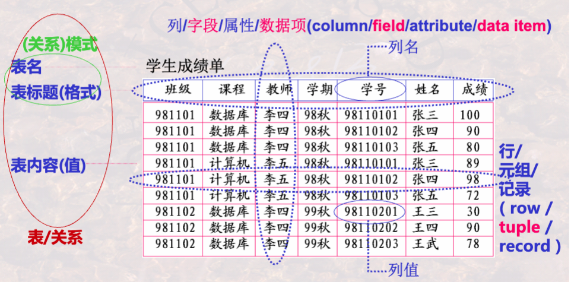

数据库也可定义为相互之间有关联关系的表的集合

## 数据库系统

数据库系统由**5**个要素组成，包含数据库（DB），数据库管理系统（DBMS），数据库应用（DBAP），数据库管理员（DBA），计算机基本系统

## 数据库管理系统

DBMS功能：

1. 数据库定义：定义数据库中表的名称，标题等
   * DBMS提供一套数据定义语言（DDL）给用户
   * 用户使用DDL描述其索要建立表的格式
   * DBMS按照用户定义，创建数据库及其中的表
2. 数据库操纵：向数据库的表中增加/删除/更新数据和对数据进行查询，检索，统计等
   * DBMS提供数据操纵语言（DML）给用户
   * 用户使用DML描述其所要进行的操作
   * DBMS依照用户描述，执行操作
3. 数据库控制：控制数据库中数据的使用
   * DBMS提供数据控制语言（DCL）给用户
   * 用户使用DCL描述其对数据库所要实施的控制
   * DBMS按照用户描述，实际控制数据库
4. 数据库维护：转储/恢复/重组/性能监测/分析
   * DBMS提供程序给用户
   * 程序中提供了对数据库维护的各种功能
   * 用户使用程序进行操作

DBMS为完成DB管理，在后台运行一系列程序

1. 语言编译器
2. 查询优化与查询实现
3. 数据存取与索引
4. 通信控制
5. 事务管理
6. 故障恢复
7. 安全性控制
8. 完整性控制
9. 数据字典管理
10. 应用程序接口
11. 数据库数据装载，重组程序
12. 数据库性能分析程序

# 结构抽象与演变

## 标准结构

DBMS管理数据的三个层次

1. 用户层次：某一用户能看到与处理的数据，全局数据的一部分
2. 逻辑层次：从全局角度理解，管理的数据
3. 内部层次：存储在介质上的数据

模式（schema）：对数据库中数据进行的一种结构性描述，所观察到数据的结构信息

视图（view）：某一种表现形式下表现出来的数据库中的数据

**模式是对视图的抽象**

### 三级模式

外部模式：用户能看到和处理的数据的结构描述

概念模式：从全局角度理解管理的数据的结构描述，体现数据之间的内在本质联系

内部模式：存储在介质上的数据的结构描述

### 两层映像

E-C Mapping：外部模式到概念模式的映像，便于用户观察和使用

C-I Mapping：概念模式到内部模式的映像，便于计算机存储和处理

### 两个独立性

逻辑数据独立性：当概念模式变化时，可以不改变外部模式，只需改变E-C Mapping

物理数据独立性：当内部模式变化时，可以不改变概念模式，只需改变C-I Mapping

## 数据模型

数据模型：规定模式统一描述方式的模型，包括数据结构，操作和约束

**数据模型是对模式的抽象**

### 经典数据模型

关系模型：**表**的形式组织数据

层次模型：**树**的形式组织数据

网状模型：**图**的形式组织数据

# 关系模型概念

关系模型处理表，由三部分组成

1. 描述DB各种数据的**基本结构**形式
2. 描述表之间可能发生的各种**操作**
3. 描述操作应遵循的**约束条件**

## 关系

域：一组值的集合，这组值具有相同的数据类型

基数：集合中元素的个数

笛卡尔积：所有可能的元组的集合，是由n个域形成的所有可能的n-元组的集合

关系：一组域的笛卡尔积的有意义的子集

关系模式与关系：同一关系模式下，可能有很多关系。关系模式是关系的结构， 关系是关系模式在某一时刻的数据。

## 关系特性

列是同质：每一列分量来自于同一个域，是同一类型的数据

不同列可来自同一个域，每一列尾一个属性，不同属性有不同的属性名

互换性：列名区分列，某一或某几列区分行

理论上，关系任意两个元组不能完全相同。但实际表可能不完全遵守

关系第一范式：属性不可再分

## 候选键

关系中一个**属性组**，其值能唯一标识一个元组

当有多个候选键时，可以选定一个作为**主键**

## 主属性

包含在任何一个候选键中的属性被称为主属性

## 外键

关系中一个非候选键的属性组，但与另一个关系的候选键对应

两个关系通常由外键所连接

## 完整性

### 实体完整性

关系主键中的属性值不能为空值（不知道或无意义的值）

空值不能参与算术、比较或逻辑运算

### 参照完整性

外键可以为空值，也可以为另一相对应关系的主键的值

### 用户自定义完整性

用户针对具体的应用环境定义的完整性约束条件

当有更新操作发生时，DBMS将自动按照自定义条件检验正确性

# 关系代数

基于集合，提供一系列关系代数操作，是一种集合思维的操作语言

关系代数操作可分为集合操作（并，交，差，笛卡尔积）和纯关系操作（投影，选择，连接，除）

## 约束

### 并相容性

参与运算的两个关系及其相关属性之间有一定的对应性，可比性或意义关联性

两个关系存在相容性，当且仅当：1）两个关系属性数目相同；2）两个关系属性的域必须相同

## 基本操作

### 并

将两个关系的元组合并成一个关系，在合并时去掉重复的元组

### 差

出现在一个关系但未出现另一个关系的元组的集合

### 广义笛卡尔积

两个关系的元组所有可能的拼接元组的集合

### 选择

从关系中选择出满足条件的元组集合，条件由逻辑运算符连接比较表达式组成

### 投影

从关系中选出属性包含在属性组中的列集合

## 扩展操作

### 交

同时出现两个关系中的元组的集合

### $\theta$-连接

两个关系的笛卡尔积中选择满足 $\theta$ 条件的元组的集合

### 等值连接

两个关系的笛卡尔积中选择属性值相等的元组的集合

### 自然连接

两个关系的笛卡尔积中选择相同属性组上值相等的元组的集合

## 复杂扩展操作

### 除

前提条件：两个关系的属性集存在真子集的关系

结果元组与除关系的所有元组都能构成在被除关系中找到相同的元组

### 外连接

两个关系进行连接，如果存在无法找到匹配的元组，则将信息用空值补全

单向外连接保证某一个关系的元组都会出现

# 关系演算

关系演算以数理逻辑中的谓词演算为基础

关系元组演算是以元组变量作为谓词变量的基本对象

关系域演算是以域变量作为谓词变量的基本对象

## 运算符

优先级：括号，$\theta$，$\exist$，$\forall$，$\neg$，$\wedge$，$\vee$

### 等价变换

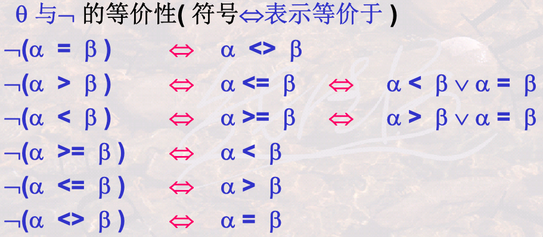

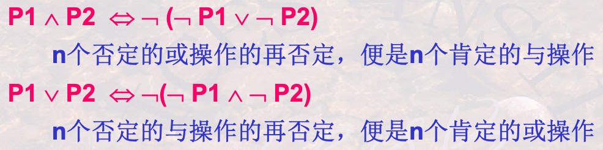

## 安全性

不产生无限关系和无穷验证的运算被称为是安全的

关系代数是安全的，而关系演算不一定是安全的

# 数据库语言SQL

SQL语言是集DDL，DML和DCL于一体的数据库语言

DDL引导词：Create（建立），Alter（修改），Drop（撤销）

DML引导词：Insert，Delete，Update，Select

DCL引导词：Grant，Revoke

DDL通常有DBA使用，也有经DBA授权后的程序员使用

DML通常由用户或应用程序员使用，访问经授权的数据库

## Select查询

### 结果唯一性

使用DISTINCT关键字去重

### 结果排序

使用ORDER BY关键字，默认为升序排列，desc表示降序

### 模糊查询

使用（NOT）LIKE关键字，匹配规则：1）**%**： 匹配零个或多个字符；2）**_**： 匹配任意单个字符；3）**\\**：转义字符

### 多表联合查询

检索条件中包含连接条件。可以实现多种连接方式

### 重名处理

使用AS关键字声明别名，区别不同的表格

# SQL复杂查询与视图

## (NOT) IN子查询

判断某一表达式的值是否在子查询结果中

## 相关子查询

内层查询需要依靠外层查询的某些参量作为限定条件才能进行的子查询

相关子查询只能由外层向内层传递参数

## $\theta$-some/$\theta$-all子查询

将表达式的值与子查询结果进行比较

## (NOT) EXISTS子查询

子查询结果中有无元组存在

## 聚集函数

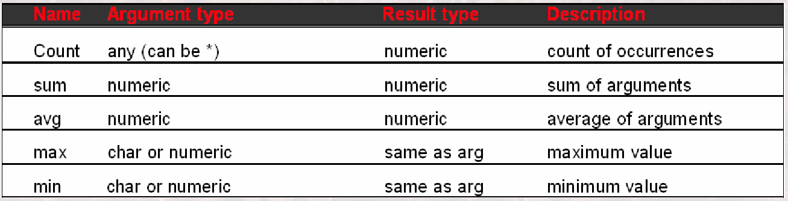

聚集函数不允许用于where子句中

## 分组查询 GROUP BY

SQL可以将检索到的元组按照某一条件进行分类，具有相同条件值的元组分到一个组或集合中，同时处理多个组或集合的聚集运算

## 分组过滤 HAVING

要对集合进行条件过滤，即满足条件的集合/分组留下，不满足条件的剔除

## 视图 View

定义视图可方便用户进行检索操作

视图更新转换为基本表的更新需要声明表的主键

不能更新的视图：1）Select包含聚集函数；2）Select使用了unique或distinct；3）视图中包含group by；4）视图中包含经算术表达式计算出来的列；5）视图有单个表的列构成，但没有包含主键

# 数据库完整性和安全性

## 数据库完整性

DBMS应保证数据库的一种特性，在任何情况下的正确性、有效性和一致性

**广义完整性**：语义完整性，并发控制，安全控制，DB故障恢复

**狭义完整性**：专指语义完整性，DBMS通常有专门的完整性管理机制与程序

### 完整性管理的作用

防止和避免数据库中不合理数据的出现

DBMS应自动防止DB中语义不合理现象

### 如何保证完整性

通过完整性控制程序，依照完整性规则，检查更新是否符合规则，从而决定是否允许更新

### 断言 ASSERTION

一个断言就是一个谓词表达式，表达了希望数据库总能满足的条件

断言测试增加了数据库维护的负担，要小心使用复杂的断言

### 触发器

实现动态完整性的程序。该程序可以在特定的时刻被自动触发执行，比如更新前或后

## 数据库安全性

DBMS应该保证数据库的一种特性，免受非法，非授权用户的使用，泄漏，更改或破坏

数据安全的级别：绝密，机密，可信和无分类

数据库系统的安全级别：物理控制，网路控制，操作系统控制和DBMS控制

### 安全机制

1. 自主安全性控制：存取控制。用户自主管理数据库安全性
2. 强制安全性机制：通过对数据和用户强制分类，使不同类用户能访问不同类数据
3. 推断控制机制：防止通过历史信息，推断出不该被知道的信息。防止通过公开信息推断出私密信息
4. 数据加密存储机制：通过加解密保护数据

### 如何保证安全性

通过安全性控制程序，依照安全性规则，检查访问是否符合规则，从而决定是否允许访问

**授权过程**

1. DBA创建DB，并为每个用户创建一个账户
2. DBA授予某用户账户级别的权利
3. 具有账户级别的用户可以创建基本表或视图，并自动成为基本表或视图的属主账户
4. 拥有属主账户的用户可以将其中一部分权利授予其他用户，用户也可进一步将权力授予另外的用户

传播范围包括水平传播数量（授权者再授权用户数目，树的广度）和垂直传播数量（被授权者传播另一个被授权者的数目，树的深度）

### 强制安全性

强制安全性强制实现不同级别用户访问不同级别数据的一种机制

访问规则：1）只有用户安全级别较高时，才能读取对象；2）只有用户安全级别较低时，才能写对象

# 嵌入式SQL基本技巧

## 嵌入式SQL语言

将SQL语言嵌入到某一种高级语言（C，C++， Java等）中使用

## 变量声明与数据库连接

在嵌入式SQL语句中可以出现宿主语言语句所使用的变量

嵌入式比交互式SQL语句更灵活，宿主语言声明的变量可以赋值，然后传递给SQL语句，使得SQL语句能够按照指定的要求进行检索

在执行嵌入式SQL程序之前，首先需要与数据库进行连接

在执行完成之后，需要与数据库断开连接

SQL语句在执行过程中，必须有提交和撤销语句才能确认其操作结果

## 游标 Cursor

检索多行结果，需要使用游标

游标是指向某检索记录集的指针，通过移动指针，可实现行的读取（Fetch into语句）

### 使用方法

先定义，再打开（执行），然后处理数据，最后关闭游标

游标可以定义一次，多次打开和关闭

### 可滚动游标

标准游标始终自开始向结束方向移动，一条记录只能被访问一次，再次访问该记录只能关闭游标后重新打开

可滚动游标是可使游标指针在记录集之间灵活移动，使每条记录可被反复访问的一种游标

可滚动游标移动时需判断是否到结束位置或起始位置

## 状态捕获及错误处理

## 状态捕获

状态是嵌入式SQL语句的执行状态，尤其指一些出错状态

状态捕获有三部分构成：1）设置SQL通信区；2）设置状态捕获语句；3）状态处理语句

*注意*：状态捕获语句的作用域被whenever限制，可能引发无限循环

## 错误处理

显式处理特定类型的错误时，需要注意状态捕获语句的作用域

# 动态SQL

静态SQL：SQL语句在程序中已经按要求写好，只需要把一些参数通过变量传递给嵌入式SQL语句即可

动态SQL：SQL语句可以在程序中动态构造，形成一个字符串，然后交给DBMS执行，仍然可以传递变量

构造步骤

1. 写好语句基本部分
2. 构造动态字符串
   1. 字符串需要加引号
   2. 添加逻辑运算符
   3. 数值变量需要转换成字符串

动态SQL执行方式

1. 立即执行语句
2. prepare-execute-using语句：prepare语句先编译，execute语句执行，using语句将动态参数值传递给SQL语句

## 数据字典/系统目录

系统维护的一些表或视图的集合，存储了数据库中各类对象的定义信息（元数据）

内容构成：1）与关系相关的信息（关系名，属性名及类型，视图的名字及定义，完整性约束）；2）用户与账户信息；3）统计与描述性数据；4）物理文件组织信息（关系如何存储，物理位置）；5）索引相关信息

## SQLDA

SQL描述区域，是一个内存数据结构，可以装载关系模式的定义信息，如列的数目，每一列的名字和类型等

通过读取SQLDA信息可以进行更为复杂的动态SQL处理

## ODBC

不同语言的应用程序与不同数据库服务器之间通讯的标准

应用程序通过调用ODBC API，可以实现1）与数据服务器的连接；2）向数据库服务器发送SQL命令；3）提取检索结果中的元组

### JDBC

Java版本的应用程序接口API

# 数据库物理存储

## 存储体系

数据组织的基础，将不同性价比的存储器组织在一起，满足高速度、大容量、低价格需求

CPU与内存直接交换信息，按存储单元（存储字进行访问）

外存按存储快进行访问，其信息需先装入内存，才能被CPU处理

操作系统对数据的组织：FAT（文件分配表）-目录（文件夹）-磁盘块/簇

## 磁盘结构

磁盘由盘面，磁道和扇区构成

磁盘读写单位：扇区Sector；连续的若干个扇区：块Block

读写时间：寻道时间（1-20ms），旋转时间（0-10ms），传输时间（每4KB页<1ms）

### RAID技术

**并行处理**：并行读取多个磁盘

* 比特级拆分：一个字节被拆分为8个比特
* 块级拆分：一个文件由多个块组成

**可靠性**：奇偶校验与纠错

* 扇区/块读写校验
* 磁盘间读写校验

级别：1）块级拆分但无冗余；2）镜像处理；3）位交叉纠错处理；4）位交叉校验；5）块交叉校验；6）块交叉分布式校验

## 数据存储与查询实现

映射关系：查询操作算法$\leftrightarrow$文件管理/索引管理：数据逻辑结构$\leftrightarrow$内存缓冲区管理$\leftrightarrow$磁盘管理I/O

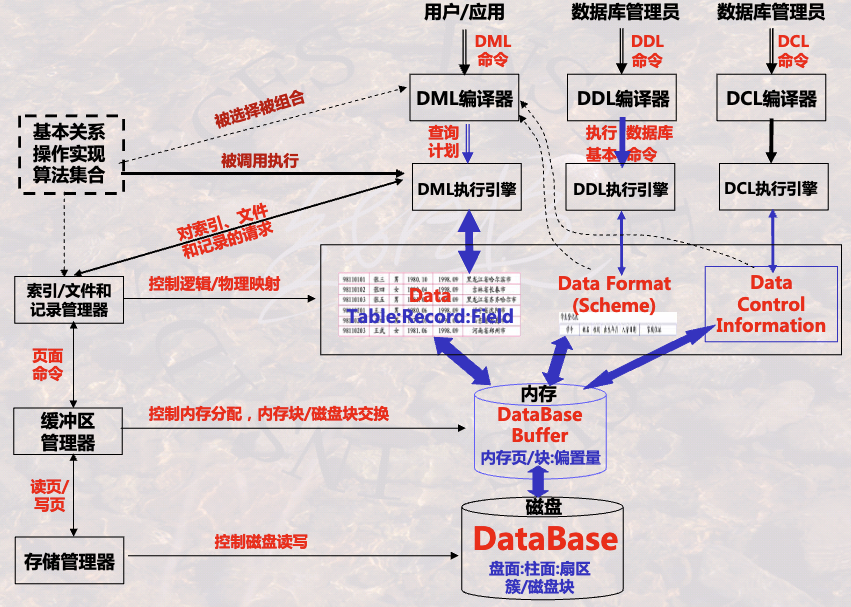

### 表/记录与磁盘的映射

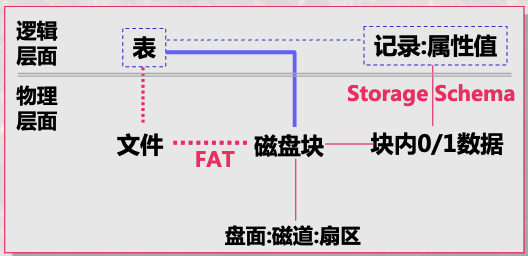

数据库可采用定长记录（固定长度）和变长记录（使用标志区分）两种方式在磁盘上存储

非跨块存储：浪费存储空间，磁盘之间无关联可并行处理

跨块存储：节省存储空间，但磁盘块之间有关联，无法并行

表所占磁盘块的分配方法

1. 连续分配：分配到连续的磁盘块上，存在扩展困难的问题
2. 链接分配：使用指针指向下一个数据块，存在访问速度的问题
3. 按簇分配：簇内使用连续磁盘块，簇间使用指针
4. 索引分配：索引块中存放指向实际数据块的指针

## 文件组织

数据组织成**记录**、**块**和**访问结构**的方式，包括把记录和块存储在磁盘上的方式以及记录和块之间相互联系的方法

方法：

1. 无序记录文件（堆文件）：记录可存储于任意有空间的位置。更新效率高，但检索效率低
2. 有序记录文件（排序文件）：记录按某属性或属性组值的顺序插入。检索效率高，但更新效率低
3. 散列文件：记录按某属性或属性组的值，依据散列函数计算存放位置。检索效率和更新效率有一定程度提高
4. 聚簇文件：将具有相同或相似属性值的记录存放于连续的磁盘块中

# 索引技术

## 概念

索引：定义在存储表基础之上，有助于无需检查所有记录而快速定位所需记录的一种辅助存储结构。由一系列磁盘上的索引项组成，索引项由**索引字段**和**行指针**构成

排序索引文件：按索引字段值的某一种顺序组织存储

散列索引文件：依据索引字段值使用散列函数分配散列桶的方式存储

性能衡量标准：1）访问时间；2）插入时间；3）删除时间；4）空间负载；5）支持存取的有效性

## 稠密索引和稀疏索引

稠密索引：对于主文件中**所有**记录，都有一个索引项和指明所在位置的索引

稀疏索引：对于主文件中**部分**记录，有索引项和对应位置的索引

### 定位方法

稀疏索引：首先找相邻的小于查询值的最大索引字段所对应的索引项，然后从对应记录开始顺序检索

稠密索引：先查索引，然后根据索引读主文件

## 主索引和辅助索引

主索引对每一存储块有一个索引项，索引项总数和存储表所占存储块数目相同。存储表的每一存储块的第一条记录（锚记录）

辅助索引定义在主文件的任一或多个非排序字段的辅助存储结构

一个主文件仅可以有一个主索引，但可以有多个辅助索引。主索引是稀疏索引，通常建立在主码上，辅助索引是稠密索引，建立于其他属性上

## 其他类型索引

聚簇索引：索引中邻近的记录在主文件中也是邻近存储。聚簇字段：主文件中某一非主码的排序字段

倒排索引：基于文本的索引结构

多级索引：当索引项较多时，可以对索引再建立索引，形成多级索引

多属性索引：索引字段由多个属性值组合在一起形成的索引

散列索引：使用散列技术组织的索引

网格索引：使用多索引字段进行交叉联合定位与检索

## B+树

一种以树型数据结构来组织索引项的多级索引，索引项包括索引字段值和指针（指向索引块或数据块或数据块中记录的指针）

非叶结点指针指向索引块，叶子结点指针指向主文件的**数据块**（稀疏索引）或**数据记录**（稠密索引），叶子结点的最后一个指针指向下一个数据块

**B树**的不同之处：索引字段值仅出现一次，指向主文件的指针可出现于叶结点或非叶结点，所有结点才能覆盖所有键值的索引

### 插入

步骤：1）寻找保存键值记录的叶子结点；2）若应插入结点已满，则申请新结点；3）同时调整键值记录，使其均衡存放于两个叶结点中；4）调整指针使其指向新叶子结点；5）寻找指向新叶子结点的非叶结点；6）若该结点已满，则需重复分裂过程

重点：1）当结点已满，则需要分裂操作；2）整个过程由叶结点向根结点逐层处理；3）需要将指针调整至正确位置

### 删除

步骤：1）找到叶子结点中寻找等于键值的记录，删除相应指针及主文件中的记录；2）调整其左/右侧结点及本结点中的键值记录，使其均衡存放于两个叶结点中；3）如有需要，可进一步调整上层结点，重新确定键值，以满足原本特性

重点：1）当指针数目小于50%，则需要合并结点；2）整个过程由叶结点向根结点逐层处理；3）需要将指针调整至正确位置

### 要点

1. 插入记录时可能需要分裂，分裂可能引发连锁反应
2. 删除记录时可能需要合并，合并分为从相邻结点中转移索引项和两个结点合为一个结点
3. 分裂/合并后需要仔细调整索引键值及指针
4. 注意叶子结点之间链接关系的调整

## 散列索引

散列目标：选择一个合适的散列函数，将一个集合均匀映射到每个桶中，即对于集合任一关键字，散列函数映射到地址集合中任何一个地址的概率是近乎相等的

散列索引：内存数据可采用散列确定存储页，主文件可使用散列确定存储块，索引可利用散列确定索引项的存储块

**静态散列索引**：桶的数目为固定值；**动态散列索引**：桶的数目随键值增多，动态增加

### 线性散列索引

解决问题：可扩展散列索引桶的数目增长过快，但利用率不足

方法：桶数选择总是使存储块的平均记录数与所能容纳的总量成一个固定比例，若超过比例，则增长**1**块

# 数据库查询实现算法

数据库的三大类操作：1）一次单一元组的一元操作：Selection，Projection；2）整个关系的一元操作：Distinct，Group By，Sorting；3）整个关系的二元操作：集合操作，包操作，积和连接

## 迭代器算法

针对于一次单一元组的一元操作

实现流水线计算策略，一组关系操作相当于扫描一遍数据库

## 一趟扫描算法

去重复 Distinct：在内存中保存已处理过的元组，当新元组到达时，与之前处理过的元组进行比较

分组聚集 Group By：在内存中保存所有的分组的聚集信息

一趟扫描算法需要保证内存足够大，能够存放所有处理过的数据

## 两趟扫描算法

当需保存的待处理数据块远大于内存可用块数时，就需要使用两趟或者多趟扫描算法

基本思路：**第一趟**划分子集，并使子集具有某种特性（有序或相同散列值）；**第二趟**处理全局性内容的操作，形成结果关系

### 两阶段多路归并排序

外排序问题：待排序数据不能一次性装入内存，需要将数据分批装入内存分批处理的排序问题

步骤：1）划分子集并子集排序；2）各子集间的归并排序

更大规模数据集的排序问题需要采用多阶段算法

### 基于排序的扫描算法

去重复：第一趟划分子表，并进行子表排序；第二趟归并阶段，在排序的基础上直接将重复的记录排除

分组聚集：第一趟划分子表，并进行子表排序；第二趟归并阶段，在排序基础上将不重复记录作为新分组输出，重复记录进行分组聚集计算

### 基于散列的扫描算法

去重复：第一趟将原始关系通过散列函划分成多个子表并进行存储；第二趟将每个子表读入内存，并用另一个散列函数形成新的数据结构，进行去重复操作（元组在子表上不重复，则在大关系中也不重复）

分组聚集：第一趟将原始关系通过散列函划分成多个子表并进行存储；第二趟将每个子表读入内存，并用另一个散列函数形成新的数据结构，进行分组聚集操作（同一分组的所有记录应该在同一个子表中）

# 数据库查询优化

**关系代数的操作执行顺序对效率有很大的影响**

三个层面：1）语义优化 - 利用模型的语义及完整性规则优化查询；2）语法优化 - **逻辑层优化**，利用语法结构，优化执行顺序；3）执行优化 - **物理层优化**，存取路径和执行算法的选择与执行顺序的优化

## 特性

**内容等价性**（语义）：去掉无关的表和属性；改写成等价的效果更好的查询语句

**语法等价性**（语法）：改变关系代数的操作顺序，尽可能早做**选择**和**投影**运算

**物理等价性**（执行）：为每一个关系代数操作选取优化的执行层例行程序，形成物理查询优化

## 逻辑层优化

优化策略

1. 尽可能早做选择和投影：中间结果变小
2. 将选择和投影串接起来：一元运算序列可一起执行，只需对整个关系扫描一遍
3. 把投影与其前或后的二元运算结合起来：第一次用关系时去掉无关属性，避免多次扫描
4. 把某些选择与其前的笛卡尔积合并成一个连接：当笛卡尔积前有选择运算并切其中有条件是比较运算，可转化为连接运算
5. 执行连接运算前对关系作适当预处理：文件排序，建立临时索引可使关系公共值高效连接
6. 找出表达式中的公共子表达式：若公共子表达式结果不大，可预先计算

### 操作顺序交换的等价性

交换律

结合律

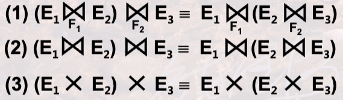

投影串接律

选择串接律

选择和投影交换律

选择和积的交换律

投影和积的交换律

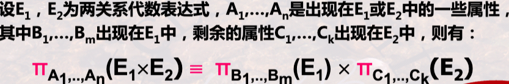

选择和并的交换律

选择和差的交换律

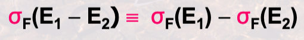

投影和并的交换律

## 物理层优化

衡量指标：1）I/O访问次数；2）CPU占用时间；3）内存使用代价；4）中间结果存储代价；5）计算量；6）网络通信量等

需要的统计信息：关系的元组数目，磁盘块数目，每个元组的字节数，一块能存储的元组数目，属性中不同值的数目和每个磁盘块的字节数等。**这些信息需要有DBA使用特定命令完成统计**

### 代价估算总结

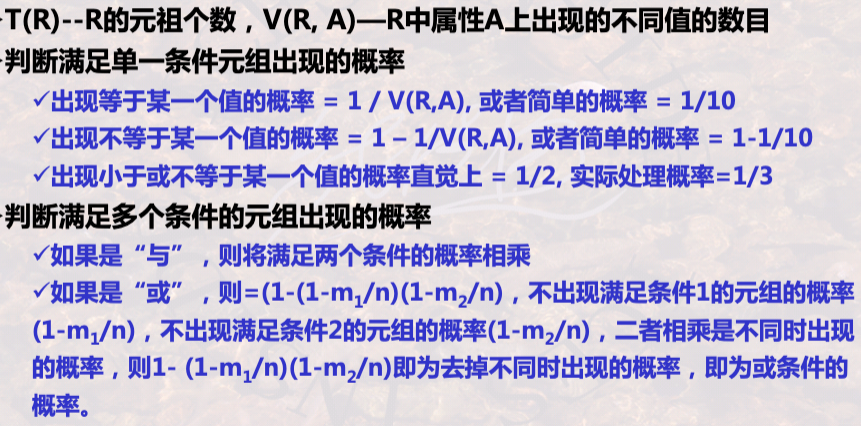

# 数据库事务处理

## 事务

一个存取或改变数据库内容的程序的一次执行，或一条或多条SQL语句的一次执行被看作一个事务（程序员角度）

数据库管理系统提供的控制数据操作的手段，通过这一手段，程序员将一系列数据库操作组合在一起作为一个整体进行操作和控制（DBMS角度）

### ACID特性

1. **原子性**(Atomicity)：一个事务中的所有操作要么全部完成，要么全部不完成，不会结束在中间的某个环节。并且在执行过程中如果出现错误，会回滚到开始前的状态
2. **一致性**(Consistency)：一个事务操作前和操作后的数据要满足完整性约束，数据库保持一致性状态
3. **隔离性**(Isolation)：因为数据库允许多个并发事务同时对其数据进行读写和修改，所以需要将每个事务隔离开，保证一个事务的执行不会影响到其他事务
4. **持久性**(Durability)：一旦事务被提交，它对数据库的改变就是永久性的，即使在系统故障或崩溃后也能够保持，被撤销事务的影响是可恢复的

## 事务调度

一组事务的基本步的一种执行顺序为对这组事务的一个调度

并发调度：多个事务从宏观上是并行执行的，但其微观上的基本操作是交叉执行的

**可串行性**：如果不管数据库初始状态如何，一个调度对数据库状态的影响都和某个串行调度相同，则这个调度是可串行化的。可串行化的等效串行序列不一定唯一

**冲突**：调度中一对连续的动作，如果交换顺序后涉及事务中至少有一个事务行为发生改变，则两个动作冲突。有冲突的两个操作不能交换顺序，没有冲突的两个事务是可交换的

冲突的情况：1）同一事务的任何两个操作；2）不同事务对同一元素的两个写操作；3）不同事务对同一元素的一读一写操作

**冲突可串行性**：一个调度如果交换两个相邻无冲突的操作能够转换到某一个串行的调度，则此调度为冲突可串行化的调度

**严格性：冲突可串行性 > 可串行性 > 并行调度正确性**

## 并发控制

三种数据不一致现象：1）丢失修改：修改结果丢失；2）不能重复读：读取的数据前后不一致；3）脏读：读取到无效的值

### 基于锁的方法

锁是控制并发的一种手段：1）每一数据元素都有唯一的锁；2）每一事务读写元素前需要获取锁；3）其他事务持有锁时需要等待；4）事务结束后释放锁

锁的类型

* 排他锁：只有一个事务能读写
* 共享锁：所有事务都可以读，但任何事务不能写
* 更新锁：初始读，以后可升级为写
* 增量锁：增量更新

相容性矩阵

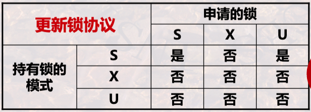

加锁/解锁级别

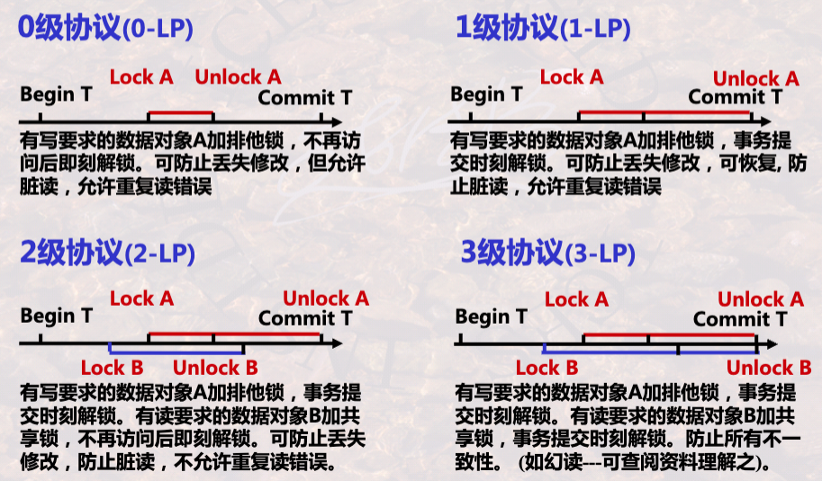

隔离性级别

1. **读未提交**(read uncommitted)：允许一个事务读取另一个事务尚未提交的数据修改。这是最低的隔离级别，存在脏读，不可重复读和幻读的问题
2. **读提交**(read committed)：一个事务只能读取已经提交的数据。其他事务的修改在该事务提交之后才可见。解决了脏读的问题，但依然可能出现另外两种问题
3. **可重复读**(repeatable read)：事务执行期间，多次读取同一数据会得到相同的结果，即在事务开始和结束之间，其他事务对数据的修改不可见。进一步了不可重复读问题
4. **串行化**(serializable)：最高的隔离级别，确保事务之间的并发执行效果与串行执行的效果相同，即不会出现脏读、不可重复读和幻读

#### 两段封锁协议 2PL

读写数据之前要获得锁，每个事务中所有加锁请求先于任何一个解锁请求

分为两个阶段：加锁段和解锁段。并且每段中只能有相应的操作

可能产生**死锁**情况

### 基于时间戳的方法

时间戳：一种基于时间的标志，将某一时刻转换成一个数值。具有唯一性和递增性

借助于时间戳，强制使一组并发事务的交叉执行，等价于一个特定顺序的串行执行，即有冲突时，则撤销事务，并重启该事务（获得一个更大的时间戳）

**简单调度规则**

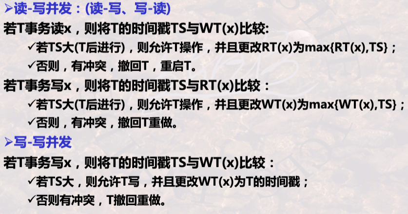

**改进调度规则**

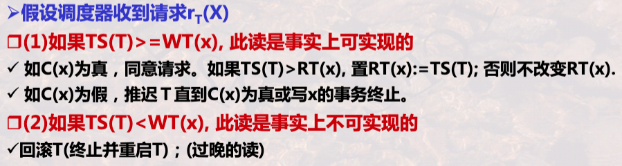

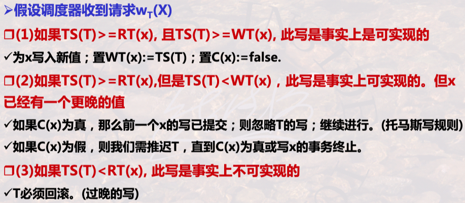

### 基于有效性的方法

事务在启动时刻被赋予唯一的时间戳，每个事务保存读写数据的集合

事务分为三个阶段进行：1）读阶段，事务从数据库中读取集合中的所有元素；2）有效性确认阶段，调度器通过比较该事务与其他事务的读写集合来确认有效性；3）写阶段，事务向数据库中写入其写集合中的元素的值

调度器维护三个集合：1）**START集合**：已经开始但尚未完成有效性确认的事务集合；2）**VAL集合**：已经确认有效性但尚未完成第三阶段写的事务；3）**FIN集合**：已经完成写阶段的事务

有效性确认规则

1. 一个较早事务正在写入一个事务T应该读过的元素对象，则另一个事务有效性不能确认
2. 一个事务T在有效性确认后可能比一个较早事务先写元素对象，则事务的有效性不能确认

## 故障恢复

故障类型：1）**事务故障**：某个事务自身运行错误所引起的故障，影响事务本身；2）**系统故障**：由于掉电、非正常关机等所引起的故障，影响正在运行的事务及数据库缓冲区；3）**介质故障**：由于介质损坏所引起的故障，全面影响内存中的数据和介质中存储的数据

恢复方法

* 事务故障：重做事务（保证已提交事务的持久性）和撤销事务（消除未提交事务的影响）
* 系统故障：运行日志（以流水方式记录每个事务对数据库的每次操作及操作顺序）
* 介质故障：副本（数据库在其他介质上存储的另一份记录）和运行日志

检查点：DBMS强制使内存DB缓冲区中的内容与介质中DB保持一致。因此故障恢复时只需要在检查点之后结束或发生的事务根据运行日志进行恢复，**在故障点前结束的重做，在故障点时刻未结束的撤销**

### 缓冲区处理策略

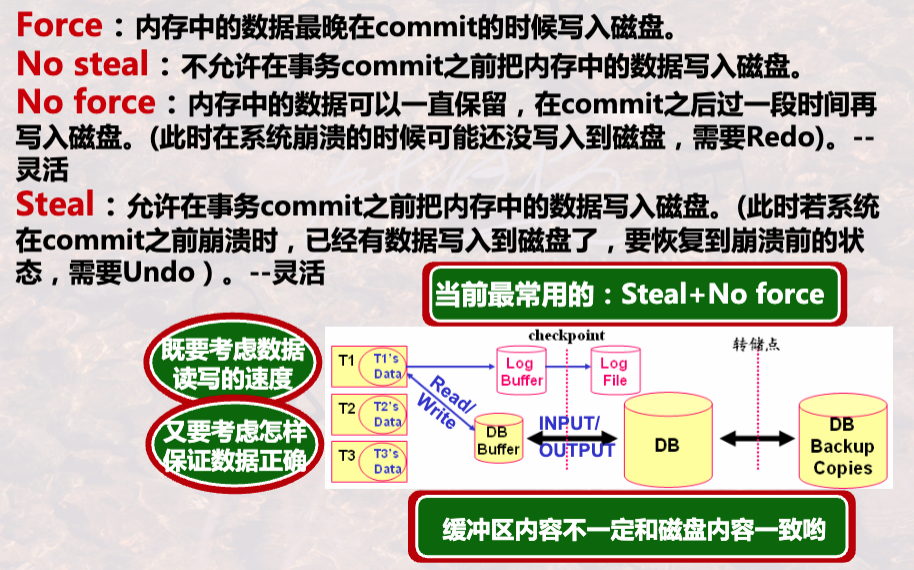

### 日志

一个包含日志记录的**只能追加**的顺序文件，不同事务的日志记录交错存储，按发生时间存储

日志记录信息包括1）事务开始；2）事务完成；3）事务未成功，被中止；4）某个事务改变数据库元素

### Undo日志

记录规则：对于任一事务，首先将**更新前**的值写入到日志中，然后将缓冲区内容写入到磁盘中，最后将提交或撤销操作写入到日志中。**所以将事务改变的所有数据写到磁盘前不能提交该事务**

恢复方法：1）确定每个事务是否已完成；2）从日志尾部开始按日志记录的反序，处理每一日志记录，撤销未完成事务（没有相应提交操作的事务）的所有修改

#### 检查点设置

* 静止检查点：周期性对日志设置检查点，即停止接受新事务，等到所有当前活跃事务提交或终止，将日志刷新到磁盘后刷新日志
* 非静止检查点：允许新事务进入，但需要保存当前所有活跃的未完成的事务

### Redo日志

记录规则：对于任一事务，首先将**更新后**的值写入到日志中，然后将提交操作写入到日志中，最后将缓冲区内容写入到磁盘中

恢复方法：1）确定每个事务是否已完成；2）从日志起始位置开始按日志记录正序处理每一日志记录，重做已提交事务的所有修改

### Undo/Redo结合日志

记录规则：对于任一事务，首先将**更新前后**的值写入到日志中，然后将提交操作写入到日志中，最后将缓冲区内容写入到磁盘中（后两步可以交换顺序）

恢复方法：1）确定每个事务是否已完成；2）自前向后 - 按日志记录正序重做所有已提交的事务和自后向前 - 按日志记录反序撤销所有未完成事务的修改（可根据故障是否发生在提交操作之后或之前）

# AWS Aurora

企业级云原生数据库，提供传统商业数据库的速度和可用性，但有着开源数据库的简单性和成本效益

兼容 MySQL 和 PostgreSQL

## 云原生数据库架构

### 存算分离

AWS Aurora 采用存算分离架构目的在于利用云原生的弹性能力，解决传统数据库的在**扩展性**、**可用性**和**成本效率**上的问题

### 存储节点 I/O

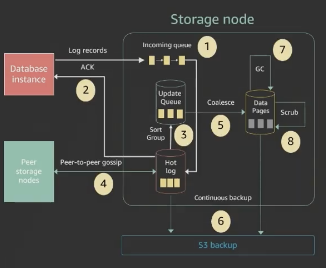

1.   **接收日志记录，并将其添加到内存队列，同时持久化保存日志记录**
     -   将接收到的写入操作日志先放入内存队列中（用于快速处理），并**可靠地写入磁盘**或其他持久化介质，确保即使系统崩溃也不会丢失数据
2.   **向数据库确认 ACK**
     -   一旦日志被安全地持久化，系统就向上层数据库返回“写入成功”的确认（ACK），此时事务可以被认为是正式提交
3.   **整理日志记录，识别日志中的缺口**
     -   对已接收的日志进行整理排序，并检测日志编号是否连续，查找是否有遗漏或缺失（即“日志缺口”）
4.   **通过 Gossip 协议与其他节点通信以填补日志缺口**
     -   与其他数据库节点进行“闲聊式”通信（gossip），从它们那里获取缺失的日志片段，确保日志完整性与一致性
5.   **将日志记录合并为新的页面版本**
     -   把一系列日志条目重放（replay）并整合为新的**数据库页版本**（Page Version），方便快速读取，提高性能
6.   **定期将日志和新的页面版本暂存（stage）到 S3**
     -   定期将整理好的日志数据以及新的页版本上传到 Amazon S3 或其他对象存储中，用于持久存储与备份
7.   **定期进行旧版本的垃圾回收**
     -   清理不再需要的旧日志和旧页面版本，释放存储空间，减少资源浪费
8.   **定期验证数据块上的 CRC 校验码**
     -   对存储的数据块进行 CRC 校验，确保数据在传输或存储过程中未发生损坏，保证数据完整性

注意：除前两步（需要保证日志一定被持久化）之外，所有操作都是异步执行的，即无需等待响应

## 故障恢复

AWS Aurora 存储层默认跨 3 个 AZ（Availability Zone 可用区），每个 AZ 保存 2 个数据副本（共 6 副本），通过 **Quorum**（大多数） 机制保证数据一致性（写入需 4/6 副本确认，读取需 3/6 副本响应）

1. **单 AZ 完全故障**
    - **场景**：一个可用区（AZ）整体宕机（包含存储层的 2 个副本）。
    - **恢复机制**：
        - 存储层剩余 4 个副本（分布在其他 2 个 AZ）仍满足写入的 Quorum（需 4/6 副本确认），服务可继续读写
        - 计算层若部署为多 AZ 集群，主实例会自动切换到其他 AZ 的备用节点，实现秒级故障转移
2. **AZ+1 故障（1 个 AZ + 另一个 AZ 的 1 个副本故障）**
    - **场景**：单个 AZ 完全宕机（2 副本） + 另一个 AZ 中 1 个副本故障（共丢失 3 副本）
    - **恢复机制**：
        - 剩余 3 个副本仍满足 **读取 Quorum**（需 3/6 副本响应），但写入需 4 副本确认，此时 Aurora 会：
            1. **自动修复**：从健康副本快速重建丢失的副本，恢复存储层的完整副本数（6 个）
            2. **维持数据持久性**：即使写入暂时阻塞，数据不会丢失，修复完成后恢复写入能力
3. **单副本或局部故障**
    - **场景**：单个存储副本损坏或节点故障（不影响 AZ 整体）
    - **恢复机制**：
        - 存储层自动检测并重建副本，期间读写操作由其他副本继续处理，对业务无感知

## 数据库克隆

**Aurora Database Clone** 是一种快速创建数据库副本的方式，基于 存储层的 **Copy-on-Write**（COW）机制，无需实际复制数据。

它不是传统意义上的“物理复制”，而是：

-   创建一个新的数据库实例（Clone），它最初与源数据库**共享**相同的存储数据；
-   只有在新的克隆数据库进行修改时，才会将数据从源数据库复制一份（Copy-on-Write）

### 原理

1.   克隆数据库创建时

     -   并不会复制整个数据文件

     -   只是新建一个“元数据引用”，指向原数据库的存储页

2.   当克隆数据库修改数据时

     -   Aurora 会触发“**写时复制（Copy-on-Write）**”，即将被修改的页面复制出来，写入自己的副本

     -   原库不受影响，保持原始状态

3.   克隆数据库可被独立读写，就像一个正常的数据库一样运行
