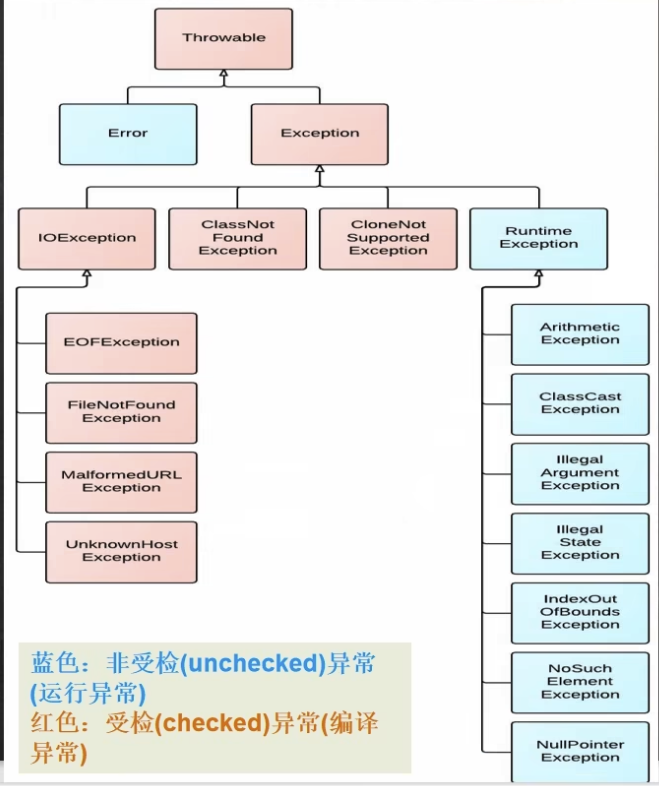

[toc]

<div STYLE="page-break-after:always;"></div>

# Java入门

## 计算

### 输入

Scanner库提供了扫描用户输入的方法

```java
// 得到用户输入
Scanner in = new Scanner(System.in);
```

Scanner库中提供了各种方法获取不同类型的用户输入，比如`nextLine()`获取下一行，`nextInt()`获取整型数据

### 变量

Java中定义变量需要明确指出变量的**类型**。同时变量还需要一个合法的**名称**

**合法的名称**：只能有字母，数字以及下划线组成，并且数字不能出现在开始位置，同时Java中的**关键字**（如abstract，public等）也不能用作名称

#### final关键字

可以将变量转为常量，即无法更改**地址**

### 浮点数（默认为double类型）

**Java中两个整数的运算结果也是整数**，因此对于除法来说，整数相除会自动**向下取整**

```java
import java.util.Scanner;

public class CalculateFloat {
    public static void main(String[] args) {
        int foot;
        int inch;
        Scanner in = new Scanner(System.in);

        foot = in.nextInt();
        inch = in.nextInt();

        System.out.println((foot + inch / 12) * 0.3048);
        System.out.println((foot + inch * 1.0 / 12) * 0.3048);
    }
}
```

输出结果

```
// foot = 5, inch = 12
1.524
1.7018
```

当浮点数和整数进行运算时，Java会将整型转为浮点数进行计算

*注意*：**浮点数的计算是有误差的**

#### float与double

| 特性         | `float`                      | `double`                      |
| ------------ | ---------------------------- | ----------------------------- |
| **关键字**   | `float`                      | `double`                      |
| **存储精度** | 单精度（约 7 位十进制数）    | 双精度（约 15-16 位十进制数） |
| **占用空间** | 4 字节（32 位）              | 8 字节（64 位）               |
| **默认类型** | 不是浮点数的默认类型         | 浮点数的默认类型              |
| **使用范围** | 用于节省空间的场景           | 用于需要更高精度的场景        |
| **声明方式** | 后缀必须加 `f`（如 `3.14f`） | 可以直接写（如 `3.14`）       |
| **计算性能** | 较高（部分场景）             | 较低                          |

更高精度的计算需要考虑使用`BigDecimal`类型

## 判断

### 关系运算

定义：计算两个值之间的关系

关系运算符的优先级比算术运算低，但高于赋值运算符

判断相等的运算符`==` 和`!=` 的优先级比其他关系运算符低

浮点数的计算会存在误差，因此判断两个浮点数是否相等不能直接用`==`，而需要将两者差值与一个极小数比较

```java
double a = 1.0;
double b = 0.1 + 0.1 + 0.1 + 0.1 + 0.1 + 0.1 + 0.1 + 0.1 + 0.1 + 0.1;
System.out.println(a == b); // 返回false
System.out.println(Math.abs(a - b) < 1e-6);  // 返回true
```

**三元运算符**需要看作一个整体，注意精度统一

### 多路分支

如果同一层可能需要多次判断条件，这种情况被称为**级联**

而级联的多个`if else` 可以用`switch-case` 改进

`switch-case`支持的类型包括：`byte`、`short`、`int`、`char`、`String` 和枚举。不支持 `boolean` 和 `float`/`double`。

```java
switch(控制表达式) {
  case 常量:
    代码
  case 常量:
    代码
  default:
    代码
}
```

注意事项：

1. 控制表达式返回值必须是**byte, short, int, char, enum, String**
2. 常量可以是常数，也可以是常数计算的表达式
3. 根据表达式结果，寻找匹配的case，并执行case后的代码，**直到break为止**
4. 如果case都不匹配，则执行default（如有）后的代码

```java
import java.util.Scanner;

public class switchTest {
    public static void main(String[] args) {
        Scanner in = new Scanner(System.in);

        int type;
        System.out.print("请输入类型:");
        type = in.nextInt();

        switch (type) {
            case 1:
                System.out.println("Hello");
                break;
            case 2:
                System.out.println("Good Morning");
            		// break;
            case 3:
                System.out.println("Good Evening");
                break;
        }
    }
}
```

如果某一个case中没有`break` 语句，那么会跨过case条件，继续执行代码，直到`break` 语句

```
请输入类型:2
Good Morning
Good Evening
```

## 循环

### while与do-while

while循环在每次进入循环体之前判断条件是否满足，因此循环体中需要有修改条件的代码，否则循环无法结束

do-while循环在每次执行完循环体后判断条件是否满足，即**do-while循环无论如何都会执行一次循环体代码**

### 如何使用循环

1. 有固定次数，使用`for` 循环 
2. 如果必须执行一次，使用`do while` 循环
3. 其他情况使用`while` 循环

### 跳出循环

`break`可以跳出循环，`continue` 跳过当前执行，继续下一次循环

跳出多重循环，可以在循环之前设置一个标签，然后使用`break [label]` 或`continue [label]` 来对整个标记的循环起作用

## 数组

一种容器，存放的所有元素都是相同类型的，并且容器大小无法改变

`for-each`循环无法修改数组中的元素

### 初始化

new创建的数组会使用默认的0值

用 `{}` 包括所有的元素

### 数组变量

数组变量只是指向开辟的地址空间第一位，因此如果有另一个数组变量指向同一地址，那么修改会在两者都体现

```java
public class arrayTest {
    public static void main(String[] args) {
        int[] a = new int[10];
        a[0] = 5;
        int[] b = a;
        b[0] = 16;
        System.out.println(a[0]); // 输出结果：16
    }
}
```

特性：

1. 数组变量是数组的管理者而非数组本身
2. 数组必须创建后交给数组变量进行管理
3. 数组变量之间的赋值是管理权限的赋予
4. 数组变量之间的比较是判断是否管理同一数组

## 包裹类型

针对八种基本数据类型相应的引用类型

| 基础类型 | 包裹类型  |
| -------- | --------- |
| boolean  | Boolean   |
| char     | Character |
| int      | Integer   |
| double   | Double    |
| byte     | Byte      |
| short    | Short     |
| long     | Long      |
| float    | Float     |

两者类型转换在jdk1.5之前需要通过手动装箱(`valueOf`)和拆箱操作，在jdk1.5实现了自动装箱和拆箱，但底层实现依然还是手动操作的逻辑

```java
Integer a = 1;
Integer b = 1;
System.out.println(a == b); // true

Integer c = 128;
Integer d = 128;
System.out.println(c == d); // false

Integer e = 127;
int f = 127;
System.out.printlb(e == f); // true
```

前两者的差别是因为在底层实现`Integer.valueOf()`中对不同大小数的操作有所差别所带来的（`Integer`对于`[-128, 127]`之间的数字直接返回，否则会重新创建`Integer`对象）

最后一个是因为只要有基本数据类型，`==`是用来判断值是否相等

## 字符

`char`: 单个字符，使用单引号`''`表示。使用Unicode编码，**一个字符占两个字节**

### 逃逸字符

| 逃逸字符 | 解释           |
| -------- | -------------- |
| \b       | 回退一位       |
| \t       | 制表符（对齐） |
| \n       | 换行           |
| \r       | 回车           |
| \\"      | 双引号         |
| \\'      | 单引号         |
| \\\      | 反斜杠         |

## 字符串

字符串变量也是**管理者**，和数组变量类似。但不能使用`for-each`循环

字符串有两种创建方式

```java
// 直接赋值：检查方法区中的常量池是否有对应数据。如有，直接指向数据的地址；否则创建，然后指向地址
String s1 = "hello";

// 调用构造器：在堆中创建空间，其中维护value属性，指向常量池中对应数据的地址空间
String s2 = new String("hello");
```

字符串是一种**不可变**的对象，每次更新实际上创建新字符串，即更改地址，效率较低

```java
String a = "hello" + "abc"; // 编译器优化：多个常量拼接只会创建一个对象

String b = "hello";
String c = "abc";
// 执行步骤
// 1. 首先创建StringBuilder对象
// 2. 执行其中的append函数，执行次数为拼接字符串的个数
// 3. 执行toString方法转为String类型
String d = b + c; // 创建三个对象。b和c指向常量池，d指向堆
```

**重要规则：**常量相加 - 看的是池；变量相加 - 最终结果指向堆

使用`+`连接字符串时，Java会将非字符串类型的参数转换为字符串类型然后进行拼接

比较两个字符串内容是否相同，应该使用`equals`

```java
String s = "bye";
String s1 = new String("bye");
System.out.println(s == "bye"); // 输出true
System.out.println(s.equals("bye")); //输出true
System.out.println(s == s1); // 输出false，两者地址不同
```

在对字符串进行分割`split()`时，如果有特殊字符，需要加入转义符`\`

**占位符：**`%s` 字符串；`%c` 字符；`%d` 整型；`%.2f`浮点数，会进行四舍五入操作

### `StringBuffer`

`StringBuffer`代表可变的字符序列，可以对字符串内容进行增删

`StringBuffer`是一个`final`类，不能被继承

`StringBuffer`的更新实际上可以直接更新内容，只有在超过数组长度时，才会更新地址，因此效率较高

```java
String str = null;
StringBuffer sb1 = new StringBuffer();
sb1.append(str);
System.out.println(sb1.length()); // 输出为4，因为会调用appendNull()方法，将null看作字符串

StringBuffer sb2 = new StringBuffer(str); // 抛出空指针异常，因为str.length()无法正常运行
```

### `StringBuilder`

`StringBuilder`也是一个可变的字符序列，**但无法保证线程安全**

该类被设计为`StringBuffer`的一个简易替换，用在字符串缓冲区被单线程使用的情况

### 区别

| String         | StringBuffer | StringBuilder |
| -------------- | ------------ | ------------- |
| 不可变字符序列 | 可变字符序列 | 可变字符序列  |
| 效率低         | 效率高       | 效率高        |
| 复用率高       | 线程安全     | 线程不安全    |

**效率**：`StringBuilder` > `StringBuffer` > `String`

### 使用原则

1. 字符串存在大量修改操作，且单线程 - `StringBuilder`
2. 字符串存在大量修改操作，且多线程 - `StringBuffer`
3. 字符串很少修改，被多个对象引用 - `String`

## 数组类 `Arrays`

常用方法

1. `Arrays.toString()`：显示数组
2. `Arrays.sort()`：对数组进行排序，默认为升序
3. `Arrays.binarySearch()`：在有序数组中进行二分搜索。如果数组中不存在目标元素，返回负数（**不一定为-1**）
4. `Arrays.copyOf()`：数组元素复制，两个参数分别为原数组和元素个数（必须大于0）。如果元素个数大于原数组容量，则在后面增加`null`
5. `Arrays.fill()`：将元素所有元素替换为声明的参数
6. `Arrays.equals()`：判断两个数组是否完全相等
7. `Arrays.asList()`：将数据转换成 `List` 集合。运行类型为 `Arrays` 中的 `ArrayList` 内部类

## `BigInteger` 和 `BigDecimal`

处理大数和高精度数的类。初始化时可以传入字符串

四则运算需要使用相应的函数进行计算

`BigDecimal` 除法运算时可能抛出异常（结果为无限循环小数）。可以通过指定精度来解决这个问题

```java
BigDecimal b1 = new BigDecimal("342.34234342334895765");
BigDecimal b2 = new BigDecimal("1.1");
// 按照分子的精度进行保存
System.out.println(b1.divide(b2, BigDecimal.ROUND_CEILING));
```

## 日期类

### 第一代日期类 `Date`

常用方法：1）构造器（无参构造器获取当前系统时间）；2）`SimpleDateFormat`：按照自定义格式进行转换；3）`parse()`：用于将指定格式的字符串转换为 `Date`

### 第二代日期类 `Calendar`

为特定瞬间与一组日历字段之间的转换提供了相应的方法，同时提供了用于操作的方法

**抽象类，并且构造器私有化**。需要用 `Calendar.getInstance()` 来获取实例

```java
Calendar calendar = Calendar.getInstance(); // 抽象类无法通过new创建对象
System.out.println(calendar);
```

默认为12小时制，可以用 `HOUR_OF_DAY` 获得24小时制

### 第三代日期类 `LocalDate`, `LocalTime`, `LocalDateTime`

之前的版本存在的问题

1. **可变形**：日期和时间应该是不可变的
2. **偏移性**：年份是从1900年开始的，月份是从0开始的
3. **格式化**：`Calendar` 没有格式化方法
4. **线程安全**：非线程安全，且不能处理闰秒等

JDK 8之后引入了 `LocalDate`（年月日），`LocalTime` （时分秒），`LocalDateTime`（全部信息）

`DateTimeFormatter` 对象进行格式化

## 函数

一块代码，接收零个或多个参数，做一件事情，并返回零个或一个值

Java函数在调用时，只会将值传入函数中，并不会修改原本的变量

函数在每次调用都会开辟单独的内存空间

函数内定义的变量被称为本地变量，而这种变量的生存期被大括号`{}`限定

# Java高级

## 类与对象

对象是实体，需要被创建，每个对象都具有唯一性，并且相互独立

类是规范，类中抽象了所有对象都具有的属性以及相关的函数方法。根据类的定义来创建对象

### 对象 = 属性 + 服务

对象自身的一些数据代表了这个对象的**属性或状态**

外部人员可以通过提供的**服务（函数）**操作对象

**封装**：把数据和对数据的操作放在一起，由操作保护相应的数据

### 成员变量

类中的函数可以直接成员变量的名称来访问成员变量

函数是通过对象来调用的

**成员变量是在创建对象之后才存在的**，而非类定义时。

成员变量的生存期是对象的生存期，作用域是类内部的成员函数

#### this

成员函数的固有本地变量，代表了当前调用这个函数的对象

### 初始化

对象的初始化有很多种方式：

1. 对于未赋初始值的成员变量，Java默认初始化为0
2. 成员变量定义时可以给顶一个初始值
3. 构造函数，在构造对象时**自动**调用，不能有返回类型

#### 构造函数

一个类中可以有多个构造函数，但参数表不同

创建对象时给出不同的参数值，会自动调用不同的构造函数

可以通过`this()`调用其他构造函数，并且要放在**第一句**，且只能**使用一次**

**重载**：一个类中同名但不同参数的函数之间位重载关系

## 对象交互

对象和对象之间的联系紧密程度叫做**耦合**。耦合程度越紧，代表着它们之间的代码是相互依赖，相互牵制的

**解耦**编程：对象和对象之间的耦合尽可能的送，平行的对象之间的直接联系尽量少，使用高层次的对象来提供通信服务

### 封闭访问属性（`private` ）

只有这个类内部可以访问，**类内部**指类的成员函数和定义初始化

这个限制是对类的而非对象的，因此当前类中所用到的其他类的对象A，对象A可以访问自己的私有变量

### 开放访问属性（`public`, `friendly`, `protected`）

`public` - 公开访问

`fridenly` - 同一个包（package）的其他类可以访问

public class必须定义在同样名称的文件中。一个编译单元（Java文件）最多只能有一个public class

### 总结

| **修饰符**       | **同一类** | **同一包** | **子类（跨包）** | **其他类** | **用途**                                |
| ---------------- | ---------- | ---------- | ---------------- | ---------- | --------------------------------------- |
| `public`         | ✅          | ✅          | ✅                | ✅          | 对所有类开放，通常用于公共 API 或工具类 |
| `protected`      | ✅          | ✅          | ✅                | ❌          | 子类和同包内可访问，适合继承时使用      |
| 无修饰符（默认） | ✅          | ✅          | ❌                | ❌          | 仅同包内可访问，适合包内共享功能        |
| `private`        | ✅          | ❌          | ❌                | ❌          | 仅类内部可访问，用于封装和保护数据      |

### 包（package）

一种组织和管理的机制，用于将相关的类、接口和子包分组在一起。它帮助解决命名冲突问题，并提供访问控制的层次结构

主要目的：

1. **组织代码**：将相关的类和接口分组，便于管理大型项目。
2. **避免命名冲突**：通过包名区分不同开发者的类，即使类名相同，也不会冲突。
3. **访问控制**：包为类和成员提供了一个默认的访问级别。
4. **代码复用**：可以通过导入包和类来重用现有的代码。

### 类变量和类函数

类中某个成员变量或成员函数有`static`关键词修饰时就被称为**类变量或类函数**，它就不再属于每一个对象，而是属于整个类。

**静态成员变量只会在类加载的时候初始化一次，并且所有修改都会更改变量的值**

#### 类变量

因此一个对象如果修改了某个类变量，其他对象所对应的类变量也进行了更新

可以通过每个对象访问类变量，**也可以通过类名来访问它们**

类对象的初始化和对象创建没有关系，只和类的装载有关

#### 类函数

**类函数中只能访问类变量**，即静态方法只能访问静态变量

类函数可以直接调用，也可以通过对象进行调用

如果不涉及任何和对象相关的成员，则可以将函数设计为类函数

## 对象容器

一般来说，容器是指具有**自动**增长容量能力的存放数据的一种数据结构

### 容器类

容器类变量定义需要包含容器类型（`ArrayList`）和元素类型（`String`）

### 对象数组

对象数组只能够的每个元素都是对象的管理者而非对象本身，因此初始化还需要保证每个管理者都有相对应的对象，否则会用`null`填充，表明**没有**具体的对象

对象数组如果在`for-each`循环中修改了对象，那么这个修改是会被持久化的。因为每个数组元素都只是管理者

### 集合容器

和数学定义的集合一致，每个元素都是**唯一**的。其中元素是无序的，因此`get()`函数不能获取某个位置的元素

### `toString`函数

如果某个类实现了`public String toString()`函数，可以直接用`System.out.print`输出其中的内容

### 散列表

里面的key和value都必须是类，因此需要用到包裹类型

## 继承与多态

### 继承

继承表达了一种`is-a`关系，即子类的对象可以被看作是父类的对象，但不能反过来。

**Java的继承只允许单继承，即一个类最多只能有一个父类**

**`final`修饰的类不能被其他类继承**

### 子类与父类

子类会继承父类所有`public`，`protected`，`friendly（缺省，但注意必须处于同一个包中）`修饰的成员变量和成员函数，并且可以添加自己单独的操作

构造一个子类对象时，父类的构造函数也会被调用，并且是优先调用。

子类中的构造函数继承地使用父类的成员变量时，有两种实现方式：

1. 将父类中的成员变量修饰符修改成可以供子类访问（`public`或者`protected`）
2. 调用`super()`函数，**注意参数设置**

如果子类中有父类的相同变量，父类的变量就被隐藏了

#### `super()`函数

根据函数所给的参数调用父类对应的构造器

如果子类构造函数中没有写相关代码，也会调用父类中的无参构造函数

### 多态

子类的对象可以被当作父类的对象来使用

1. 子类的对象可以赋值给父类的对象
2. 子类的对象可以传递给需要父类对象的函数
3. 子类的对象可以放在存放父类对象的容器中

Java对象变量都是**多态变量**，可以保存声明类型的对象（静态类型），也可以是类型的子类对象（动态类型）

#### 向上造型

把子类对象赋值给父类的变量，被称为向上造型

父类的对象不能赋值给子类的变量

注意：造型（cast）与类型转换不同

#### 绑定

通过对象调用函数时，选择具体函数运行被称为**绑定**

静态绑定：编译时就已经确定

动态绑定：运行时确定

#### 覆盖（override）

子类和父类中名称和参数表相同的两个函数形成了覆盖关系

子类对象调用运行子类定义的函数，父类对象调用运行父类定义的函数

### 类型系统

单根结构：Java所有的类都继承Object类

`@Override`注解表示下面的函数覆盖了父类的函数，即函数修饰符，名称和参数表必须**完全相同**

## 设计原则

1. 消除代码复制
2. 耦合度低
3. 可扩展性

### 代码复制

**问题**：如果修改一个副本，那么必须同时修改其他副本，否则会出现不一致的问题

解决方法：1）抽取相同功能定义的代码块定义为函数；2）父类-子类继承

### 耦合与聚合

程序设计的目标是一系列通过定义明确的接口通信来协同工作的类。**耦合**是指类和类之间的联系

耦合度决定修改程序的容易程度，因此需要努力降低耦合度，保证修改不那么困难和费时

**聚合**与程序中一个单独的单元所承担的任务数量和种类相关，针对类或方法这样的程序单元。理想情况下，一个代码单元应该负责一个聚合任务，即一个代码单元可以看作是一个逻辑单元

### 可扩展性

代码某些部分不需要修改就可以适应将来可能的变化

从程序中识别出框架和数据，以代码实现框架，将部分功能以数据方式加载，可以在很大程度上实现可扩展性

## 抽象与接口

### 抽象（abstract）

抽象方法是不完全的，只是一个方法签名而完全没有方法体，因此不需要大括号`{}`

抽象类的作用仅仅是表达接口，而不包含具体实现细节。抽象类中可以没有任何抽象方法

一个类如果有抽象方法，则必须定义为抽象类

如果父类是抽象类，子类必须覆盖父类的所有抽象方法，否则子类也会成为抽象类

### 责任驱动设计

程序实现的功能分配到不同的类/对象中

**数据**与**表现**分离开，两者专注于自己的逻辑即可

### 接口（interface）

接口是纯抽象类：

1. 所有成员函数都是抽象函数
2. 所有成员变量都是`public static final`

接口规定了长什么样，而不用管具体实现

类可以实现（implements）多个接口，接口可以继承接口，但不能继承类，也不能实现接口

`Serializable`接口：串行化接口，表明可以实现网络传输

`Comparable`接口：比较接口，表明可以实现对象大小比较

## 控制反转

**控制反转（Inversion of Control, IoC）** 是一种设计原则，用于减少代码之间的耦合性。在传统的编程模式下，程序通常由代码直接控制依赖对象的创建和使用，而在 IoC 中，这种控制被“反转”，由外部容器或框架来负责。

在 Java 中，IoC 通常与 **依赖注入（Dependency Injection, DI）** 结合使用，用于构建灵活、可扩展的系统。

```java
public class UserService {
    private UserRepository userRepository;

    // 通过构造函数注入依赖
    public UserService(UserRepository userRepository) {
        this.userRepository = userRepository;
    }
}
```

Java 中 IoC 的实现方式主要有以下两种：

1. **依赖注入（DI）**
   - 构造函数注入
   - Setter 方法注入
   - 接口注入
2. **事件监听回调**
   - 常见于 GUI 编程，事件的处理由框架调用，而不是主动控制。

### 内部类

定义在一个类中的类，被称为内部类，也叫成员类。成员类可以访问成员变量和成员函数（包括私有权限）

### 匿名类

在创建对象的时候给出类的定义形成**匿名类**。匿名类可以继承某个类，也可以实现某个接口

## MVC

MVC模式将数据，表现和控制分离开。核心思想：每个部分都保持单一职责

**Model负责数据，View负责表现，Control负责接收用户输入**。View和Model之间通过通知和更新的方式进行交互，而Control通过调用Model接口来修改数据

## 异常

程序**执行**中发生的不正常情况称为异常

异常事件可分为两大类：1）错误（Error）：Java虚拟机无法解决的严重问题；2）异常（Exception）：因编程错误或偶然的外在因素导致的一般性问题，可以使用针对性的代码。又可以分为**运行时异常**和**编译时异常**

### 异常体系



运行异常：不用显式处理，Java会使用默认处理机制

编译异常：必须显式处理，否则编译无法通过

### 异常与继承

子类覆盖函数时，子类不能声明比父类更多的异常

子类重写函数所抛出的异常类型要么和父类一致，要么为父类抛出异常的子类

子类的构造函数必须声明父类可能抛出的全部异常，因为在构造函数中，会自动调用父类的构造函数

### 运行时异常

1. `NullPointerException`（空指针异常）：当程序在需要对象的地方使用`null`时，抛出该异常
2. `ArithmeticException`（数字运算异常）：当出现异常的运算条件时，抛出该异常
3. `ArrayIndexOutOfBoundsException`（数组索引越界异常）：用非法索引访问数组时，抛出该异常
4. `ClassCastException`（类型转换异常）：当试图将对象强制转换为不是实例的子类时，抛出该异常
5. `NumberFormatException`（数字格式异常）：当程序将字符串转为不适当格式的数值类型时，抛出该异常

### 异常捕捉

`try-catch-finally`语句用来捕捉异常。`try`语句中放入可能出现异常的代码，`catch`语句放入处理异常的代码，`finally`语句中放入一定需要执行（无论是否发生异常）的代码。`catch`语句可以有多个，通常将资源释放，关闭连接的代码放在`finally`语句中，`finally`代码块会在抛出异常之前运行。

常用函数：

1. `getMessage()`：获取异常信息
2. `printStackTrace()`：打印异常的调用堆栈信息

多个`catch`语句要求子类异常必须声明在父类异常之前

`throw`关键字可以将异常再次抛出

### 异常抛出

如果函数可能抛出异常，需要在函数名之后加上`throws + 异常`

如果没有显式处理，默认为`throws`处理方法

### 自定义异常

继承`Exception`类。一般情况下继承`RuntimeException`，这样便于使用默认的处理机制

## 流

基础字节输入输出流：`InputStream`, `OutStream`

文件输入输出流：`FileInputStream`, `FileOutputStreamm`

过滤器流：`DataInputStream`, `DataOutputStrem`。以一个介质流对象为基础构建过滤器流，最终形成的流对象能在数据的输入输出时，使用过滤器流的方法来读写数据

文本流：`BufferReader`, `BufferWriter`

### 网络通信

`read()`函数是阻塞的，在读到需要的内容之前会停下来等待

### 对象串行化

实现对象串行化，类必须实现一个`Serializable`接口

## 内部类

一个类的内部又完整嵌套另一个类结构，被嵌套的类称为内部类，嵌套其他类的类被称为外部类

类的**五大成员**：属性，方法，构造器，代码块，内部类

四大内部类：

1. 定义在外部类局部位置上（方法或代码块内）
   1. 局部内部类（有类名）
   2. 匿名内部类（无类名）
2. 定义在外部类的成员位置（属性或方法）上
   1. 成员内部类（无static修饰）
   2. 静态内部类（有static修饰）

### 局部内部类

通常定义在**方法**中，作用域只在定义的方法或代码块中

不能添加访问修饰符，但是可以用`final`修饰（限制不能被其他类继承）

可以**直接访问**外部类的所有成员，包含私有成员

外部类需要创建局部内部类的对象，调用其中的成员方法

外部其他类不能访问局部内部类

如果外部类和局部内部类的成员重名时，默认遵循就近原则，如果想访问外部类的成员，可以使用`外部类.this.成员`进行访问（`外部类.this`相当于外部类的对象）

### 匿名内部类

定义在外部类的局部位置，比如**方法**中，并且没有类名。匿名内部类还是一个**对象**

匿名内部类的名称是系统指定的，格式为`外部类$序号`，比如 `外部类$1`，`外部类$2`...

**使用场景**：基于接口/类的匿名内部类：如果只使用很少的次数（一次），通过实现类+创建对象的方式性价比不高，因此使用匿名内部类简化开发

匿名内部类使用一次，就会被销毁，不能再使用了

可以**直接访问**外部类的所有成员，包含私有成员

如果外部类和匿名内部类的成员重名时，默认遵循就近原则，如果想访问外部类的成员，可以使用`外部类.this.成员`进行访问（`外部类.this`相当于外部类的对象）

### 成员内部类

定义在外部类的成员位置上，与成员变量，成员方法同级。

可以添加访问修饰符

作用域和外部类其他成员一样，为整个类体

可以**直接访问**外部类的所有成员，包含私有成员

外部其他类使用成员内部类：

1. 使用外部类对象调用

   ```java
   OutClass2.InnerClass in = out.new InnerClass();
   ```

2. 在外部类定义返回成员内部类的方法，然后调用该方法

   ```java
   OutClass2.InnerClass in2 = out.get();
   ```

如果外部类和成员内部类的成员重名时，默认遵循就近原则，如果想访问外部类的成员，可以使用`外部类.this.成员`进行访问（`外部类.this`相当于外部类的对象）

### 静态内部类

定义在外部类的成员位置， 且有`static`修饰

可以添加访问修饰符

**可以直接访问外部类的静态成员，但不能访问非静态成员**

作用域和外部类其他成员一样，为整个类体

外部其他类使用静态内部类

1. 使用外部类的类名直接访问（满足访问权限的情况下）

   ```java
   OutClass3.InnerClass in = new OutClass3.InnerClass();
   ```

2. 在外部类定义返回静态内部类的方法，然后调用该方法（该方法为静态方法）

如果外部类和成员内部类的成员重名时，默认遵循就近原则，如果想访问外部类的成员，可以使用`外部类.成员`进行访问

# Java进阶

## 枚举

枚举类：可以将**所有**具体的对象列举出来的类

枚举是一组常量的集合，属于一种特殊的类，里面只有限地包含一组特定的对象

创建枚举类的方法

1. 自定义枚举类：1）将构造期私有化；2）去掉setter方法；3）在内部创建固定的对象；4）优化方案：可以加入`final`修饰符

   ```java
   class EnumSeason {
       private String name;
       private String content;
   
       public final static EnumSeason SPRING = new EnumSeason("spring", "warm");
       public final static EnumSeason WINTER = new EnumSeason("winter", "cold");
       public final static EnumSeason SUMMER = new EnumSeason("summer", "hot");
       public final static EnumSeason AUTUMN = new EnumSeason("autumn", "cool");
   
       private EnumSeason(String name, String content) {
           this.name = name;
           this.content = content;
       }
   
       public String getName() {
           return name;
       }
   
       public String getContent() {
           return content;
       }
   
       @Override
       public String toString() {
           return "EnumSeason{" +
                   "name='" + name + '\'' +
                   ", content='" + content + '\'' +
                   '}';
       }
   }

2. 使用`enum`关键字创建枚举类：1）如果有多个对象，需要使用`,`分隔；2）常量对象放在最前面；3）继承`java.lang.Enum`类，并且用`final`修饰了这个类；4）如果在声明了有参构造器的情况下需要使用无参构造器，必须**显式**声明无参构造器

   ```java
   enum AllSeasons {
       SPRING("spring", "warm"),
       SUMMER("summer", "hot"),
       AUTUMN("autumn", "cool"),
       WINTER("winter", "cold");
   
       private String name;
       private String content;
   
       private AllSeasons(String name, String content) {
           this.name = name;
           this.content = content;
       }
   
       public String getContent() {
           return content;
       }
   
       public String getName() {
           return name;
       }
   
       @Override
       public String toString() {
           return "AllSeasons{" +
                   "name='" + name + '\'' +
                   ", content='" + content + '\'' +
                   '}';
       }
   }
   ```

**`enum`构造的枚举类不能继承其他类，但还可以实现接口**

## 注解

### 常见注解

注解（Annotation）也被称为元数据（Metadata），用于修饰解释包，类，方法，属性，构造器，局部变量等数据信息。

注解可以被编译，看作补充信息。注解类的声明不是`class`而是`@interface`

基本的注解：1）`@Override`：限定某个方法重写父类方法；2）`@Deprecated`：表示某个程序元素已过时；3）`@SuppressWarnings`：抑制编译器警告

包含`@Override`注解时，**编译器**会检查该方法是否重写了父类的方法，从而涉及到编译是否能通过

`@Deprecated`注解表示不推荐使用，但依然可以正常使用。主要在版本更迭中起到过渡效果

`@SuppressWarnings`需要声明需要抑制的警告。该注解的作用范围与声明位置相关，通常声明在方法/类之前

### 元注解

修饰注解的注解

|    种类    | 解释                        |
| :--------: | :-------------------------- |
| Retention  | 指定注解的作用范围          |
|   Target   | 指定注解的使用场景          |
| Documented | 指定注解是否在`javadoc`体现 |
| Inherited  | 继承注解                    |

使用`@Documented`时，`RetentionPolicy`必须使用`RUNTIME`

## 集合

优点：1. 动态保存任意多个对象。2. 提供了一系列操作对象的方法。

可分为单列集合（`Collection`）和双列集合（`Map`）

### `Collection` 接口

其中包含 `List` 和 `Set` 两个子接口

遍历元素的方式：`Iterator`（迭代器），普通 `for` 循环和增强 `for` 循环

`Iterator` 遍历方法：调用 `hasNext()` 方法，如果返回 `true`，表示还有元素，接着调用 `next()` 获取元素

增强 `for` 循环底层实现仍然是迭代器，可以理解为简化版的迭代器

#### `List` 接口

元素**有序**，即添加顺序和取出顺序一致，且元素可以重复

每个元素都有对应的顺序索引，本身支持索引取值

##### `ArrayList`

ArrayList 可以放入所有元素（包括 null）

ArrayList 由 Object 数组来实现数据存储，其基本等同于 Vector，但不是线程安全的（多线程不推荐使用 ArrayList）

当使用无参构造器创建一个 ArrayList 对象时，初始数组容量为 0，当第一次添加数据时，会将数组大小扩容到 10。若指定大小（非零）构造对象时，初始容量为指定大小即可

当 ArrayList 中的元素数量达到当前容量时，ArrayList 会触发**自动扩容**机制。扩容的流程主要分为三步

1. 首先会创建一个新的数组，这个新数组的长度是原数组长度的 1.5 倍
2. 然后使用 Arrays.copyof 方法，将所有的元素从旧数组复制到新数组中
3. 最后将要添加的新元素加入到新数组中，这样就完成了动态扩容

##### `Vector`

Vector 由 Object 数组来实现数据存储，并且 Vector 是线程安全的。但其效率不高

当使用无参构造器创建一个 Vector 对象时，初始数组容量为 10。若指定大小（非零）构造对象时，初始容量为指定大小即可

当 Vector 中元素数量达到当前容量时，Vector 同样会触发自动扩容机制，但其默认扩容指数为 2，即新数组长度为原数组长度的 **2倍**。另外 Vector 中还提供了参数，可以指定每次扩容增量

##### `LinkedList`

LinkedList 可以存储任意元素，但其不是线程安全的

LinkedList 底层维护了一个双向链表，维护了 `first` 和 `last` 两个属性，分别指向头节点和尾节点

LinkedList 中每个节点维护 `prev`、 `next` 和 `item` 三个属性，分别代表前指针，后指针和当前元素

LinkedList 的元素添加删除相比于 ArrayList 更高效，但元素的查找效率更低

#### `Set` 接口

元素**无序**，即添加顺序和取出顺序不一致，且不允许重复元素/对象

Set 同样可以使用迭代器和增强 for 循环遍历，但不支持索引遍历

##### `HashSet`

HashSet 底层是 HashMap，可以存放 null 值。其中 key 与添加元素/对象哈希值相关，value 为一个共享的 object PRESENT

在执行 `add` 方法后，会返回一个布尔值，代表是否成功加入

1.   添加一个元素时，先得到哈希值，将其转成索引值
2.   找到存储数据表 table，看这个索引位置是否已经存放的有元素
3.   如果没有，直接加入
4.   如果有，遍历当前索引的链表，并调用 equals 比较，如果相同，就放弃添加；如果不相同，则添加到最后
5.   在 Java 8 中，如果一条链表的元素个数为 `TREEIFY_THRESHOLD`（默认是8），并且 table 的大小不小于 `MIN_TREEIFY_CAPACITY`（默认64），就会进行树化，转换为红黑树

##### `LinkedHashSet`

LinkedHashSet 是 HashSet 的子类

LinkedHashSet 底层是一个 LinkedHashMap，底层维护了一个数组和双向链表

LinkedHashSet 根据元素的哈希值来决定元素的存储位置，同时使用链表维护元素的次序，使其遍历顺序与添加顺序一致

##### `TreeSet`

TreeSet 能保证元素的顺序，其底层实现为 TreeMap

当使用无参构造器创建 TreeSet 时，元素为自然顺序

此外 TreeSet 构造器可以使用 Comparator 作为参数，从而实现自定义排序

### `Map` 接口

Map 用于保存具有映射关系的数据，即 key 和 value 存在单向对应关系，通过 `get` 函数指定 key 总能找到对应的 value

Map 中的 key 和 value 可以是任何引用类型的数据。key 不允许重复，而 value 允许重复

遍历元素的方式

1.   使用 `keySet()` 获得所有的 key，通过 `get()` 获得 value
2.   使用 `entrySet()` 获得所有的对应关系，通过 `getKey()` 和 `getValue()` 分别获得 key 和 value
3.   如果只需要 value，使用 `values()` 获得所有的 value

前两种方法使用迭代器或增强 for 循环，而第三种方法还可以使用普通 for 循环

#### `HashMap`

HashMap 是线程不安全的

HashMap 底层实现是数组 + 链表，在 Java 8 之后引入了红黑树

扩容机制

1.   当创建对象时，将加载因子（loadfactor）初始化为 0.75
2.   当添加 key- value 对时，通过 key 的哈希值得到在 table 的索引。然后判断该索引处是否有元素，如果没有元素直接添加。如果该索引处有元素，继续判断该元素的 key 是否和准备加入的 key 相等，如果相等，则直接替换 value；如果不相等需要判断是树结构还是链表结构，做出相应处理。如果添加时发现容量不够，则需要扩容
3.   第一次添加，则需要扩容 table 容量为16，临界值（threshold）为 $16 \times 0.75 = 12$
4.   以后再扩容，则需要扩容 table 容量为原来的 2 倍，临界值为原来的2倍。注意扩容机制的触发在于哈希表中存储的元素总量而非单一链表上的元素数量
5.   在 Java 8 中，如果一条链表的元素个数超过 `TREEIFY_THRESHOLD`（默认是8），则需要判断 table 的大小，如果 table 的大小不小于 `MIIN_TREEIFY_CAPACITY`（默认64），就会进行树化（红黑树）；否则，执行 2 倍扩容

#### `Hashtable`

Hashtable 中的 key 和 value 均不能为 null

Hashtable 是线程安全的

Hashtable 底层实现是数组 + 链表。其 table 初始大小为 11，扩容机制与 HashMap 类似，但扩容算法为原大小的二倍加 1，即 $new = old \times 2 + 1$

#### `Properties`

Properties 继承自 Hashtable 类

Properties 用于从配置文件中加载数据到对象中，并且提供读取（`get`）和修改（`remove`、`put`）的方法

#### `TreeMap`

TreeMap 能保证 key 的顺序

当使用无参构造器创建时，默认为自然排序

此外 Comparator 可以作为参数传入 TreeMap 的构造器，从而实现自定义排序

### `Collections`

Collections 作为一个工具类，其中提供了很多辅助函数

常见方法

-   `reverse()`：反转元素
-   `shuffle()`：随机打乱顺序
-   `sort()`：根据元素自然顺序，升序排序。另外可使用 Comparator 自定义排序
-   `swap()`：将指定两个位置的元素进行交换
-   `max()`：根据自然顺序返回最大元素。另外可使用 Comparator 自定义排序
-   `min()`：根据自然顺序返回最小元素。另外可使用 Comparator 自定义排序
-   `frequency()`：返回指定元素在集合中出现次数
-   `copy()`：将源集合复制到目标集合中
-   `replaceAll()`：使用新值替换所有指定的旧值

## 泛型

使用泛型，在编译时编译器会检查添加元素的类型，提高了安全性。同时在遍历过程中，减少了类型转换的次数，提高了运行效率

泛型又被称为参数化类型，可以类声明时通过一个标识表示类中某个属性的类型，或某个方法的返回类型，或参数类型

注意事项

1.   给泛型指定数据类型时，必须使用引用类型，不能为基本数据类型
2.   指定泛型的具体类型后，可传入该类型或该类型的子类型

### 自定义泛型类

普通成员（属性、方法）可以使用泛型，且泛型可以定义多个

使用泛型的数组不能初始化，因为无法开辟合理的内存空间

静态成员中不能使用类的泛型，因为静态和类相关，在类加载时，对象还未创建，所以 JVM 无法完成初始化

如果在创建对象时，没有指定类型，默认为 Object

### 自定义泛型接口

接口中的静态成员不能使用泛型

泛型接口的类型在继承接口或实现接口时确定

没有指定类型时，默认为 Object

