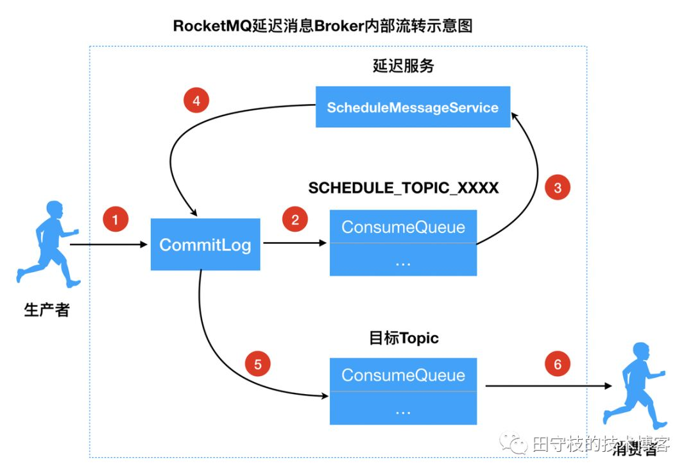
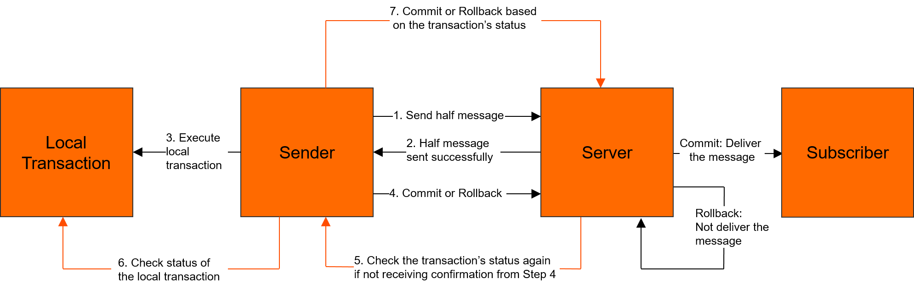
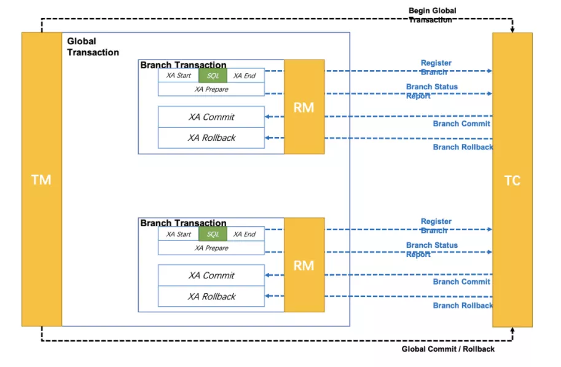

[toc]

<div STYLE="page-break-after:always;"></div>

# 消息队列

## 为什么需要消息队列

同步与异步

1. 同步要求顺序执行，当前任务执行完成才能开始下一个任务；而异步可以同时执行多个任务
2. 同步通常是单线程执行，而异步可以使用多线程或事件循环，使任务可以并发执行
3. 同步适用于计算密集型任务，而异步适用于 I/O 密集型任务

同步通信存在问题

1. 造成系统开销较大，响应时间较长
2. 需要保证每个服务顺利执行，整个链路才能执行完，即链路成功率对外部因素（如网络）较为敏感

异步优势

1. 明显提升系统的吞吐量
2. 即使服务失败，也可以通过分布式事务解决方案保证最终成功

## 消息队列

一般消息的体量都不大，但消息会很多。消息队列可以将系统超量请求暂存其中，以便系统后期可以慢慢进行处理。消息队列解决**通信**问题

分类：

1. 有Broker的消息队列（有一台服务器作为中转服务器）
   - 重Topic：整个Broker是根据topic来进行消息的中转。因此必然需要topic存在（Kafka， RocketMQ）
   - 轻Topic：除了topic还存在其他的中转模式（Rabbit MQ）
2. 无Broker的消息队列
   - 在生产者和消费者之间没有使用Broker，直接使用socket进行通信（ZeroMQ）

| 消息中间件 | 开发语言 | 单机吞吐量 | Topic 支持情况                | 社区活跃度 |
| ---------- | -------- | ---------- | ----------------------------- | ---------- |
| ActiveMQ   | Java     | 万级       | -                             | 低         |
| RabbitMQ   | Erlang   | 万级       | -                             | 高         |
| Kafka      | Java     | 十万级     | 百级 Topic 时会影响系统吞吐量 | 高         |
| RocketMQ   | Java     | 十万级     | 千级 Topic 时会影响系统吞吐量 | 高         |

## 常见协议

- **JMS**（Java Messaging Service）：Java消息服务。Java平台上有关面向消息的中间件（MOM）的技术规范，它便于消息系统中的Java应用程序进行消息交换，并且通过提供标准的产生、发送、接收消息的接口，简化企业应用的开发。ActiveMQ是该协议的典型实现
- **STOMP**（Streaming Text Orientated Message Protocol）：面向流文本的消息协议。一种MOM设计的简单文本协议。STOMP提供一个可互操作的连接格式，允许客户端与任意STOMP消息代理（Broker）进行交互。ActiveMQ是该协议的典型实现，RabbitMQ通过插件可以支持该协议
- **AMQP**（Advanced Message Queuing Protocol）：高级消息队列协议。一个提供统一消息服务的应用层标准，是应用层协议的一个开放标准，是一种MOM设计。基于此协议的客户端与消息中间件可传递消息，并不受客户端/中间件不同产品，不同开发语言等条件的限制。 RabbitMQ是该协议的典型实现
- **MQTT**（Message Queuing Telemetry Transport）：消息队列遥测传输。IBM开发的一个即时通讯协议，是一种二进制协议，主要用于服务器和低功耗IoT（物联网）设备间的通信。该协议支持所有平台，几乎可以把所有联网物品和外部连接起来，被用来当做传感器和致动器的通信协议。 RabbitMQ通过插件可以支持该协议

# Kafka

Kafka是一个分布式，支持分区（partition），多副本的（replica），基于zookeeper协调的分布式消息系统。其最大特性就是可以实时处理⼤量数据以满⾜各种需求场景：⽐如基于hadoop的批处理系统、低延迟的实时系统、Storm/Spark流式处理引擎等

**启动Kafka需要先启动Zookeeper**

## 基本知识与相关命令

### 相关术语

| 名称               | 解释                                                         |
| ------------------ | ------------------------------------------------------------ |
| **Broker**         | 多个Broker可以组成一个Kafka集群                              |
| **Topic**          | Kafka根据topic对消息进行归类，发布到Kafka集群的每条消息都需要指定一个topic |
| **Producer**       | 消息生产者，向Broker发送消息的客户端                         |
| **Consumer**       | 消息消费者，从Broker读取消息的客户端                         |
| **Consumer Group** | 每个Consumer属于一个特定的Consumer Group，一条消息可以被多个不同的Consumer Group消费，但一个Consumer Group中只能有一个Consumer能够消费该消息 |
| **Partition**      | 物理上的概念，一个topic可以分为多个partition，每个partition内的消息是有序的 |

### 创建Topic

Topic可以实现消息的分类，不同消费者订阅不同的Topic

```shell
./kafka-topics.sh --create --zookeeper [zk ip address]:2181 --replication-factor 1 --partitions 1 --topic test
```

创建名为“test”的Topic，这个Topic只有⼀个partition，并且备份因⼦也设置为1

```shell
./kafka-topics.sh --list --zookeeper [zk ip address]:2181
```

查看当前Kafka内有哪些Topic

```shell
./kafka-topics.sh --describe --zookeeper [zk ip address]:2181 --topic test
```

查看Kafka中的某个Topic

### 发送消息

Kafka⾃带了⼀个producer命令客户端，可以从本地⽂件中读取内容，或者我们也可以以命令⾏中直接输⼊内容，并将这些内容以消息的形式发送到Kafka集群中。在默认情况下，每⼀个⾏会被当做成⼀个独⽴的消息。使⽤Kafka的发送消息的客户端，指定发送到的Kafka服务器地址和Topic

```shell
./kafka-console-producer.sh --broker-list [kafka ip address]:9092 --topic test
```

### 消费消息

对于consumer，Kafka同样也携带了⼀个命令⾏客户端，会将获取到内容在命令中进⾏输出，**默认是消费最新的消息**。使⽤Kafka的消费者消息的客户端，从指定Kafka服务器的指定Topic中消费消息

消费方式：

1. 消费最新消息

```shell
./kafka-console-consumer.sh --bootstrap-server [kafka ip address]:9092 --topic test
```

2. 从头开始消费

```shell
./kafka-console-consumer.sh --bootstrap-server [kafka ip address]:9092 --from-beginning --topic test
```

### 注意事项

- 生产者将消息发送给Broker，Broker会将消息保存在本地的日志中
- 消息的保存是有序的，通过偏移量来描述消息的有序性
- 消费者消费消息时也是通过偏移量来描述当前要消费的那条消息的位置

### 单播消息和多播消息

单播消息：⼀个消费组⾥只会有**⼀个消费者**能消费到某⼀个Topic中的消息。于是可以创建多个消费者，这些消费者在同⼀个消费组中

```shell
./kafka-console-consumer.sh --bootstrap-server [kafka ip address]:9092 --consumer-property group.id=testGroup --topic test
```

多播消息：在⼀些业务场景中需要让⼀条消息被多个消费者消费，那么就可以使⽤多播模式。Kafka实现多播，只需要将不同消费者放进不同消费组即可

### 查看消费组信息

```shell
# 查看当前主题下有哪些消费组
./kafka-consumer-groups.sh --bootstrap-server [kafka ip address]:9092 --list

# 查看消费组中的具体信息：⽐如当前偏移量、最后⼀条消息的偏移量、堆积的消息数量
./kafka-consumer-groups.sh --bootstrap-server [kafka ip address]:9092 --describe --group testGroup
```

重点关注以下⼏个信息：

- Current-offset: 最后被消费的消息的偏移量
- Log-end-offset: 消息总量（最后⼀条消息的偏移量）
- Lag：积压了多少条消息

## 主题和分区

### 主题 Topic

主题在Kafka中是⼀个逻辑的概念，Kafka通过Topic将消息进⾏分类。不同的Topic会被订阅该Topic的消费者消费

但是有⼀个问题，如果说这个Topic中的消息⾮常⾮常多，多到需要⼏T来存，因为消息是会被保存到log⽇志⽂件中的。为了解决这个⽂件过⼤的问题，Kafka提出了分区的概念

### 分区 Partition

通过Partition将一个主题中的消息分区存储，好处在于

1. 分区存储，可以解决统⼀存储⽂件过⼤的问题
2. 提供了读写的吞吐量：读和写可以同时在多个分区中进⾏

创建多分区的主题

```shell
./kafka-topics.sh --create --zookeeper [kafka ip address]:2181 --replication-factor 1 --partitions 2 --topic test1
```

特殊的主题：__consumer_offsets，存储每个消费者当前消费消息的偏移量。默认分区数为50，保证高并发

## Kafka集群

创建集群：在单机上创建多个 `server.properties` 文件，然后使用不同的配置文件启动多个Kafka Broker

配置文件必要的修改包括 `broker.id`，Broker的IP地址与端口号以及日志文件路径

### 副本 Replica

副本是为主题中的分区创建多个备份，不同的副本会被部署在不同的broker上，其中会有⼀个副本作为Leader，其他是Follower

Leader：Kafka的写和读的操作，都发⽣在leader上。leader负责把数据同步给follower。当leader挂了，经过主从选举，从多个follower中选举产⽣⼀个新的leader

Follower：接受Leader同步的数据

### 集群消费

⼀个partition只能被⼀个消费组中的⼀个消费者消费，⽬的是为了保证消费的顺序性，但是多个partion的多个消费者消费的总的顺序性是得不到保证的

partition的数量决定了消费组中消费者的数量，建议同⼀个消费组中消费者的数量不要超过partition的数量，否则多的消费者消费不到消息

如果消费者挂了，那么会触发rebalance机制，会让其他消费者来消费该分区

## 生产者 Producer

### 基本实现

1. 设置参数

   ```java
   Properties props = new Properties();
   // 设置kafka broker地址
   props.put(ProducerConfig.BOOTSTRAP_SERVERS_CONFIG, "172.16.253.38:9092,172.16.253.38:9093,172.16.253.38:9094");
   
   //把发送的key从字符串序列化为字节数组
   props.put(ProducerConfig.KEY_SERIALIZER_CLASS_CONFIG, StringSerializer.class.getName());
   //把发送消息value从字符串序列化为字节数组
   props.put(ProducerConfig.VALUE_SERIALIZER_CLASS_CONFIG, StringSerializer.class.getName());
   ```

2. 创建生产者，传入参数

   ```java
   Producer<String,String> producer = new KafkaProducer<String, String>(props);
   ```

3. 创建并发送消息

   ```java
   //key：作⽤是决定了往哪个分区上发，value：具体要发送的消息内容
   //另外还可以在key之前添加一个参数，指定接收分区
   ProducerRecord<String,String> producerRecord = new ProducerRecord<> (TOPIC_NAME,"mykeyvalue","hellokafka");
   
   //4.发送消息,得到消息发送的元数据并输出
   RecordMetadata metadata = producer.send(producerRecord).get();
   System.out.println("同步⽅式发送消息结果：" + "topic-" + metadata.topic() + "|partition-" + metadata.partition() + "|offset-" + metadata.offset());
   ```

### 同步发送

如果生产者发送消息后没有ACK，生产者会阻塞。如果超过一定时间（默认为3秒），则会重试发送

**返回ACK的配置**

- `acks = 0`：表示producer不需要等待任何broker确认收到消息的回复，就可以继续发送下⼀条消息。性能最⾼，但是最容易丢消息
- `acks = 1`：⾄少要等待leader已经成功将数据写⼊本地log，但是不需要等待所有follower是否成功写⼊。就可以继续发送下⼀条消息。这种情况下，如果follower没有成功备份数据，⽽此时leader⼜挂掉，则消息会丢失。性能和安全型最均衡
- `acks = -1/all`：要等待 min.insync.replicas (默认为1，推荐配置⼤于等于2) 这个参数配置的副本（包括leader）个数都成功写⼊⽇志，这种策略会保证只要有⼀个备份存活就不会丢失数据，保证安全性，但性能最差

```java
// 配置ACK
props.put(ProducerConfig.ACKS_CONFIG, "1");
/*
发送失败会重试，默认重试间隔100ms，重试能保证消息发送的可靠性，但是也可能造成消息重复发送，⽐如⽹络抖动，所以需要在接收者那边做好消息接收的幂等性处理
*/
props.put(ProducerConfig.RETRIES_CONFIG, 3);
//重试间隔设置
props.put(ProducerConfig.RETRY_BACKOFF_MS_CONFIG, 300);
```

### 异步发送

⽣产者发送完消息后就可以执⾏之后的业务，Broker在收到消息后异步调⽤⽣产者提供的callback回调⽅法

```java
producer.send(producerRecord, new Callback() {
  public void onCompletion(RecordMetadata metadata, Exception exception) {
    if (exception != null) {
      System.err.println("发送消息失败：" + exception.getStackTrace());
    }
    
    if (metadata != null) {
      System.out.println("异步⽅式发送消息结果：" + "topic-" + metadata.topic() + "|partition-" + metadata.partition() + "|offset-" + metadata.offset());
    }
  }
});
```

### 发送缓冲区

发送缓冲区存储生产的消息。生产者会跑⼀个本地线程，该线程去缓冲区中取一定量的消息，发送到Kafka，如果到一定时间内剩余消息不足也会发送⼀次

相关配置

- Kafka默认会创建⼀个消息缓冲区 (32M)，⽤来存放要发送的消息

  ```java
  props.put(ProducerConfig.BUFFER_MEMORY_CONFIG, 33554432);
  ```

- Kafka本地线程会去缓冲区中拉取数据 (16K)，发送到broker

  ```java
  props.put(ProducerConfig.BATCH_SIZE_CONFIG, 16384);
  ```

- 如果数据不足，间隔一定时间 (10ms) 也会将已拉到的数据发到broker

  ```java
  props.put(ProducerConfig.LINGER_MS_CONFIG, 10);
  ```

## 消费者 Consumer

### 基本实现

1. 参数设置

   ```java
   Properties props = new Properties();
   // 设置kafka地址
   props.put(ConsumerConfig.BOOTSTRAP_SERVERS_CONFIG, "10.31.167.10:9092,10.31.167.10:9093,10.31.167.10:9094");
   
   // 设置消费组
   props.put(ConsumerConfig.GROUP_ID_CONFIG, CONSUMER_GROUP_NAME);
   
   //把key和value从字符串序列化为字节数组
   props.put(ConsumerConfig.KEY_DESERIALIZER_CLASS_CONFIG,
   StringDeserializer.class.getName());
   props.put(ConsumerConfig.VALUE_DESERIALIZER_CLASS_CONFIG, StringDeserializer.class.getName());
   ```

2. 创建消费者

   ```java
   KafkaConsumer<String, String> consumer = new KafkaConsumer<String, String>(props);
   ```

3. 订阅主题列表并消费消息

   ```java
   consumer.subscribe(Arrays.asList(TOPIC_NAME));
   
   while (true) {
     /*
     * poll() API 是拉取消息的⻓轮询
     */
   	ConsumerRecords<String, String> records = consumer.poll(Duration.ofMillis(1000));
   	for (ConsumerRecord<String, String> record : records) {
       System.out.printf("收到消息：partition = %d,offset = %d, key = %s, value = %s%n", record.partition(), record.offset(), record.key(), record.value());
     }
   }
   ```

### 自动提交 offset

消费者poll到消息后，会⾃动向Broker的_consumer_offsets主题提交当前主题 - 分区消费的偏移量

**⾃动提交会丢消息：**因为如果消费者还没消费完poll下来的消息就⾃动提交了偏移量，那么此时消费者挂了，于是下⼀个消费者会从已提交的offset的下⼀个位置开始消费消息。之前未被消费的消息就丢失掉了

```java
// 默认配置
// 是否⾃动提交offset，默认就是true
props.put(ConsumerConfig.ENABLE_AUTO_COMMIT_CONFIG, "true");
// ⾃动提交offset的间隔时间
props.put(ConsumerConfig.AUTO_COMMIT_INTERVAL_MS_CONFIG, "1000");
```

### 手动提交 offset

消费者在消费消息之后，手动向Broker提交当前的偏移量

```java
props.put(ConsumerConfig.ENABLE_AUTO_COMMIT_CONFIG, "false");
```

提交方式

- 同步提交：在消费完消息后调⽤同步提交的⽅法，当集群返回ack前⼀直阻塞，返回ack后表示提交成功，执⾏之后的逻辑

  ```java
  while (true) {
  	ConsumerRecords<String, String> records = consumer.poll(Duration.ofMillis(1000));
    for (ConsumerRecord<String, String> record : records) {
      System.out.printf("收到消息：partition = %d,offset = %d, key = %s, value = %s%n", record.partition(), record.offset(), record.key(), record.value());
    }
  
    //存在消息并且所有的消息已消费完
    if (records.count() > 0) {
      // ⼿动同步提交offset，当前线程会阻塞直到offset提交成功
      // ⼀般使⽤同步提交，因为提交之后⼀般也没有什么逻辑代码了
      consumer.commitSync();//=======阻塞=== 提交成功
    }
  }
  ```

- 异步提交

  ```java
  while (true) {
  	ConsumerRecords<String, String> records = consumer.poll(Duration.ofMillis(1000));
    for (ConsumerRecord<String, String> record : records) {
      System.out.printf("收到消息：partition = %d,offset = %d, key = %s, value = %s%n", record.partition(), record.offset(), record.key(), record.value());
    }
  
    //存在消息并且所有的消息已消费完
    if (records.count() > 0) {
      // ⼿动异步提交offset，当前线程提交offset不会阻塞，可以继续处理后⾯的程序逻辑
  		consumer.commitAsync(new OffsetCommitCallback() {
        @Override
        public void onComplete(Map<TopicPartition, OffsetAndMetadata> offsets, Exception exception) {
          if (exception != null) {
            System.err.println("Commit failed for " + offsets);
            System.err.println("Commit failed exception: " + exception.getStackTrace());
          }
        }
      });
    }
  }
  ```

### 拉取消息

消费者建立与Broker之间的长连接，然后开始拉取消息，每次拉取消息受到数量和时间两方面的限制。

- 设置一次拉取的最大数量

  ```java
  props.put(ConsumerConfig.MAX_POLL_RECORDS_CONFIG, 500);
  ```

- 设置一次拉取的最大时长

  ```java
  // 设置单次拉取的最长时长为1秒。如果不足1秒，可以继续拉取；否则，该次拉取结束
  ConsumerRecords<String, String> records = consumer.poll(Duration.ofMillis(1000));
  ```

- 另外如果两次poll的时间如果超出了一定的时间间隔 (30秒)，Kafka会认为其消费能⼒过弱，将其踢出消费组，将分区分配给其他消费者（使用rebalance机制）

  ```java
  props.put(ConsumerConfig.MAX_POLL_INTERVAL_MS_CONFIG, 30 * 1000);
  ```

### 心跳检测

消费者定期向Kafka集群发送⼼跳，集群发现如果有超过一定时间没有续约的消费者，将被踢出消费组，触发该消费组的rebalance机制，将该分区交给消费组⾥的其他消费者进⾏消费

```java
//consumer给broker发送⼼跳的间隔时间
props.put(ConsumerConfig.HEARTBEAT_INTERVAL_MS_CONFIG, 1000);
//kafka如果超过10秒没有收到消费者的⼼跳，则会把消费者踢出消费组，进⾏rebalance，把分区分配给其他消费者
props.put(ConsumerConfig.SESSION_TIMEOUT_MS_CONFIG, 10 * 1000);
```

### 消费指定设置

- 指定分区消费

  ```java
  consumer.assign(Arrays.asList(new TopicPartition(TOPIC_NAME, 0)));
  ```

- 从头消费

  ```java
  consumer.assign(Arrays.asList(new TopicPartition(TOPIC_NAME, 0)));
  consumer.seekToBeginning(Arrays.asList(new TopicPartition(TOPIC_NAME, 0)));
  ```

- 指定offset消费

  ```java
  consumer.assign(Arrays.asList(new TopicPartition(TOPIC_NAME, 0)));
  consumer.seek(new TopicPartition(TOPIC_NAME, 0), 10);
  ```

- 指定时间点消费

  ```java
  List<PartitionInfo> topicPartitions = consumer.partitionsFor(TOPIC_NAME);
  //从1⼩时前开始消费
  long fetchDataTime = new Date().getTime() - 1000 * 60 * 60;
  Map<TopicPartition, Long> map = new HashMap<>();
  
  for (PartitionInfo par : topicPartitions) {
    map.put(new TopicPartition(TOPIC_NAME, par.partition()), fetchDataTime);
  }
  
  Map<TopicPartition, OffsetAndTimestamp> parMap = consumer.offsetsForTimes(map);
  for (Map.Entry<TopicPartition, OffsetAndTimestamp> entry: parMap.entrySet()) {
    TopicPartition key = entry.getKey();
    OffsetAndTimestamp value = entry.getValue();
    if (key == null || value == null) continue;
    Long offset = value.offset();
    System.out.println("partition-" + key.partition() + "|offset-" + offset);
    System.out.println();
    //根据消费⾥的timestamp确定offset
    if (value != null) {
      consumer.assign(Arrays.asList(key));
      consumer.seek(key, offset);
    }
  }
  ```

### 新消费组设置

新消费组中的消费者在启动以后，默认会从当前分区的最后⼀条消息的offset+1开始消费（消费新消息）

可以设置让新消费组第⼀次从头开始消费。之后开始消费新消息

```java
props.put(ConsumerConfig.AUTO_OFFSET_RESET_CONFIG, "earliest");
```

## 集群中的Controller，rebalance和HW

### Controller

Kafka集群中的broker在zk中创建临时序号节点，序号最⼩的节点（最先创建的节点）将作为集群的controller，负责管理整个集群中的所有分区和副本的状态：

- 当某个分区的leader副本出现故障时，由控制器负责为该分区选举新的leader副本（ISR中最左边的副本）
- 当检测到某个分区的ISR集合发⽣变化时，由控制器负责通知所有broker更新其元数据信息
- 当使⽤kafka-topics.sh脚本为某个topic增加分区数量时，同样还是由控制器负责让新分区被其他节点感知到

### Rebalance 机制

如果**消费者没有指明分区消费**，当消费组⾥消费者和分区的关系发⽣变化，即分区在消费组中没有对应消费者或消费者没有对应的分区，那么就会触发rebalance机制

分区分配的三种策略

- range：根据公式计算得到每个消费消费哪⼏个分区：前⾯的消费者是分区总数/消费者数量+1,之后的消费者是分区总数/消费者数量
- 轮询：所有分区重新分配，每个消费者依次消费一个分区
- sticky：粘合策略，如果需要rebalance，会在之前已分配的基础上调整，不会改变之前的分配情况。如果这个策略没有开，那么就要进⾏全部的重新分配。建议开启。

### HW和LEO

LEO是某个副本最后消息的消息位置（log-end-offset）

HW是已完成同步的位置。消息在写⼊broker时，且每个broker完成这条消息的同步后，HW才会变化。在这之前消费者是消费不到这条消息的。在同步完成之后，HW更新之后，消费者才能消费到这条消息，这样的⽬的是防⽌消息的丢失

## Kafka优化

### 防止消息丢失

生产者：设置为acks参数，一般将acks设置为1，保证数据leader将数据成功写入日志。如果有强安全性的要求，需要将acks设置为-1，并且设置需要的同步分区数 >= 2

消费者：将自动提交改为手动提交

### 防止消息重复消费

使用幂等性原则解决重复消费的问题

幂等性：无论消息发送多少次，最终只会产生一次效果。幂等性可以确保消息在发送和处理过程中不会被重复处理，从而避免产生重复的副作用或结果。

幂等性方案：1）在数据库中创建联合主键，防⽌相同的主键创建出多条记录；2）使⽤分布式锁，以业务id为锁，保证只有⼀条记录能够创建成功

### 顺序消费

⽣产者：保证消息按顺序消费，且消息不丢失 -- 使⽤同步的发送，ack设置成⾮0的值

消费者：主题只能设置⼀个分区，消费组中只能有⼀个消费者

kafka的顺序消费使⽤场景不多，因为牺牲掉了性能，但是⽐如rocketmq在这⼀块有专⻔的功能已设计好

### 消息积压

消息的消费者的消费速度远赶不上⽣产者的⽣产消息的速度，导致Kafka中有⼤量的数据没有被消费。随着没有被消费的数据堆积越多，消费者寻址的性能会越来越差，最后导致整个Kafka对外提供的服务的性能很差，从⽽造成其他服务也访问速度变慢，造成服务雪崩

解决方案：1）增加消费者并发数（分区数要足够大），使用线程池等方式提高消费能力；2）优化消费者逻辑，使用异步处理方式避免耗时操作阻塞消费；3）增加消费组，但这种方式无法优化原先消费慢的消费者，消息积压现象依然可能存在；4）创建⼀个消费者，该消费者在Kafka另建⼀个主题，配上多个分区，多个分区再配上多个消费者。该消费者将poll下来的消息，不进⾏消费，直接转发到新建的主题上

### 延时队列

1. **使用分级延迟Topic**。创建多个Topic，每个Topic代表延时的间隔。生产者发送消息到对应的Topic中，消息中包含了时间。消费者订阅对应的Topic，消费时轮询消费Topic中的消息
2. **使用应用层轮询**。生产者把希望处理的时间戳（或延时时间）写入消息中，消费者拉取消息后判断当前时间是否满足处理条件

# RocketMQ

## 概述

RocketMQ是一个统一消息引擎、轻量级数据处理平台

RocketMQ提供了mqadmin，这是一个运维指令，用于对MQ的主题，集群，Broker等信息进行管理，使用该命令要注意修改相关文件，声明ext目录

### 基本概念

**消息 Message**：消息系统所传输信息的**物理载体**，生产和消费数据的最小单位，**每条消息必须属于一个主题**

**主题 Topic**：一类消息的集合，每个主题包含若干条消息，每条消息只能属于一个主题，是RocketMQ进行消息订阅的基本单位

一个生产者可以同时发送多种Topic的消息；而一个消费者只对某种特定的Topic感兴趣，即只可以订阅和消费一种Topic的消息

**标签 Tag**：用于分区同一主题下不同类型的消息。来自同一业务单元的消息，可以根据不同业务目的在同一主题下设置不同标签

**Topic是消息的一级分类，Tag是消息的二级分类**

**队列 Queue**：存储消息的物理实体。一个主题可以包含多个队列，与Kafka中的分区 Partition 类似

一个Topic的Queue中的消息只能被一个消费者组中的一个消费者消费。一个Queue中的消息不允许同一个消费者组中的多个消费者同时消费

**消息标识 MessageID/Key**：RocketMQ中每个消息拥有唯一的MessageID，且可以携带具有业务标识的Key，以方便对消息查询

MessageId有两个：在生产者send()消息时会自动生成一个MessageID（msgID)，当消息到达Broker后，Broker也会自动生成一个MessageID (offsetMsgID)。msgID、offsetMsgID与key都称为消息标识

- msgID：由producer端生成，其生成规则为：producerIP + 进程pid + MessageClientIDSetter类的ClassLoader的hashCode + 当前时间 + AutomicInteger自增计数器
- offsetMsgID：由broker端生成，其生成规则为： brokerIP + 物理分区的offset（Queue中的偏移量）
- key：由用户指定的业务相关的唯一标识

### 系统架构

RocketMQ由四部分构成

- **生产者 Producer**：负责生产消息，消息投递过程支持快速失败且低延迟
  - RocketMQ中的消息生产者都是以生产者组（Producer Group）的形式出现的。生产者组是同一类生产者的集合，这类Producer发送相同Topic类型的消息
- **消费者 Consumer**：负责消费消息，并对消息进行相关业务处理
  - RocketMQ中的消息消费者都是以消费者组（Consumer Group）的形式出现的。消费者组是同一类消费者的集合，这类Consumer消费的是同一个Topic类型的消息
- **NameServer**：一个Broker与Topic路由的注册中心，支持Broker的动态注册与发现
  - Broker管理：接受Broker集群的注册信息并且保存下来作为路由信息的基本数据；提供心跳检测机制，检查Broker是否还存活
  - 路由信息管理：每个NameServer中都保存着Broker集群的整个路由信息和用于客户端查询的队列信息。Producer和Conumser通过NameServer可以获取整个Broker集群的路由信息，从而进行消息的投递和消费
- **Broker**：消息中转角色，负责存储、转发消息，同时为消费者的拉取请求作准备。Broker同时也存储着消息相关的**元数据**，包括消费者组消费进度偏移offset、主题、队列等
  - Remoting Module：整个Broker的实体，负责处理来自clients端的请求。而这个Broker实体则由以下模块构成
  - Client Manager：客户端管理器。负责接收、解析客户端(Producer/Consumer)请求，管理客户端。例如，维护Consumer的Topic订阅信息
  - Store Service：存储服务。提供方便简单的API接口，处理**消息存储到物理硬盘**和**消息查询**功能
  - HA Service：高可用服务，提供Master Broker 和 Slave Broker之间的数据同步功能
  - Index Service：索引服务。根据特定的Message key，对投递到Broker的消息进行索引服务，同时也提供根据Message Key对消息进行快速查询的功能

#### 补充信息

NameServer路由注册：在Broker节点启动时，依次与集群中的NameServer节点建立**长连接**，发起注册请求，以此实现每个NameServer节点的Broker列表包含当前Broker

心跳检测机制：Broker节点为了证明自己是活着的，为了维护与NameServer间的长连接，会将最新的信息以心跳包的方式上报给NameServer，每30秒发送一次心跳。心跳包中包含 BrokerId、Broker地址(IP+Port)、Broker名称、Broker所属集群名称等等。NameServer在接收到心跳包后，会更新心跳时间戳，记录这个Broker的最新存活时间

NameServer路由剔除：NameServer中有⼀个定时任务，每隔10秒就会扫描⼀次Broker表，查看每一个Broker的最新心跳时间戳距离当前时间是否超过120秒，如果超过，则会判定Broker失效，然后将其从Broker列表中剔除

NameServer路由发现：RocketMQ的路由发现采用的是**Pull模型**。当Topic路由信息出现变化时，NameServer不会主动推送给客户端，而是客户端定时拉取主题最新的路由。默认客户端每30秒会拉取一次最新的路由

NameServer选择策略：客户端（Producer与Consumer）首先会生产一个随机数，然后再与NameServer节点数量取模，此时得到的就是所要连接的节点索引，然后就会进行连接。如果连接失败，则会采用round-robin（轮询）策略，逐个尝试着去连接其它节点

### 工作流程

1. 启动NameServer，NameServer启动后开始监听端口，等待Broker、Producer、Consumer连接
2. 启动Broker时，Broker会与所有的NameServer建立并保持长连接，然后每30秒向NameServer定时发送心跳包
3. 发送消息前，可以先创建Topic，创建Topic时需要指定该Topic要存储在哪些Broker上，当然，在创建Topic时也会将Topic与Broker的关系写入到NameServer中。不过，这步是可选的，也可以在发送消息时自动创建Topic
4. Producer发送消息，启动时先跟NameServer集群中的其中一台建立长连接，并从NameServer中获取路由信息，即当前发送的Topic消息的Queue与Broker的地址（IP+Port）的映射关系。然后根据算法策略从队选择一个Queue，与队列所在的Broker建立长连接从而向Broker发消息。当然，在获取到路由信息后，Producer会首先将路由信息缓存到本地，再每30秒从NameServer更新一次路由信息
5. Consumer跟Producer类似，跟其中一台NameServer建立长连接，获取其所订阅Topic的路由信息，然后根据算法策略从路由信息中获取到其所要消费的Queue，然后直接跟Broker建立长连接，开始消费其中的消息。Consumer在获取到路由信息后，同样也会每30秒从NameServer更新一次路由信息。不过不同于Producer的是，Consumer还会向Broker发送心跳，以确保Broker的存活状态

## 集群

### 数据复制

Master Broker与Slave Broker之间的数据同步

同步复制：消息写入master后，master会等待slave同步数据成功后才向producer返回成功ACK

异步复制：消息写入master后，master立即向producer返回成功ACK，无需等待slave同步数据成功

### 数据持久化 - 文件刷盘

一个Broker将内存中的消息持久化到磁盘

同步刷盘：当消息持久化到broker的磁盘后才算是消息写入成功。

异步刷盘：当消息写入到broker的内存后即表示消息写入成功，当数据量达到一定大小后，统一将内存中的消息持久化到磁盘

### 集群模式

- 多Master：Broker集群仅由多个master构成，不存在Slave。同一Topic的各个Queue会平均分布在各个master节点上
  - 优点：配置简单。在磁盘配置为RAID10时，即使机器宕机不可恢复情况下，由于RAID10磁盘非常可靠，消息也不会丢（异步刷盘丢失少量消息，同步刷盘一条不丢），性能最高，单个Master宕机或重启维护对应用无影响
  - 缺点：单台机器宕机期间，这台机器上未被消费的消息在机器恢复之前不可订阅（不可消费），消息实时性会受到影响
- 多Master多Slave：broker集群由多个master构成，每个master又配置了多个slave。Master和slave为**主备关系**
  - 采用异步复制：当master宕机后slave能够**自动切换**为master。不过由于slave从master的同步具有短暂的延迟（毫秒级），所以当master宕机后，这种异步复制方式可能会存在少量消息的丢失问题
  - 采用同步复制：同步双写（master和slave都需要成功写入）。优点是消息的安全性更高，不存在消息丢失的情况。但单个消息的RT略高，从而导致性能要略低（大约低10%）。缺点在于Master宕机后，Slave不会自动切换到Master

## 工作原理

### 消息生产

生产者将消息写入Broker的Queue中

- Producer发送消息之前，会先向NameServer发出获取 消息Topic的路由信息 的请求
- NameServer返回该Topic的路由表及Broker列表。路由表根据Topic找到涉及该主题的BrokerName，Broker列表根据BrokerName找到Master Broker
- Producer根据代码中指定的Queue选择策略，从Queue列表中选出一个队列，用于后续存储消息
- Produer对消息做一些特殊处理，例如，消息本身超过4M，则会对其进行压缩
- Producer向选择出的Queue所在的Broker发出RPC请求，将消息发送到选择出的Queue

Queue选择算法：

1. 轮询算法：保证每个Queue中可以均匀获取消息
   - 问题：在某些Broker上的Queue可能投递延迟较严重。从而导致Producer的缓存队列中出现较大的消息积压，影响消息的投递性能
2. 最小投递延迟算法：统计每次消息投递的延迟，然后根据结果将消息投递到延迟最小的Queue
   - 问题：消息在Queue上的分配不均匀。投递延迟小的Queue其可能会存在大量的消息。而对该Queue的消费者压力会增大，降低消息的消费能力，可能会导致MQ中消息的堆积

### 消息存储

RocketMQ中的消息存储在本地文件系统中，这些相关文件默认在当前用户主目录下的 `store` 目录中

- `abort`：该文件在Broker启动后会自动创建，正常关闭Broker，该文件会自动消失。若在没有启动Broker的情况下，发现这个文件是存在的，则说明之前Broker的关闭是非正常关闭
- `checkpoint`：其中存储着commitlog、consumequeue、index文件的最后刷盘时间戳
- `commitlog`：其中存放着commitlog/mappedFile文件，而消息是写在commitlog文件中的
- `cong`：存放着Broker运行期间的一些配置数据
- `consumequeue`：其中存放着consumequeue文件，队列就存放在这个目录中
- `index`：其中存放着消息索引文件indexFile
- `lock`：运行期间使用到的全局资源锁

### commitlog

#### 目录与文件

目录中存放很多 `mappedFile` 文件，每个文件最大容量为1G，文件名标示当前文件第一条消息的**起始逻辑偏移量**

一个Broker中仅包含一个commitlog目录，所有的mappedFile文件都是存放在该目录中的。即无论当前Broker中存放着多少Topic的消息，这些消息都是被**顺序**写入到了mappedFile文件中的。也就是说，这些消息在Broker中存放时并没有被按照Topic进行分类存放

#### 消息单元

mappedFile文件由一个个消息单元组成

每个消息单元中包含消息总长度MsgLen、消息的物理位置physicalOffset、消息体内容Body、消息体长度BodyLength、消息主题Topic、Topic长度TopicLength、消息生产者BornHost、消息发送时间戳BornTimestamp、消息所在的队列QueueId、消息在Queue中存储的偏移量QueueOffset等近20余项消息相关属性

### consumequeue

#### 目录与文件

为了提高效率，会为每个Topic在 `~/store/consumequeue` 中创建一个目录，目录名为Topic名称。在该Topic目录下，会再为每个该Topic的Queue建立一个目录，目录名为queueId。每个目录中存放着若干consumequeue文件，consumequeue文件是commitlog的**索引文件**，可以根据consumequeue定位到具体的消息

#### 索引条目

每个consumequeue文件可以包含30w个索引条目，每个索引条目包含了三个消息重要属性：消息在mappedFile文件中的偏移量commitlog offset（8字节）、消息长度（4字节）和消息Tag的hashcode值（8字节）。这三个属性占20个字节，所以每个文件的大小是**固定**的 $30w \times 20$ 字节

### 文件读写

一条消息进入到Broker后经历了以下几个过程才最终被持久化

1. Broker根据queueId，获取到该消息对应索引条目要在consumequeue目录中的写入偏移量，即QueueOffset
2. 将queueId、queueOffset等数据，与消息一起封装为消息单元
3. 将消息单元写入到commitlog
4. 同时，形成消息索引条目
5. 将消息索引条目分发到相应的consumequeue

当Consumer来拉取消息时会经历以下几个步骤

1. Consumer获取到其要消费消息所在Queue的偏移量，即在队列中的索引位置
2. Consumer向Broker发送拉取请求，其中会包含其要拉取消息的Queue、消息offset及消息Tag
3. Broker计算在该consumequeue中的queueOffset
4. 从该queueOffset处开始向后查找第一个指定Tag的索引条目
5. 解析该索引条目的前8个字节，即可定位到该消息在commitlog中的commitlog offset
6. 从对应commitlog offset中读取消息单元，并发送给Consumer

### indexFile

RocketMQ还提供了根据**key**（业务逻辑标识）进行消息查询的功能。该查询是通过store目录中的index子目录中的indexFile进行索引实现的快速查询。IndexFile中的索引数据是在包含了key的消息被发送到Broker时写入的。如果消息中没有包含key，则不会写入

#### 索引条目

每个indexFile文件由三部分构成：indexHeader（40字节），slots槽位（每个4字节），indexes索引数据。每个indexFile文件中包含500w个slot槽。而每个slot槽又可能会挂载很多的index索引单元

indexHeader中包含

- beginTimestamp（8字节）：该indexFile中第一条消息的存储时间

- endTimestamp（8字节）：该indexFile中最后一条消息存储时间

- beginPhyoffset（8字节）：该indexFile中第一条消息在commitlog中的偏移量commitlog offset

- endPhyoffset（8字节）：该indexFile中最后一条消息在commitlog中的偏移量commitlog offset
- hashSlotCount（4字节）：已经填充有index的slot数量（并不是每个slot槽下都挂载有index索引单元，这里统计的是所有挂载了index索引单元的slot槽的数量）
- indexCount（4字节）：该indexFile中包含的索引单元个数（统计出当前indexFile中所有slot槽下挂载的所有index索引单元的数量之和）

index索引单位中包含

- keyHash（4字节）：消息中指定的业务key的hash值

- phyOffset（8字节）：当前key对应的消息在commitlog中的偏移量commitlog offset

- timeDiff（4字节）：当前key对应消息的存储时间与当前indexFile创建时间的时间差

- preIndexNo（4字节）：当前slot下当前index索引单元的前一个index索引单元的indexNo

#### 文件创建

indexFile的文件名为当前文件被创建时的时间戳。根据业务key进行查询时，查询条件除了key之外，还需要指定一个要查询的时间戳，表示要查询指定时间戳之前存储的最新消息，而时间戳文件名可以简化查询

何时创建indexFile文件

- 当第一条带key的消息发送来后，系统发现没有indexFile，此时会创建第一个indexFile文件
- 当一个indexFile中挂载的index索引单元数量超出2000w个时，会创建新的indexFile

### 消息消费

#### 获取消息

**拉取式消费 pull**：Consumer主动从Broker中拉取消息，主动权由Consumer控制。一旦获取了批量消息，就会启动消费过程。不过，该方式的实时性较弱，即Broker中有了新的消息时消费者并不能及时发现并消费

**推动式消费 push**：典型的发布 - 订阅模式，该模式下Broker收到数据后会主动推送给Consumer。该获取方式一般实时性较高

总的来说Pull需要应用去实现对关联Queue的遍历，实时性差，但便于应用控制消息的拉取。Push封装了对关联Queue的遍历，实时性强，但需要维持长连接，会占用较多的系统资源

#### 消费模式

**广播模式**：相同Consumer Group的每个Consumer实例都接收同一个Topic的全量消息。即每条消息都会被发送到Consumer Group中的每个Consumer

**集群模式**：相同Consumer Group的每个Consumer实例平均分摊同一个Topic的消息。即每条消息只会被发送到Consumer Group中的某个Consumer

消费进度保存

- 广播模式：消费进度保存在consumer端。因为广播模式下consumer group中每个consumer都会 消费所有消息，但它们的消费进度是**不同**。所以consumer各自保存各自的消费进度。
- 集群模式：消费进度保存在broker中。consumer group中的所有consumer共同消费同一个Topic 中的消息，**同一条消息只会被消费一次**。消费进度会参与到了消费的负载均衡中，所以消费进度是需要共享的。可以使用 `cat config/consumerOfferset.json` 命令查看消费进度

### Rebalance机制

当消费者订阅的队列数量发生变化或消费组中消费者的数量发生变化时，需要将⼀个Topic下的多个Queue在同⼀个Consumer Group中的多个 Consumer间进行重新分配，目的为了提高消息的并行消费能力

#### 问题

1. **消费暂停**：rebalance过程中所有相关的消费者需要暂停消息消费，在结束之后继续消费
2. **消费重复**：如果offset采用**异步提交**策略（参考：Kafka提交offset），可能导致消息的重复消费
3. **消费突刺**：重复消费的消息过多或因为Rebalance暂停时间过长从而导致积压了部分消息，可能造成结束之后瞬间需要消费很多消息

#### 过程

在Broker中维护着多个Map集合，这些集合中动态存放着当前Topic中Queue的信息、Consumer Group 中Consumer实例的信息。一旦发现消费者所订阅的Queue数量发生变化，或消费者组中消费者的数量发生变化，立即向Consumer Group中的每个实例发出Rebalance通知。Consumer实例在接收到通知后会采用Queue分配算法自己获取到相应的Queue，即**由Consumer自主进行Rebalance**

#### Queue分配算法

- 平均分配策略：计算每个消费者应该分配多少个Queue，然后依次将对应数量的Queue逐个分配给Consumer
- 环形平均策略：根据消费者的顺序，依次在由Queue组成的环形图中逐个分配，无需提前计算
- 一致性hash策略：将consumer的hash值作为Node节点存放到hash环上，然后将queue的hash值也放到hash环 上，通过**顺时针**方向，距离queue最近的那个consumer就是该queue要分配的consumer。但这种策略可能存在分配不均的问题。适用于Consumer数量变化较频繁的场景
- 同机房策略：根据queue的部署机房位置和consumer的**位置**，过滤出当前consumer相同机房的queue。然后按照平均分配策略或环形平均策略对同机房queue进行分配。如果没有同机房queue，则按照平均分 配策略或环形平均策略对所有queue进行分配

#### 至少一次原则

每条消息必须要被**成功消费**一次。Consumer在消费完消息后会向其消费进度记录器提交其消费消息的offset， offset被成功记录到记录器中，那么这条消费就被成功消费了

### 订阅关系一致性

订阅关系的一致性指的是，同一个消费者组（Group ID相同）下所有Consumer实例所订阅的Topic与Tag及对消息的处理逻辑必须完全一致。否则，消息消费的逻辑就会混乱，甚至导致消息丢失

不满足一致性原则的情况

- 订阅不同Topic
- 订阅不同Tag
- 订阅不同数量的Topic

### Offset管理

消费进度offset是用来记录每个Queue的不同消费组的消费进度的。根据消费进度记录器的不同，可以分为两种模式：本地模式和远程模式

**本地模式**：当消费模式为**广播**模式时，offset使用本地模式存储。因为每条消息会被所有的消费者消费，每个消费 者管理自己的消费进度，各个消费者之间不存在消费进度的交集，存储在 `.rocketmq_offsets/ ${clientId}/${group}/Offsets.json` 文件中

**远程模式**：当消费模式为**集群**模式时，offset使用远程模式管理。因为所有Cosnumer实例对消息采用的是均衡消 费，所有Consumer共享Queue的消费进度，Broker记录消费进度，存储在 `store/config/consumerOffset.json` 文件中

## 消费幂等

幂等：若某操作执行多次与执行一次对系统产生的影响是相同的，则称该操作是幂等的

当出现消费者对某条消息重复消费的情况时，重复消费的结果与消费一次的结果是相同的，并且多次消费并未对业务系统产生任何负面影响，那么这个消费过程就是消费幂等的。这主要是为了解决消息可能出现的重复发送或重复消费的问题

消息重复场景

- 发送消息重复
- 消费消息重复
- Rebalance消息重复

解决原理：幂等令牌与唯一性处理

- 幂等令牌：生产者和消费者两者中的既定协议，通常指具备唯一业务标识的字符串
- 唯一性处理：服务端采用一定策略，保证同一业务逻辑不会被重复执行成功多次

通用方案

1. 首先通过缓存去重。在缓存中如果已经存在了某幂等令牌，则说明本次操作是重复性操作；若缓 存没有命中，则进入下一步
2. 在唯一性处理之前，先在数据库中查询幂等令牌作为索引的数据是否存在。若存在，则说明本次 操作为重复性操作；若不存在，则进入下一步
3. 在同一事务中完成三项操作：唯一性处理后，将幂等令牌写入到缓存，并将幂等令牌作为唯一索 引的数据写入到DB中

基于RocketMQ实现消费幂等则需要使用不会重复的**业务标识Key**作为幂等令牌

## 消息堆积与消费延迟

消息处理流程中，如果Consumer的消费速度跟不上Producer的发送速度，MQ中未处理的消息会越来 越多（进的多出的少），这部分消息就被称为**堆积消息**。消息出现堆积从而造成**消费延迟**

消息堆积的主要瓶颈在于客户端的消费能力，而消费能力由**消费耗时**和**消费并发度**决定。注意，消费耗时的优先级要高于消费并发度，即在保证了消费耗时的合理性前提下，再考虑消费并发度问题

### 消费耗时

影响消息处理时长的主要因素是码逻辑。影响处理时长代码主要为**CPU内部计算型代码**和**外部I/O操作型代码**，其中在不存在复杂的循环和递归时，外部I/O操作是主要原因

外部IO操作型代码包含

- 读写外部数据库，例如对远程MySQL的访问
- 读写外部缓存系统，例如对远程Redis的访问
- 下游系统调用，例如Dubbo的RPC远程调用，Spring Cloud的对下游系统的Http接口调用

### 消费并发度

对于普通消息、延时消息及事务消息，消费者端的消费并发度由**单节点线程数**和**节点数量**共同决定，其值为节点数量 $\times$ 单节点线程数。不过，通常需要优先调整单节点的线程数，理想的单机线程数为 $C \times \frac{T1 + T2}{T1}$，其中 $C$， $T1$， $T2$ 分别代表CPU内核数，CPU内部逻辑耗时，外部I/O操作耗时。 若单机硬件资源达到了上限，则需要通过横向扩展来提高消费并发度

然而顺序消息则是不同的

- 全局顺序消息：该类型消息的Topic只有一个Queue分区。其可以保证该Topic的所有消息被 顺序消费。为了保证这个全局顺序性，Consumer Group中在同一时刻只能有一个Consumer的一 个线程进行消费。所以其并发度为1
- 分区顺序消息：该类型消息的Topic有多个Queue分区。其仅可以保证该Topic的每个Queue 分区中的消息被顺序消费，不能保证整个Topic中消息的顺序消费。为了保证这个分区顺序性， 每个Queue分区中的消息在Consumer Group中的同一时刻只能有一个Consumer的一个线程进行消费。即，在同一时刻最多会出现多个Queue分区有多个Consumer的多个线程并行消费。所以 其并发度为Topic的分区数量

### 解决消息堆积

**梳理消息的消费耗时**

通过压测获取消息的消费耗时，并对耗时较高的操作的代码逻辑进行分析

- 消息消费逻辑的计算复杂度是否过高，代码是否存在**无限循环和递归**等缺陷
- 消息消费逻辑中的**I/O操作**是否是必须的，能否用本地缓存等方案规避
- 消费逻辑中的复杂耗时的操作是否可以做**异步化**处理。如果可以，是否会造成逻辑错乱

**设置消息消费的并发度**

- 逐步调大单个Consumer节点的线程数，并观测节点的系统指标，得到单个节点最优的**消费线程数**和**消息吞吐量**
- 根据上下游链路的**流量峰值**计算出需要设置的节点数

## 消息清理

消息清理需要以commitlog文件为单位进行清理

commitlog文件存在一个过期时间，默认为72小时。除用户手动清理，还可能因为这些原因被自动清理

- 文件过期，且到达清理时间点（默认为凌晨4点）后，自动清理过期文件
- 文件过期，且磁盘空间占用率已达过期清理警戒线（默认75%）后，无论是否达到清理时间点， 都会自动清理过期文件
- 磁盘占用率达到清理警戒线（默认85%）后，开始按照设定好的规则清理文件，无论是否过期。 默认会从最老的文件开始清理
- 磁盘占用率达到系统危险警戒线（默认90%）后，Broker将拒绝消息写入

## RocketMQ应用

### 普通消息

#### 同步消息

Producer发出⼀条消息后，会在收到MQ返回的ACK之后才发下⼀条消息。该方式的消息可靠性最高，但消息发送效率太低

```java
public class SyncProducer {
    public static void main(String[] args) throws Exception {
        // 创建一个producer，参数为Producer Group名称
        DefaultMQProducer producer = new DefaultMQProducer("pg");
        // 指定nameServer地址
        producer.setNamesrvAddr("rocketmqOS:9876");
        // 设置当发送失败时重试发送的次数，默认为2
      	producer.setRetryTimesWhenSendFailed(3);
        // 设置发送超时时限为5s，默认3s
        producer.setSendMsgTimeout(5000);
        // 开启生产者
        producer.start();
        // 生产并发送100条消息
        for (int i = 0; i < 100; i++) {
            byte[] body = ("Hi," + i).getBytes();
            Message msg = new Message("someTopic", "someTag", body);
			// 为消息指定key
            msg.setKeys("key-" + i);
            // 发送消息
            SendResult sendResult = producer.send(msg);
            System.out.println(sendResult);
        }
        // 关闭producer
        producer.shutdown();
    }
}
```

#### 异步消息

Producer发出消息后无需等待MQ返回ACK，直接发送下⼀条消息。该方式的消息可靠性和发送效率均可以得到保障

```java
public class AsyncProducer {
    public static void main(String[] args) throws Exception {
        DefaultMQProducer producer = new DefaultMQProducer("pg");
        producer.setNamesrvAddr("rocketmqOS:9876");
        // 指定异步发送失败后不进行重试发送
        producer.setRetryTimesWhenSendAsyncFailed(0);
        // 指定新创建的Topic的Queue数量为2，默认为4
        producer.setDefaultTopicQueueNums(2);
        producer.start();
        
		for (int i = 0; i < 100; i++) {
            byte[] body = ("Hi," + i).getBytes();
            try {
                Message msg = new Message("myTopicA", "myTag", body);
                // 异步发送。指定回调
                producer.send(msg, new SendCallback() {
                    // 当producer接收到MQ发送来的ACK后就会触发该回调方法的执行
                    @Override
                    public void onSuccess(SendResult sendResult) {
                    System.out.println(sendResult);
                    }
                    @Override
                    public void onException(Throwable e) {
                    e.printStackTrace();
                    }
                });
            }  catch (Exception e) {
                e.printStackTrace();
            }
        }
        
        // sleep一会儿
        // 由于采用的是异步发送，所以若这里不sleep，
        // 则消息还未发送就会将producer给关闭，报错
        TimeUnit.SECONDS.sleep(3);
        producer.shutdown();
    }
}
```

#### 单向消息

Producer仅负责发送消息，不等待、不处理MQ的ACK。该发送方式时MQ也不返回ACK。该方式的消息发送效率最高，但消息可靠性较差

```java
public class OnewayProducer {
    public static void main(String[] args) throws Exception{
        DefaultMQProducer producer = new DefaultMQProducer("pg");
        producer.setNamesrvAddr("rocketmqOS:9876");
        producer.start();
        for (int i = 0; i < 10; i++) {
            byte[] body = ("Hi," + i).getBytes();
            Message msg = new Message("single", "someTag", body);
            // 单向发送
            producer.sendOneway(msg);
        }
        producer.shutdown();
        System.out.println("producer shutdown");
    }
}
```

#### 消费者示例代码

```java
public class SomeConsumer {
    public static void main(String[] args) throws MQClientException {
        // 定义一个pull消费者
        // DefaultLitePullConsumer consumer = new
        DefaultLitePullConsumer("cg");
        // 定义一个push消费者
        DefaultMQPushConsumer consumer = new
        DefaultMQPushConsumer("cg");
        // 指定nameServer
        consumer.setNamesrvAddr("rocketmqOS:9876");
        // 指定从第一条消息开始消费
        consumer.setConsumeFromWhere(ConsumeFromWhere.CONSUME_FROM_FIRST_OFFSET);
        // 指定消费topic与tag
        consumer.subscribe("someTopic", "*");
        // 指定采用“广播模式”进行消费，默认为“集群模式”
        // consumer.setMessageModel(MessageModel.BROADCASTING);
        // 注册消息监听器
        consumer.registerMessageListener(new MessageListenerConcurrently() {
            // 一旦broker中有了其订阅的消息就会触发该方法的执行，
            // 其返回值为当前consumer消费的状态
            @Override
            public ConsumeConcurrentlyStatus consumeMessage(List<MessageExt> msgs, ConsumeConcurrentlyContext context) {
                // 逐条消费消息
                for (MessageExt msg : msgs) {
                    System.out.println(msg);
                }
                // 返回消费状态：消费成功
                return ConsumeConcurrentlyStatus.CONSUME_SUCCESS;
            }
        });
        // 开启消费者消费
        consumer.start();
        System.out.println("Consumer Started");
    }
}
```

### 顺序消息

严格按照消息发送顺序进行消费的消息

```java
public class OrderedProducer {
    public static void main(String[] args) throws Exception {
        DefaultMQProducer producer = new DefaultMQProducer("pg");
        producer.setNamesrvAddr("rocketmqOS:9876");
        producer.start();
        for (int i = 0; i < 100; i++) {
            Integer orderId = i;
            byte[] body = ("Hi," + i).getBytes();
            Message msg = new Message("TopicA", "TagA", body);
            // 使用消息key作为选择
            // msg.setKeys(orderId.toString()); 
            SendResult sendResult = producer.send(msg, new MessageQueueSelector() {
                @Override
                public MessageQueue select(List<MessageQueue> mqs, Message msg, Object arg) {
                    // 使用消息key作为选择
                    // String msgKey = msg.getKeys();
                    // Integer id = Integer.valueOf(msgKey);

                    // 使用参数作为选择
                    Integer id = (Integer) arg;
                    int index = id % mqs.size();
                    return mqs.get(index);
                }
            }, orderId);
            
            System.out.println(sendResult);
        }
        producer.shutdown();
    }
}
```

### 延时消息

当消息写入到Broker后，在指定的时长后才可被消费处理的消息。 采用RocketMQ的延时消息可以实现**定时任务**的功能，而无需使用定时器

#### 延迟等级

延时消息的延迟时长不支持随意时长的延迟，是通过特定的延迟等级（定义在服务端）来指定的

如果需要自定义的延时等级，可以通过在broker加载时使用的配置文件中新增 `messageDelayLevel` 条目进行修改

#### 实现方案



1. 修改消息的Topic为SCHEDULE_TOPIC_XXXX
2. 根据延时等级，在consumequeue目录中SCHEDULE_TOPIC_XXXX主题下创建出相应的queueId 目录与consumequeue文件
3. 修改消息索引单元内容。索引单元中的Message Tag HashCode部分原本存放的是消息的Tag的 Hash值，现修改为消息的**投递时间**。投递时间是指该消息被重新修改为原Topic后再次被写入到 commitlog中的时间。**投递时间 = 消息存储时间 + 延时等级时间**。消息存储时间指的是消息被发送到Broker时的时间戳
4. 将消息索引写入到SCHEDULE_TOPIC_XXXX主题下相应的consumequeue中
5. Broker内部的ScheduleMessageService消费SCHEDULE_TOPIC_XXXX主题中的消息
6. ScheuleMessageService会创建并启动一个定时器，定时器任务会检测相应是否到投递时间，将原来写入的消息再次读出，并将其原来的延时等级设置为0，再次将消息投递给目标Topic中
7. 普通消息消费流程

#### 生产者代码

```java
public class DelayProducer {
    public static void main(String[] args) throws Exception {
        DefaultMQProducer producer = new DefaultMQProducer("pg");
        producer.setNamesrvAddr("rocketmqOS:9876");
        producer.start();
        for (int i = 0; i < 10; i++) {
            byte[] body = ("Hi," + i).getBytes();
            Message msg = new Message("TopicB", "someTag", body);
            // 指定消息延迟等级为3级，即延迟10s
            msg.setDelayTimeLevel(3);
            SendResult sendResult = producer.send(msg);
            // 输出消息被发送的时间
            System.out.print(new SimpleDateFormat("mm:ss").format(new Date()));
            System.out.println(" ," + sendResult);
        }
        producer.shutdown();
    }
}
```

### 事务消息

#### 分布式事务

一次操作由若干分支操作组成，这些分支操作分属不同应用，分布在不同服务器上。分布式事务需要保证这些分支操作要么全部成功，要么全部失败。分布式事务与普通事务一样，就是为了保证操作结果的一致性

#### 事务消息

RocketMQ提供的一种高级消息类型，支持在分布式场景下保障消息生产和本地事务的最终一致性

处理流程



#### 半事务消息

暂不能投递的消息，发送方已经成功地将消息发送到了Broker，但是Broker未收到最终确认指令，此时该消息被标记成“暂不能投递”状态，即不能被消费者看到

#### 本地事务状态

生产者**回调操作**执行的结果为本地事务状态，其会发送给TC（事务协调器），而TC会再发送给TM（事务管理器）。TM会根据TC发 送来的本地事务状态来决定全局事务确认指令

#### 消息回查

当本地事务状态为 `UNKNOWN` 或TC未收到TM的全局确认指令时，需要重新查询本地事务的执行结果

可以在Broker加载的配置文件中设置消息回查

```properties
#指定TM在20秒内应将最终确认状态发送给TC，否则引发消息回查。默认为60秒
transactionTimeout=20
#指定最多回查5次，超过后将丢弃消息并记录错误日志。默认15次
transactionCheckMax=5
#指定设置的多次消息回查的时间间隔为10秒。默认为60秒
transactionCheckInterval=10
```

#### XA模式

XA（Unix Transaction）是一种分布式事务解决方案，一种分布式事务处理模式，是基于XA协议（2PC）的

三个重要组件

- TC：事务协调器，维护全局和分支事务的状态，驱动全局事务提交或回滚
- TM：事务管理器，定义全局事务的范围：开始全局事务、提交或回滚全局事务。全局事务的实际发起者
- RM：资源管理器，管理分支事务处理的资源，与TC交谈以注册分支事务和报告分支事务的状态，并驱动分支事务提交或回滚

**架构**



#### 代码示例

生产者

```java
public class TransactionProducer {
    public static void main(String[] args) throws Exception {
        TransactionMQProducer producer = new
        TransactionMQProducer("tpg");
        producer.setNamesrvAddr("rocketmqOS:9876");
        /**
        * 定义一个线程池
        * @param corePoolSize 线程池中核心线程数量
        * @param maximumPoolSize 线程池中最多线程数
        * @param keepAliveTime 这是一个时间。当线程池中线程数量大于核心线程数量时，多余空闲线程的存活时长
        * @param unit 时间单位
        * @param workQueue 临时存放任务的队列，其参数就是队列的长度
        * @param threadFactory 线程工厂
        */
        ExecutorService executorService = new ThreadPoolExecutor(2, 5, 100, TimeUnit.SECONDS, new ArrayBlockingQueue<Runnable>(2000), new ThreadFactory() {
            @Override
            public Thread newThread(Runnable r) {
                Thread thread = new Thread(r);
                thread.setName("client-transaction-msg-check-thread");
                return thread;
            }
        });
        // 为生产者指定一个线程池
        producer.setExecutorService(executorService);
        // 为生产者添加事务监听器
        producer.setTransactionListener(new ICBCTransactionListener());
        producer.start();
        String[] tags = {"TAGA","TAGB","TAGC"};
        for (int i = 0; i < 3; i++) {
            byte[] body = ("Hi," + i).getBytes();
            Message msg = new Message("TTopic", tags[i], body);
            // 发送事务消息
            // 第二个参数用于指定在执行本地事务时要使用的业务参数
            SendResult sendResult = producer.sendMessageInTransaction(msg,null);
            System.out.println("发送结果为：" + sendResult.getSendStatus());
        }
    }
}
```

事务监听器

```java
public class ICBCTransactionListener implements TransactionListener {
    // 回调操作方法
    // 消息预提交成功就会触发该方法的执行，用于完成本地事务
    @Override
    public LocalTransactionState executeLocalTransaction(Message msg, Object arg) {
        System.out.println("预提交消息成功：" + msg);
        // 假设接收到TAGA的消息就表示扣款操作成功，TAGB的消息表示扣款失败，
        // TAGC表示扣款结果不清楚，需要执行消息回查
        if (StringUtils.equals("TAGA", msg.getTags())) {
            return LocalTransactionState.COMMIT_MESSAGE;
        } 
        else if (StringUtils.equals("TAGB", msg.getTags())) {
            return LocalTransactionState.ROLLBACK_MESSAGE;
        } 
        else if (StringUtils.equals("TAGC", msg.getTags())) {
            return LocalTransactionState.UNKNOW;
        }
        
        return LocalTransactionState.UNKNOW;
        }

    // 消息回查方法
    // 引发消息回查的原因最常见的有两个：
    // 1)回调操作返回UNKNWON
    // 2)TC没有接收到TM的最终全局事务确认指令
    @Override
    public LocalTransactionState checkLocalTransaction(MessageExt msg) {
        System.out.println("执行消息回查" + msg.getTags());
        return LocalTransactionState.COMMIT_MESSAGE;
    }
}
```

### 批量消息

#### 批量发送消息

生产者进行消息发送时可以一次发送多条消息，只需要消息满足以下要求

- 批量发送的消息必须具有相同的Topic
- 批量发送的消息必须具有相同的刷盘策略
- 批量发送的消息不能是延时消息与事务消息

#### 批量消费消息

Consumer的MessageListenerConcurrently监听接口的`consumeMessage()` 方法的第一个参数为消息列表，但默认情况下每次只能消费**一条**消息

若要使其一次可以消费多条消息，则可以通过修改 Consumer的consumeMessageBatchMaxSize属性来指定。不过，该值不能超过32。因为默认情况下消 费者每次可以拉取的消息最多是32条。若要修改一次拉取的最大值，则可通过修改Consumer的 pullBatchSize属性来指定

#### 代码示例

批量发送

```java
public class BatchProducer {
    public static void main(String[] args) throws Exception {
        DefaultMQProducer producer = new DefaultMQProducer("pg");
        producer.setNamesrvAddr("rocketmqOS:9876");
        // 指定要发送的消息的最大大小，默认是4M
        // 不过，仅修改该属性是不行的，还需要同时修改broker加载的配置文件中的
        // maxMessageSize属性
        // producer.setMaxMessageSize(8 * 1024 * 1024);
        producer.start();
        // 定义要发送的消息集合
        List<Message> messages = new ArrayList<>();
        for (int i = 0; i < 100; i++) {
            byte[] body = ("Hi," + i).getBytes();
            Message msg = new Message("someTopic", "someTag", body);
            messages.add(msg);
        }
        // 定义消息列表分割器，将消息列表分割为多个不超出4M大小的小列表
        MessageListSplitter splitter = new MessageListSplitter(messages);
        while (splitter.hasNext()) {
            try {
                List<Message> listItem = splitter.next();
                producer.send(listItem);
            } catch (Exception e) {
                e.printStackTrace();
            }
        }
        producer.shutdown();
    }
}
```

消息分割器

```java
// 消息列表分割器：只用于处理每条消息的大小不超4M的情况。
// 若存在某条消息，其本身大小大于4M，这个分割器无法处理，
// 其直接将这条消息构成一个子列表返回。并没有再进行分割
public class MessageListSplitter implements Iterator<List<Message>> {
    // 指定极限值为4M
    private final int SIZE_LIMIT = 4 *1024 * 1024;
    // 存放所有要发送的消息
    private final List<Message> messages;
    // 要进行批量发送消息的小集合起始索引
    private int currIndex;
    public MessageListSplitter(List<Message> messages) {
        this.messages = messages;
    }

    @Override
    public boolean hasNext() {
        // 判断当前开始遍历的消息索引要小于消息总数
        return currIndex < messages.size();
    }

    @Override
    public List<Message> next() {
        int nextIndex = currIndex;
        // 记录当前要发送的这一小批次消息列表的大小
        int totalSize = 0;
        for (; nextIndex < messages.size(); nextIndex++) {
            // 获取当前遍历的消息
            Message message = messages.get(nextIndex);
            // 统计当前遍历的message的大小
            int tmpSize = message.getTopic().length() + message.getBody().length;
            Map<String, String> properties = message.getProperties();
            for (Map.Entry<String, String> entry: properties.entrySet()) {
                tmpSize += entry.getKey().length() + entry.getValue().length();
            }
            tmpSize = tmpSize + 20;
            // 判断当前消息本身是否大于4M
            if (tmpSize > SIZE_LIMIT) {
                if (nextIndex - currIndex == 0) {
                    nextIndex++;
                }
                break;
            }
            
            if (tmpSize + totalSize > SIZE_LIMIT) {
                break;
            } 
            else {
                totalSize += tmpSize;
            }
        }
        
        // 获取当前messages列表的子集合[currIndex, nextIndex)
        List<Message> subList = messages.subList(currIndex, nextIndex);
        // 下次遍历的开始索引
        currIndex = nextIndex;
        return subList;
    }
}
```

批量消费

```java
public class BatchConsumer {
    public static void main(String[] args) throws MQClientException {
        DefaultMQPushConsumer consumer = new DefaultMQPushConsumer("cg");
        consumer.setNamesrvAddr("rocketmqOS:9876");
        consumer.setConsumeFromWhere(ConsumeFromWhere.CONSUME_FROM_FIRST_OFFSET);
        consumer.subscribe("someTopicA", "*");
        // 指定每次可以消费10条消息，默认为1
        consumer.setConsumeMessageBatchMaxSize(10);
        // 指定每次可以从Broker拉取40条消息，默认为32
        consumer.setPullBatchSize(40);
        consumer.registerMessageListener(new MessageListenerConcurrently() {
            @Override
            public ConsumeConcurrentlyStatus consumeMessage(List<MessageExt> msgs, ConsumeConcurrentlyContext context) {
                for (MessageExt msg : msgs) {
                    System.out.println(msg);
                }
                // 消费成功的返回结果
                return ConsumeConcurrentlyStatus.CONSUME_SUCCESS;
                // 消费异常时的返回结果
                // return ConsumeConcurrentlyStatus.RECONSUME_LATER;
            }
        });
        consumer.start();
        System.out.println("Consumer Started");
    }
}
```

### 消息过滤

消息者在进行消息订阅时，除了可以指定要订阅消息的Topic外，还可以对指定Topic中的消息根据指定条件（Tag或SQL）进行过滤，即可以订阅比Topic更加细粒度的消息类型

#### SQL过滤

SQL过滤是一种通过特定表达式对事先埋入到消息 `properties` 中的**用户属性**进行筛选过滤的方式。通过SQL过滤可以实现对消息的复杂过滤。不过，只有使用**PUSH模式**的消费者才能使用SQL过滤

*注意*：默认情况下Broker没有开启消息的SQL过滤功能，需要在Broker加载的配置文件中添加相关属性，以开启该功能

```properties
enablePropertyFilter = true
```

#### 代码示例

生产者SQL过滤

```java
public class FilterBySQLProducer {
    public static void main(String[] args) throws Exception {
        DefaultMQProducer producer = new DefaultMQProducer("pg");
        producer.setNamesrvAddr("rocketmqOS:9876");
        producer.start();
        for (int i = 0; i < 10; i++) {
            try {
                byte[] body = ("Hi," + i).getBytes();
                Message msg = new Message("myTopic", "myTag", body);
                msg.putUserProperty("age", i + "");
                SendResult sendResult = producer.send(msg);
                System.out.println(sendResult);
            } catch (Exception e) {
                e.printStackTrace();
            }
        }
        producer.shutdown();
    }
}
```

消费者SQL过滤

```java
public class FilterBySQLConsumer {
    public static void main(String[] args) throws Exception {
        DefaultMQPushConsumer consumer = new DefaultMQPushConsumer("cg");
        consumer.setNamesrvAddr("rocketmqOS:9876");
        consumer.setConsumeFromWhere(ConsumeFromWhere.CONSUME_FROM_FIRST_OFFSET);

        consumer.subscribe("myTopic", MessageSelector.bySql("age between 0 and 6"));
        consumer.registerMessageListener(new MessageListenerConcurrently() {
            @Override
            public ConsumeConcurrentlyStatus consumeMessage(List<MessageExt> msgs, ConsumeConcurrentlyContext context) {
                for (MessageExt me:msgs){
                    System.out.println(me);
                }
                
                return ConsumeConcurrentlyStatus.CONSUME_SUCCESS;
            }
        });
        consumer.start();
        System.out.println("Consumer Started");
    }
}
```

## 消息发送重试机制

生产者在发送消息时，若采用**同步或异步**发送方式，发送失败会重试，但单向消息发送方式发送失败是没有重试机制的

只有普通消息具有发送重试机制，顺序消息是没有的

消息重投机制可以保证消息**尽可能**发送成功、不丢失，但可能会造成消息重复。消息重复在 RocketMQ中是无法避免的问题

消息重复在一般情况下不会发生，当出现消息量大、网络抖动，消息重复就会成为大概率事件

Consumer负载变化会发生Rebalance，不会导致消息重复，但可能出现重复消费

消息重复无法避免，但要避免消息的重复消费

避免消息重复消费的解决方案是，为消息添加唯一标识（例如消息key），使消费者对消息进行消费判断来避免重复消费

### 同步发送失败策略

在重试时是不会选择上次发送失败的Broker，而是选择其它Broker。若只有一个Broker，即只能发送到该Broker，会尽量发送到该Broker上的其它Queue

Broker具有**失败隔离**功能，使Producer尽量选择未发生过发送失败的Broker作为目标 Broker，保证其它消息尽量不发送到问题Broker，为了提升消息发送效率，降低消息发送耗时

### 异步发送失败策略

异步发送失败重试时，异步重试不会选择其他broker，仅在同一个broker上做重试，所以该策略无法保证消息不丢

### 消息刷盘失败策略

消息刷盘超时（Master或Slave）或slave不可用（slave在做数据同步时向master返回状态不是 SEND_OK）时，默认是不会将消息尝试发送到其他Broker的。不过，对于重要消息可以通过在Broker的配置文件设置retryAnotherBrokerWhenNotStoreOK属性为true来开启

## 消息消费重试机制

### 顺序消息

当Consumer消费消息失败后，为了保证消息的顺序性，其会自动不断地进行消息重试，直到消费成功。重试期间应用会出现消息消费被阻塞的情况

### 无序消息

当Consumer消费消息失败时，可以通过设置返回状态达到消息重试的效果。不过需要注意，无序消息的重试只对**集群**消费方式生效

无序消息重试间隔为阶梯时间，默认最多重试16次，可通过设置 `consumer.SetMaxReconsumeTimes(10);` 修改重试次数。若修改值大于16，则超过16次的重试时间间隔均为2小时

| 第几次重试 | 与上次重试的间隔时间 | 第几次重试 | 与上次重试的间隔时间 |
| ---------- | -------------------- | ---------- | -------------------- |
| 1          | 10秒                 | 9          | 7分钟                |
| 2          | 30秒                 | 10         | 8分钟                |
| 3          | 1分钟                | 11         | 9分钟                |
| 4          | 2分钟                | 12         | 10分钟               |
| 5          | 3分钟                | 13         | 20分钟               |
| 6          | 4分钟                | 14         | 30分钟               |
| 7          | 5分钟                | 15         | 1小时                |
| 8          | 6分钟                | 16         | 2小时                |

### 相关设置

对无序消息，消息消费失败后若希望消费重试，则需要在消息监听器接口的实现如下任一配置

- 返回 `ConsumeConcurrentlyStatus.RECONSUME_LATER;`
- 返回 `Null`
- 返回异常

消息消费失败后若不希望消费重试，则在捕获到异常后同样也返回与消费成功后的相同的结果，即`ConsumeConcurrentlyStatus.CONSUME_SUCCESS`，则不进行消费重试

## 重试队列

当RocketMQ对消息的消费出现异常时，会将发生**异常的消息的offset**提交到Broker中的重试队列，而非再次拉取原消息进行消费。系统在发生消息消费异常时会为当前的Topic@Group创建一个重试队列，该队列以%RETRY%开头，到达重试时间后进行消费重试

Broker对于重试消息的处理是通过**延时消息**实现的。先将消息保存到SCHEDULE_TOPIC_XXXX延迟队列中，延迟时间到后，会将消息投递到%RETRY%consumerGroup@consumerGroup重试队列中

## 死信队列 DLQ

当一条消息初次消费失败，消息队列会自动进行消费重试；达到最大重试次数后，若消费依然失败，则表明消费者在**正常情况**下无法正确地消费该消息，此时，消息队列不会立刻将消息丢弃，而是将其发送到消费者对应的死信队列中，该消息成为死信消息

特征

- 死信队列中的消息不会再被消费者正常消费，即DLQ对于消费者是不可见的
- 死信存储有效期与正常消息相同，均为 3 天（commitlog文件的过期时间），3 天后会被自动删除
- 死信队列就是一个特殊的Topic，名称为%DLQ%consumerGroup@consumerGroup ，即每个消费者组都有一个死信队列
- 如果⼀个消费者组未产生死信消息，则不会为其创建相应的死信队列

死信消息的处理：当⼀条消息进入死信队列，就意味着**系统中某些地方出现了问题**，从而导致消费者无法正常消费该消息，比如代码中原本就存在Bug。因此，对于死信消息，通常需要开发人员进行特殊处理。最关键的步骤是**排查可疑因素**，解决代码中可能存在的Bug，然后再将原来的死信消息再次进行投递消费

## 补充知识 - 磁盘阵列 RAID

RAID：廉价（独立）冗余磁盘阵列，原始目的是将多个容量较小、相对廉价的磁盘进行有机组合，从而以较低的成本获得与昂贵大容量磁盘相当的容量、性能、可靠性。现在是将独立磁盘进行有机组合，成为**高性能**、**高可靠**的存储技术

### 关键技术

#### 镜像技术

一种冗余技术，为磁盘提供数据备份功能，防止磁盘发生故障而造成数据丢失

镜像提供了完全的数据冗余能力，当一个数据副本失效不可用时，外部系统仍可 正常访问另一副本，不会对应用系统运行和性能产生影响。而且镜像不需要额外的计算和校验

镜像技术可以从多个副本进行并发读取数据，提供更高的读 I/O 性能，但不能并行写数据

#### 数据条带技术

是一种自动将 I/O操作负载均衡到多个物理磁盘上的技术

将一块连续的数据分成很多小部分并把它们分别存储到不同磁盘上。这就能使多个进程可以并发访问数据的多个不同部分，从而获得最大程度上的 I/O 并行能力，极大地提升性能

#### 数据校验技术

RAID 要在写入数据的同时进行校验计算，并将得到的校验数据存储在 RAID 成员磁盘中

校验数据可以集中保存在某个磁盘或分散存储在多个不同磁盘中。当其中一部分数据出错时，就可以对剩余数据和校验数据进行反校验计算重建丢失的数据

### 常见等级

#### JBOD/Spanning

磁盘簇，表示一个没有控制软件提供协调控制的磁盘集合

JBOD 的数据存放机制是由第一块磁盘开始按顺序往后存储，当前磁盘存储空间用完后，再依次往后面的磁盘存储数据

#### RAID0

RAID0 是一种简单的、无数据校验的**数据条带化技术**，并不提供任何形式的冗余策略

RAID0 将所在磁盘条带化后组成大容量的存储空间，将数据分散存储在所有磁盘中，以独立访问方式实现多块磁盘的**并读访问**

RAID0 具有低成本、高读写性能、 100% 的高存储空间利用率等优点，但是它不提供数据冗余保护，一旦数据损坏，将无法恢复。适用于对数据的顺序读写要求不高，对数据的安全性和可靠性要求不高，但对系统性能要求很高的场景

#### RAID1

采用**镜像技术**，它将数据完全一致地分别写到工作磁盘和镜像磁盘，它的磁盘空间利用率为 50%

RAID1是为了增强数据安全性使两块磁盘数据呈现完全镜像，从而达到安全性好、技术简单、管理方便。 RAID1 拥有完全容错的能力，适用于对顺序读写性能要求较高或对数据安全性要求较高的场景

#### RAID10

RAID1和RAID0的结合，先做**条带**，再做**镜像**

即将进来的数据先分散到不同的磁盘，再将磁盘中的数据做镜像

#### RAID01

RAID0和RAID1的结合，先做**镜像**，再做**条带**

即将进来的数据先做镜像，再将镜像数据写入到与之前数据不同的磁盘

条带技术中如果其中一个磁盘出现异常，其他磁盘中的数据不完整了，即无法正常工作。**因此RAID10要比RAID01的容错率更高，所以生产环境下一般是不使用RAID01的**
