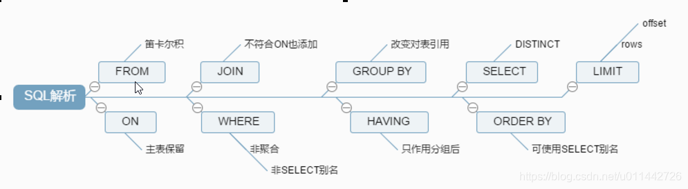

[toc]

# 基础

## 概念

数据库 DB：存储数据的仓库，保存一系列有组织的数据

数据库管理系统 DBMS：数据库通过DBMS创建和操作的容器

结构化查询语言 SQL：与数据库通信的语言

SQL的优点：1）不是某个特定数据库供应商专有的语言，几乎所有DBMS都支持SQL；2）简单易学；3）虽然简单，但实际上是一种强有力的语言，灵活使用其语言元素，可以进行非常复杂和高级的数据库操作

## 存储数据的特点

* 将数据放到表中，表再放到库中
* 一个数据库中可以有多个表，每个表都有一个的名字，用来标识自己。表名具有唯一性。
* 表具有一些特性，这些特性定义了数据在表中如何存储，类似java中“类”的设计。
* 表由列组成，我们也称为字段。所有表都是由一个或多个列组成的，每一列类似java 中的“属性”
* 表中的数据是按行存储的，每一行类似于java中的“对象”

## MySQL

### 登录方式

mysql -h [主机名] -P [端口号] -u [用户名] -p[密码] 

**注意：**-p和密码之间不能有空格

### 常见命令

show databases：查看所有数据库

show tables {from [数据库名]}：查看指定数据库的所有数据表

select database()：查看当前所在数据库

select version()：查看当前MySQL版本

use [数据库名]：使用数据库

desc [数据表名]：查看表结构

show variables like ‘%char%’：查看当前字符集

### 语法规范

1. 不区分大小写，建议关键字大写，表民、列名小写
2. 每句话用;或\g结尾
3. 各子句一般分行写
4. 关键字不能缩写也不能分行
5. 用缩进提高语句的可读性
6. 注释方式：单行注释：#/-- 注释文字；多行注释：/* 注释文字 */

## DQL 数据查询语言

### 基础查询

**SELECT-FROM语句**

特点：1）查询列表可以是表中的字段，常量，表达式和函数；2）查询结果是一个虚拟的表格

着重号（``）可表明为字段名称而非关键字

使用AS关键字或者空格声明别名，可以便于理解，同时如果要查询字段有重名情况，使用别名可以加以区分。如果别名出现特殊字符，对于别名字段需要添加**双引号**。如果表已经有别名，则不能使用原始表名

MySQL中的加号只能作为**运算符**，即两个操作数都为数值型，做加法运算；若一方为字符型，则尝试将字符型转换成数值型，如果转换失败，字符型数值转为0；若一方为null，则最终结果为null

### 条件查询

**WHERE子句**

分类：1）按条件表达式筛选（>/</=/<>/>=/<=）；2）按逻辑表达式筛选（AND/OR/NOT）；3）模糊查询（LIKE/BETWEEN AND/IN/IS NULL）

通配符：1）`%` - 任意多个字符；2）`_` - 任意单个字符；3）`\` 或 `ESCAPE` - 转义符

BETWEEN AND注意事项：1）包含临界值；2）注意前后顺序；3）前后临界值类型一致

IN注意事项：1）列表中各项类型一致或兼容；2）不支持模糊查询

`<=>` 安全等于：可以判断NULL值的等于符号

### 排序查询

**ORDER BY子句**

ASC：升序，默认排序方式；DESC：降序

支持的排序方式：字段，表达式，别名，函数

如果有多个排序条件，可以将排序条件按优先级放入子句中

### 常见函数

1. 单行函数
   - 字符函数：LENGTH，CONCAT，LOWER，UPPER，SUBSTR（**索引从1开始**），INSTR（第一次出现的索引），TRIM（前后去空），LPAD/RPAD（左/右填充），REPLACE
   - 数学函数：ROUND，CEIL，FLOOR，TRUNCATE，MOD
   - 日期函数：NOW（当前系统日期时间），CURDATE，CURTIME，str_to_date（字符转日期）， date_format（日期转字符）, YEAR/MONTH/DAY/HOUR/MINUTE/SECOND，DATEDIFF
   - 流程控制函数：IF（三元运算符），CASE（类switch case结构 `CASE...[WHEN...THEN...]{ELSE...}END`，类多重if结构 `CASE [WHEN... THEN...]ELSE...END`）
   - 其他函数
2. 分组函数/聚合函数：统计使用（SUM，AVG，MAX，MIN，COUNT）
   - SUM，AVG只处理数值型；MAX，MIN，COUNT支持其他类型
   - 所有函数都忽略NULL值
   - 和分组函数一同查询的字段要求是GROUP BY后的字段

### 分组查询

**GROUP BY子句**

将表中数据分成若干组

**HAVING子句**添加分组后的筛选条件（筛选条件与分组函数相关）

GROUP BY后的字段可出现在SELECT语句之后

GROUP BY后也可以添加函数表达式和多个字段（没有顺序要求）

### 连接查询

SQL92标准（仅支持内连接）

1. 等值连接：连接条件取等号，$n$ 表连接至少需要 $n-1$ 个连接条件，结果为多表的交集
2. 非等值连接：连接条件为非等号
3. 自连接：特殊的等值连接，连接对象均为一张表

SQL99标准（除全外连接都支持，连接条件放在 **ON** 子句后）

1. 内连接：采用 **INNER(可省) JOIN** 关键字
2. 外连接：采用 **LEFT/RIGHT JOIN** 关键字，用于查询一个表中有，另一个表没有的情况。查询结果为主表中的所有记录，如果从表中不存在匹配的情况，则使用NULL填充。全外连接不分为主从表，查询结果会显示所有记录
3. 交叉连接：采用 **CROSS JOIN** 关键字，得到结果为笛卡尔积

### 子查询

出现在其他子句中的SELECT语句，被称为子查询或内查询，子查询需要放在小括号内，使得子查询执行优先级高于主查询

子查询分类

1. 标量子查询：结果集只有一行一列，出现于SELECT/WHERE/HAVING子查询
2. 列子查询：结果集为一列多行，出现于WHERE/HAVING子查询
3. 行子查询：结果集为一行多列，出现于WHERE/HAVING子查询，等价于多个条件且条件符号相同
4. 表子查询：结果集为多行多列，出现于FROM/WHERE/HAVING/EXISTS子查询

### 分页查询

**LIMIT子句**

当返回数据量很大时，可通过分页查询降低开销

参数为offset（起始索引，从0开始）和size（显示的条目个数）

### 联合查询

**UNION关键字**

查询结果来自多个表，且表间没有直接的连接关系，将多条查询结果合并成一个结果

多条查询语句的查询列数和查询字段的类型需要保持一致

UNION关键字默认去重，使用UNION ALL可保留所有记录

## DML 数据操作语言

### 插入

**INSERT INTO ... VALUES ...**

插入值与列顺序需要保持一致

插入值类型需要与列类型一致或兼容

可以省略列名，默认所有列都需要插入值，并且与表中列顺序一致

可以使用子查询

### 修改

**UPDATE ... SET ...**

一般需要WHERE子句加入筛选条件

修改多表记录时，需要使用连接操作

### 删除

**DELETE FROM ...**

一般需要WHERE子句加入筛选条件

**TRUNCATE语句**

清空相应表中的所有数据

如果删除表中存在自增长列，DELTE删除后插入新数据会从断点开始自增，而TRUNCATE删除后插入会从1开始

TRUNCATE没有返回值且不能回滚，DELETE有返回值可以回滚

## DDL 数据定义语言

### 管理库

**CREATE DATABASE**语句创建库， 可以添加IF NOT EXISTS，用于判断是否存在

**ALTER DATABASE**语句更改库，可修改库的字符集

**DROP DATABASE**语句删除库，可以添加IF EXISTS用于判断库是否存在

### 管理表

**CREATE TABLE**语句创建表，可在其中对每一列声明其长度和约束

**ALTER TABLE**语句修改表，可修改表名 (RENAME TO)，列名 (CHANGE，修改列名时需要同时表明列类型)，列类型 (MODIFY)，列约束 (MODIFY) 和添加 (ADD，可以使用FIRST/AFTER规定添加位置)/删除 (DROP) 列

**DROP TABLE**语句删除表，可以添加IF EXISTS用于判断库是否存在

**CREATE TABLE ... LIKE ...**语句复制表的结构，若想要复制数据，需要使用查询

### 数据类型

#### 整型

根据保存数值范围可分为Tinyint，Smallint，Mediumint，INT，Bigint

默认为有符号整数，可使用 UNSIGNED 设置为无符号整数

如果插入数值超出范围，插入结果为临界值

#### 浮点型

FLOAT，DOUBLE，DEC/DECIMAL（定点型）

可以设置整个数的长度和保留的小数位数

定点型精度更高，如果要求插入精度较高则考虑使用定点型

#### 字符型

包含CHAR，VARCHAR，BINARY，VARBINARY，BIT，ENUM，SET，TEXT，BLOB（二进制）

VARCHAR长度可变，更省空间

#### 日期型

DATE，DATETIME，TIMESTAMP，TIME，YEAR

TIMESTAMP和实际时区有关，而DATETIME不受时区影响

### 约束

分类：1）NOT NULL：字段必须非空；2）DEFAULT：字段有默认值；3）PRIMARY KEY：字段为主键，唯一且非空；4）UNIQUE：字段值唯一；5）CHECK：字段值需要满足条件（MySQL不支持）；6）FOREIGN KEY：字段值在主表中必须存在，列类型与主表关联列一致或兼容（**主表的关联列必须为key，即一般为主键或唯一键**）

#### 列级约束

支持默认、非空、主键和唯一约束

修改表时添加/删除需要使用 ALTER TABLE ... MODIFY COLUMN ... 语句 

#### 表级约束

**CONSTRAINT子句**

除非空和默认都支持

修改表时添加需要使用 ALTER TABLE ... ADD ... 语句

修改表时删除需要使用 ALTER TABLE ... DROP ... 语句

### 标识列

**AUTO_INCREMENT关键字**

自增长列，系统可提供默认的序列值

一个表中只能有一个标识列，标识列要求为一个key，标识列类型必须为数值型

## TCL 事务控制语言

### 事务

隐式事务：没有明显的开始和终止标记，如INSERT，UPDATE，DELETE

显式事务：有明显的开始（START TRANSACTION）和终止（COMMIT/ROLLBACK）标记。需要设置禁用自动提交（SET AUTOCOMMIT=0）

TRUNCATE 操作不支持回滚

### 并发问题

脏读：读取了另一个事务已更新但未提交的字段值

不可重复读：在另一个事务更新提交前后读取到不同的值

幻读：读取到另一个事务插入的行

## 视图

通过表动态生成的临时数据

优点：1）重用SQL语句；2）简化复杂SQL操作；3）保护数据，提高安全性

使用 **CREATE VIEW ... AS ...** 语句创建视图，主要用于较复杂的SQL查询在多个地方使用的场景

使用 **CREATE OR REPLACE VIEW ... AS ...** 或 **ALTER VIEW ... AS ...** 语句修改视图

使用 **DROP VIEW** 删除视图

不能更新的视图

- 包含以下关键字的sql语句：分组函数、DISTINCT、GROUP BY、HAVING、UNION或者UNION ALL
- 常量视图
- SELECT中包含子查询
- JOIN
- FROM 一个不能更新的视图
- WHERE 子句的子查询引用了 FROM 子句中的表

## 变量

### 系统变量

由系统提供，属于服务器层面

查看全局变量需要使用 GLOBAL 关键字，默认为会话变量

SHOW {GLOBAL/SESSION} VARIABLES：查看系统变量

SELECT @@{GLOBAL.}系统变量：查看指定的系统变量

SET {@@{GLOBAL.}系统变量}：为系统变量赋值

### 自定义变量

用户变量：针对当前会话有效

- 声明：SET @变量名 =/:= 值，SELECT @变量名 := 值
- 赋值：声明方法或者SELECT ... INTO ...

局部变量：只在定义的块中有效，必须在块中的开始

- 声明：DECLARE 变量名 类型 {DEFAULT 值}
- 赋值：SET 方法或者 SELECT INTO 方法

## 存储过程和函数

### 存储过程

一组预先编译好的SQL语句集合，适合批量插入和更新

好处：1）提高代码的重用性；2）简化操作；3）减少编译次数和与数据库服务器的连接次数

创建语法：CREATE PROCEDURE 名字 (参数列表) BEGIN ... END

调用语法：CALL 名字 (参数列表)

删除语法：DROP PROCEDURE 名字

查看信息语法：SHOW CREATE PROCEDURE 名字

参数列表包含1）参数模式；2）参数名；3）参数类型

**参数模式**

1. **IN**：该参数作为输入，即需要调用方传入值
2. **OUT**：该参数作为输出，即可作为返回值
3. **INOUT**：该参数作为输入和输出

存储过程体中每句话结束使用 `;` 结尾，而存储过程结束标记需要使用 DELIMITER 定义

### 函数

一组预先编译好的SQL语句集合，但有且仅有**一个**返回值，适合处理数据后返回结果

创建语法：CREATE FUNCTION 名字 (参数列表) RETURNS 返回类型 BEGIN ... END

调用语法：SELECT 名字 (参数列表)

删除语法：DROP FUNCTION 名字

查看信息语法：SHOW CREATE FUNCTION 名字

参数列表包含1）参数名；2）参数类型

## 流程控制结构

### 分支结构

#### IF 函数

实现简单的双分支

语法：IF (条件, 成功返回值, 失败返回值)

#### CASE 结构

用于实现等值判断（任何地方）和区间判断（只能在BEGIN END中）

语法

1. 等值判断 - CASE 变量|表达式|字段 [WHEN 判断值 THEN 返回值] {ELSE 返回值} END CASE
2. 区间判断 - CASE 变量|表达式|字段 [WHEN 判断条件 THEN 返回值] {ELSE 返回值} END CASE

如果没有 ELSE 子句且所有判断都不满足，则返回NULL

#### IF 结构

实现多重分支，只能定义在BEGIN END中

语法：IF 条件 THEN 语句 [ELSEIF 条件 THEN 语句] {ELSE 语句} END IF

### 循环结构

可分为WHILE，LOOP，REPEAT

循环控制分为 ITERATE（类似于continue）和 LEAVE（类似于break）

语法（每种都可以添加标签，用于添加循环控制）

1. WHILE 循环条件 DO 循环体 END WHILE - 先判断后执行
2. LOOP 循环体 END LOOP - 用于模拟死循环
3. REPEAT 循环体 UNTIL 结束循环条件 - 先执行后判断

# 高级

## 主要文件

`log-bin` 文件：主要用于主从复制

`log-error` 文件：记录严重的警告和错误信息，每次启动和关闭的详细信息等，默认关闭

`log` 文件：记录查询的SQL语句，默认关闭

`frm` 文件：存放表结构

`myd` 文件：存放表数据

`myi` 文件：存放表索引

## 逻辑架构

第一层：**连接层**。客户端和连接服务，包含本地sock通信和大多数基于客户端/服务端工具实现的类似于tcp/ip的通信。主要完成一些类似于连接处理、授权认证、及相关的安全方案。在该层上引入了线程池的概念，为通过认证安全接入的客户端提供线程。同样在该层上可以实现基于SSL的安全链接。服务器也会为安全接入的每个客户端验证它所具有操作权限

第二层：**服务层**。主要完成核心服务功能，如SQL接口，缓存查询，SQL分析和优化以及部分内置函数的执行。所有跨存储引擎的功能也在这一层实现，如过程、函数等。在该层，服务器会解析查询并创建相应的内部解析树，并对其完成相应的优化如确定查询表的顺序，是否利用索引等，最后生成相应的执行操作

第三层：**存储引擎层**。负责MySQL中数据的存储和提取，服务器通过API与存储引擎进行通信，可根据实际需求进行选取。插件式的存储引擎架构将查询处理和其它的系统任务以及数据的存储提取相分离

第四层：**文件存储层**。将数据存储在文件系统之上，并完成与存储引擎的交互

## 存储引擎

| 对比项       | MyISAM                                                       | InnoDB                                                       |
| ------------ | ------------------------------------------------------------ | ------------------------------------------------------------ |
| **主外键**   | 不支持                                                       | 支持                                                         |
| **事务**     | 不支持                                                       | 支持                                                         |
| **行表锁**   | 表锁，即使操作一条记录也会锁住整个表 不适合高并发的操作 | 行锁，操作时只锁某一行，不对其它行有影响 适合高并发的操作 |
| **缓存**     | 只缓存索引，不缓存真实数据                                   | 不仅缓存索引还要缓存真实数据，对内存要求较高，而且内存大小对性能有决定性的影响 |
| **表空间**   | 小                                                           | 大                                                           |
| **关注点**   | 性能                                                         | 事务                                                         |
| **默认安装** | Y                                                            | Y                                                            |

### 选型

1.  **高井发读写交易**：对于需要处理大量并发读写操作的电商交易系统，**InnoDB** 是首选存储引擎。它支持事务处理、行级锁定和外键约束，能够保证数据的完整性和一致性。InnoDB的聚集索引和辅助索引结构也有助于提高查询性能。
2.  **读多写少的查询密集型场景**：如果业务场景主要是读取操作，如商品浏览和展示，可以考虑使用 **MyISAM** 存储引擎。MyISAM提供全文索引功能，适合文本搜索和匹配，且在读多写少的情况下，表级锁定可以提供较好的读性能
3.  **临时数据存储**：对于需要快速读取和不关心数据持久性的临时数据，如购物车中的临时商品信息，可以使用 **Memory** 存储引擎。它将所有数据存储在内存中，提供极快的数据访问速度，但数据在数据库重启后会丢失
4.  **数据归档**：对于需要长期存储的历史订单数据，可以使用 **Archive** 存储引擎。Archive 引擎优化了数据存储，适合存储大量未修改的数据，如日志信息

## SQL性能下降原因

1. 查询数据过多：是否可拆分
2. 索引失效：单值和复合索引。条件多时，可以建共同索引(混合索引)。混合索引一般会偶先使用
3. 关联过多表，JOIN操作过多：尽量先过滤后JOIN
4. 服务器调优及各个参数设置（缓冲、线程数等）

## SQL执行顺序

## SQL JOIN

## 索引

### 概念

索引（Index）是帮助MySQL高效获取数据的数据结构，本质上是**排好序**的**快速查找**数据结构

在数据之外，数据库系统还维护着满足特定查找算法的数据结构，这些数据结构以某种方式引用（指向）数据，
这样就可以在这些数据结构上实现高级查找算法。这种数据结构，就是索引

一般来说索引本身也很大，不可能全部存储在内存中，因此索引往往以索引文件的形式存储的磁盘上

### 优劣势

优势

1. 提高数据检索效率，降低数据库I/O成本
2. 通过索引列对数据进行排序，降低数据排序的成本，降低了CPU消耗

劣势

1. 索引同样是一张表，保存主键与索引字段，因此索引也占用空间
2. 索引会降低更新表的速度
3. 建立最优索引也需要花时间研究

### 索引分类

**单值索引**：一个索引只包含单个列，一个表可以有多个单列索引

**唯一索引**：索引列的值必须唯一，但允许有空值

**复合索引**：一个索引包含多个列。在数据库操作期间，复合索引比单值索引所需要的开销更小(对于相同的多个列建索引)，当表的行数远大于索引列的数目时可以使用复合索引

四种方式来添加数据表的索引：

ALTER TABLE tbl_name ADD PRIMARY KEY (column_list): 该语句添加一个主键，这意味着索引值必须是唯一的，且不能为NULL。

ALTER TABLE tbl_name ADD UNIQUE index_name (column_list): 这条语句创建索引的值必须是唯一的（除了NULL外，NULL可能会出现多次）。

ALTER TABLE tbl_name ADD INDEX index_name (column_list): 添加普通索引，索引值可出现多次。

ALTER TABLE tbl_name ADD FULLTEXT index_name (column_list):该语句指定了索引为 FULLTEXT...

### MySQL索引结构

B树索引：MyISAM的默认普通索引

B+树索引：InnoDB的默认普通索引

聚簇索引：它并不是一种单独的索引类型，而是一种数据存储方式。聚簇表示数据行和相邻的键值进错的存储在一起

Full-text 全文索引：全文索引（也称全文检索）是目前搜索引擎使用的一种关键技术。它能够利用【分词技术】等多种算法智能分析出文本文字中关键词的频率和重要性，然后按照一定的算法规则智能地筛选出我们想要的搜索结果

Hash索引：只有Memory, NDB两种引擎支持，Memory引擎默认支持Hash索引，如果多个hash值相同，出现哈希碰撞，那么索引以链表方式存储

### 需要创建索引的场景

- 主键自动建立唯一索引
- 频繁作为查询条件的字段应该创建索引(where 后面的语句)
- 查询中与其它表关联的字段，外键关系建立索引
- 单键/组合索引的选择问题，who？(在高并发下倾向创建组合索引)
- 查询中排序的字段，排序字段若通过索引去访问将大大提高排序速度
- 查询中统计或者分组字段

### 一定不要创建索引的场景

- 表记录太少
- 经常增删改的表
  - Why:提高了查询速度，同时却会降低更新表的速度，如对表进行INSERT、UPDATE和DELETE。 因为更新表时，MySQL不仅要保存数据，还要保存一下索引文件
- Where条件里用不到的字段不创建索引
- 数据重复且分布平均的表字段，因此应该只为最经常查询和最经常排序的数据列建立索引。 注意，如果某个数据列包含许多重复的内容，为它建立索引就没有太大的实际效果。

## 性能分析

### 常见瓶颈

1. CPU 
   - SQL中对大量数据进行比较、关联、排序、分组
2. I/O
   - 实例内存满足不了缓存数据或排序等需要，导致产生大量 物理 IO
   - 查询执行效率低，扫描过多数据行
3. 锁
   - 不适宜的锁的设置，导致线程阻塞，性能下降
   - 死锁，线程之间交叉调用资源，导致死锁，程序卡住
4. 服务器硬件的性能瓶颈：top, free, iostat和vmstat来查看系统的性能状态

### EXPLAIN 关键字

使用 `EXPLAIN` 关键字可以模拟优化器执行SQL查询语句，从而知道MySQL是 如何处理你的SQL语句的。分析你的查询语句或是表结构的性能瓶颈

**作用**

- 表的读取顺序
- 哪些索引可以使用
- 数据读取操作的操作类型
- 哪些索引被实际使用
- 表之间的引用
- 每张表有多少行被优化器查询

**字段解释**

- id
  - SELECT 查询的序列号, 包含一组数字，表示查询中执行 SELECT 子句或操作表的顺序
  - 三种情况
    - id相同，执行顺序由上至下
    - id不同，如果是子查询，id的序号会递增，id值越大优先级越高，越先被执行
    - id相同不同同时存在时，id相同可认为是一组，从上往下顺序执行了；在所有组中，id值越大，优先级越高，越先执行
- select_type
  - 声明查询类型，主要用于区别普通查询、联合查询、子查询等复杂查询
  - SIMPLE
    - 简单的 select 查询,查询中不包含子查询或者UNION
  - PRIMARY
    - 查询中若包含任何复杂的子部分，最外层查询则被标记为Primary
  - SUBQUERY
    - 在SELECT或WHERE列表中包含了子查询
  - DERIVED
    - 在FROM列表中包含的子查询被标记为DERIVED(衍生) MySQL会递归执行这些子查询, 把结果放在临时表里
  - UNION
    - 若第二个SELECT出现在UNION之后，则被标记为UNION； 若UNION包含在FROM子句的子查询中,外层SELECT将被标记为：DERIVED
  - UNION RESULT
    - 从UNION表获取结果的SELECT
- table
  - 显示这一行的数据是关于哪张表的
- type
  - 显示访问类型，从**最好到最差**依次是system>const>eq_ref>ref>range>index>ALL。一般来说，至少保证达到range，最好能达到ref
  - system
    - 表只有一行记录（等于系统表），这是const类型的特列，平时不会出现，这个也可以忽略不计
  - const
    - 表示通过索引一次就找到了, const用于比较primary key或者unique索引。因为只匹配一行数据，所以很快。如将主键置于where列表中，MySQL就能将该查询转换为一个常量
  - eq_ref
    - 唯一性索引扫描，对于每个索引键，表中只有一条记录与之匹配。常见于主键或唯一索引扫描
  - ref
    - 非唯一性索引扫描，返回匹配某个单独值的所有行。本质上也是一种索引访问，它返回所有匹配某个单独值的行，然而， 它可能会找到多个符合条件的行，所以他应该属于查找和扫描的混合体
  - range
    - 只检索给定范围的行,使用一个索引来选择行。key 列显示使用了哪个索引 一般就是在你的where语句中出现了between、<、>、in等的查询 这种范围扫描索引扫描比全表扫描要好，因为它只需要开始于索引的某一点，而结束于另一点，不用扫描全部索引
  - index
    - Full Index Scan，index与ALL区别为index类型只遍历索引树。这通常比ALL快，因为索引文件通常比数据文件小。 也就是说虽然ALL和Index都是读全表，但index是从索引中读取的，而all是从硬盘中读的
  - ALL
    - Full Table Scan，将遍历全表以找到匹配的行
- possible_keys
  - 显示可能应用在这张表中的索引，一个或多个。 查询涉及到的字段上若存在索引，则该索引将被列出，但不一定被查询实际使用
- key
  - 实际使用的索引。如果为NULL，则没有使用索引
- key_len
  - 表示索引中使用的字节数，可通过该列计算查询中使用的索引的长度，越小越好。能够帮助检查是否充分使用索引
- ref
  - 显示索引的哪一列被使用了，如果可能的话，最好是一个常量。哪些列或常量被用于查找索引列上的值
- rows
  - 显示MySQL认为它执行查询时必须检查的行数，越少越好
- extra
  - 包含不适合在其他列中显示但十分重要的额外信息
  - Using filesort 
    - 说明mysql会对数据使用一个外部的索引排序，而不是按照表内的索引顺序进行读取。 MySQL中无法利用索引完成的排序操作称为“文件排序”
  - Using temporary 
    - 使了用临时表保存中间结果,MySQL在对查询结果排序时使用临时表。常见于排序 order by 和分组查询 group by
  - Using index
    - 表示相应的select操作中使用了覆盖索引(Covering Index)，避免访问了表的数据行，效率不错！ 如果同时出现using where，表明索引被用来执行索引键值的查找; 如果没有同时出现using where，表明索引只是用来读取数据而非利用索引执行查找
    - 覆盖索引：SELECT数据列只用从索引中就能获得，不必读取数据行，MySQL可利用索引返回SELECT列表中的字段，而不必根据索引再次读取数据文件，即**查询列被索引覆盖**
  - Using where
    - 表明使用了where过滤
  - using join buffer
    - 使用了连接缓存
  - impossible where
    - where子句的值总是false，不能用来获取任何元组
  - select tables optimized away
    - 在没有GROU PBY子句的情况下，基于索引优化MIN/MAX操作或者 对于MyISAM存储引擎优化COUNT(*)操作，不必等到执行阶段再进行计算， 查询执行计划生成的阶段即完成优化
  - distinct
    - 优化distinct操作，在找到第一匹配元组后停止找同样值的动作

### 工具

1.  **MySQL Enterprise Monitor**：这是 Oracle 提供的官方 MySQL 监控工具，提供实时监控功能，包括性能和可用性监控、查询分析、集群监控等。它具有可视化界面，可以轻松管理和监控多个 MySQL 服务器
2.  **Percona Monitoring and Management（PMM）**：Percona 提供的开源监控工具，专门用于监控 MySQL 和其他数据库系统。PMM 提供查询分析、系统指标监控、安全功能、集成性能顾问和历史数据分析等功能
3.  **Prometheus**：这是一个开源的监控工具，通过 MySQL Exporter 集成来收集 MySQL 的性能指标。通常与 Grafana 一起使用，后者是一个可视化工具，用于创建图表和指标

## 索引失效及优化

出现原因

1. 对于复合索引，违反最佳最左前缀法则（如果索引了多列，要遵守最左前缀法则。指的是查询从索引的最左前列开始并且不跳过索引中的列）
2. 在索引列上做任何操作，如计算、函数、类型转换
3. 复合索引中若中间列使用范围查询，剩余列索引失效
4. 使用非等值（不等于）条件。IS NOT NULL也无法使用索引,但是IS NULL是可以使用索引的
5. 使用以通配符 `%` **开始**的LIKE查询。使用覆盖索引解决
6. 字符串类型未使用单引号
7. 使用OR连接条件，可能导致索引失效

一般性建议

- 对于单键索引，尽量选择针对当前query过滤性更好的索引
- 在选择组合索引的时候，当前query中过滤性最好的字段在索引字段顺序中，位置越靠前越好。(避免索引过滤性好的索引失效)
- 在选择组合索引的时候，尽量选择可以能够包含当前query中的where字句中更多字段的索引
- 尽可能通过分析统计信息和调整query的写法来达到选择合适索引的目的

优化口诀

全值匹配我最爱，最左前缀要遵守
带头大哥不能死，中间兄弟不能断
索引列上少计算，范围之后全失效
LIKE百分写最右，覆盖索引不写星
不等空值还有or，素引失效要少用
VAR引号不可丢，SQL高级也不难！

## 查询优化

### 小表驱动大表

1. 保证被驱动表的join字段已经被索引
2. left join 时，选择小表作为驱动表，大表作为被驱动表
3. inner join 时，mysql会自己帮你把小结果集的表选为驱动表
4. 子查询尽量不要放在被驱动表，有可能使用不到索引
5. IN/EXISTS要根据数据量大小进行适合选择，如果子查询中的表较大，则采用EXISTS

### ORDER BY优化

ORDER BY子句，尽量使用Index方式排序,避免使用FileSort方式排序

- MySQL支持二种方式的排序，FileSort和Index。Index效率高，指MySQL扫描索引本身完成排序。FileSort方式效率较低
- ORDER BY满足两情况，会使用Index方式排序
  - ORDER BY 语句使用索引最左前列
  - 使用Where子句与Order BY子句条件列组合满足索引最左前列
  - 注意：如果出现不同顺序要求，即有升有降，也会使用Filesort

**双路排序**：MySQL 4.1之前是使用双路排序,字面意思就是两次扫描磁盘，最终得到数据， 读取行指针和orderby列，对他们进行排序，然后扫描已经排序好的列表，按照列表中的值重新从列表中读取对应的数据输出

**单路排序**

- 从磁盘读取查询需要的所有列，按照order by列在buffer对它们进行排序，然后扫描排序后的列表进行输出。 它的效率更快一些，避免了第二次读取数据。并且把随机IO变成了顺序IO,但是它会使用更多的空间， 因为它把每一行都保存在内存中了
- 可能出现的问题：在sort_buffer中，方法B比方法A要多占用很多空间，因为方法B是把所有字段都取出, 所以有可能取出的数据的总大小超出了sort_buffer的容量，导致每次只能取sort_buffer容量大小的数据，进行排序（创建tmp文件，多路合并），排完再取取sort_buffer容量大小，再排……从而多次I/O
- 优化策略：1）增大 `sort_buffer_size` 参数的设置；2）增大 `max_length_for_sort_data` 参数的设置；3）去掉select 后面不需要的字段

### GROUP BY优化

- group by实质是先排序后进行分组，遵照索引建的最佳左前缀
- 当无法使用索引列，增大 `max_length_for_sort_data` 参数的设置+增大 `sort_buffer_size` 参数的设置
- where高于having，能写在where限定的条件就不要去having限定了。

### 慢查询日志

MySQL的慢查询日志是MySQL提供的一种日志记录，它用来记录在MySQL中响应时间超过阈值的语句，具体指运行时间超过 `long_query_time` 值的SQL，则会被记录到慢查询日志中

MySQL默认关闭慢查询日志，使用 `SHOW VARIABLES LIKE '%slow_query_log%';` 查看慢查询是否开启；通过 `set global slow_query_log=1;` 开启慢查询

使用 `mysqldumpslow` 日志分析工具返回想要的SQL语句

### SHOW PROFILE

Show Profile 是MySQL 提供可以用来分析当前会话中语句执行的资源消耗情况。可以用于SQL的调优的测量

分析步骤

1. 查看当前的MySQL版本是否支持，使用 `Show variables like 'profiling';`

2. 默认关闭，使用前开启功能

3. 运行SQL语句

4. 使用 `show profiles` 查看当前所有执行的SQL语句和运行时间

5. 使用 `show profile [参数] for query [id]` 具体诊断SQL语句

   -   参数列表

     | 参数             | 描述                                                         |
     | ---------------- | ------------------------------------------------------------ |
     | ALL              | 显示所有的开销信息                                           |
     | BLOCK IO         | 显示块IO相关开销                                             |
     | CONTEXT SWITCHES | 上下文切换相关开销                                           |
     | CPU              | 显示CPU相关开销信息                                          |
     | IPC              | 显示发送和接收相关开销信息                                   |
     | MEMORY           | 显示内存相关开销信息                                         |
     | PAGE FAULTS      | 显示页面错误相关开销信息                                     |
     | SOURCE           | 显示和 Source_function、Source_file、Source_line 相关的开销信息 |
     | SWAPS            | 显示交换次数相关的开销信息                                   |

开发注意的字段

1. 查询结果太大，内存都不够用了往磁盘上搬了 Converting HEAP to MyISAM
2. 创建临时表 Creating tmp table
3. 把内存中临时表复制到磁盘 Copying to tmp table on disk
4. 锁 Locked

### 全局查询日志

用于测试环境

使用 `set global general_log=1;` 开启功能

全局查询日志可以存放到日志文件中，也可以存放到Mysql系统表中。存放到日志中性能更好一些，存储到表中，使用 `set global log_output='TABLE'` 设置记录在 `mysql.general_log` 表中

### 优化技巧

**索引优化**：

-   确保对经常用于“WHERE’子句、、JOIN’条件和'ORDER BY^排序的列创建索引
-   避免对低选择性的列（如性别、状态等）创建索引，因为它们不会显著加快查询速度
-   使用合适的索引类型，如B-Tree、Hash、Full-text等
-   考虑使用复合索引，并注意索引列的顺序，以匹配查询模式
-   定期重建索引以减少碎片化

**查询语句优化**：

-   使用^EXPLAIN 关键字分析查询语句的执行计划，查看是否使用了索引
-   避免使用'SELECT *，只选择需要的列

-   減少子查询和复杂的JOIN操作，尽量使用临时表或表变量
-   使用“LIMIT’来限制返回的数据量。

**数据库结构优化**：

-   考虑数据库的规范化和反规范化，以减少数据冗余和提高查询效率
-   垂直分割（Splitting）大表，将不常用的列移动到单独的表中
-   水平分割（Sharding）大表，将数据分布到多个表或数据库中

**缓存优化**：

-   使用MySQL的查询缓存或应用层缓存来减少对数据库的直接访问
-   合理配置缓存大小和有效期，以确保缓存数据的时效性和准确性

**服务器和硬件优化**：

-   确保数据库服务器有足够的内存和CPU资源
-   使用快速的存储系统，如SSD，以提高数据的读写速度

**配置优化**：

-   根据实际负载调整MySQL的配置参数，如innodb_buffer_pool_size”、'query_cache_size"等

-   开启或优化慢查询日志，以便分析和优化慢查询

**使用合适的存储引擎**：

-   根据业务需求选择合适的存储引擎，如InnoDB、MyISAM或其他引擎

**避免全表扫描**：

-   确保查询能够利用索引，避免不必要的全表扫描

**批量数据处理**：

-   对于批量数据插入、更新或删除操作，使用批处理来减少事务开销

**读写分离**

-   在高并发的读操作场景下，使用主从复制和读写分离来分散数据库负载

### MyBatis 层面优化

**连接池优化**

数据库连接是一种有限的资源，尤其是在高并发的应用中。合理配置连接池可以显著提高数据库操作的性能和稳定性

-   **最大连接数（maxTotal）**：这个参数定义了连接池中最大的连接数。如果请求连接的数量超过了这个值，新的数据库操作请求将会等待，直到连接被释放。设置这个值时需要考虑应用的并发需求和数据库服务器的承載能力
-   **最小空闲连接数（minIdle）**：这个参数定义了连接池中最小的空闲连接数。连接池会尝试维持至少这么多的空闲连接，以便于新的请求可以立即获取连接而不需要等待。这样可以减少创建新连接的开销
-   **连接最大空闲时间（maxIdLeMillis）**：这个参数定义了连接在池中空闲的最长时间。超过这个时间的空闲连接将会被关闭，以释放资源
-   **连接最大存活时间（maxWaitMillis）**：这个参数定义了在抛出异常之前，申请连接的最大等待时间。如果设置得太短，可能会导致在高并发环境下，用户请求因等待数据库连接而超时
-   **连接测试语句（testOnBorrow/testOnReturn）**：这些参数定义了在获取连接和归还连接时，是否进行连接有效性测试。这有助于避免使用已经失效的数据库连接

**延迟加载**

延迟加载是一种按需加载数据的策略，特别适用于关联查询，可以减少初次查询时的数据加载量，从而提高性能。

-   **开后延迟加载**：在 MyBatis 配置文件中设置 `lazyLoadingEnabled` 为 `true`，以开启延迟加载功能

- **使用 `select` 属性**：在 `<association>` 或 `<collection>` 标签中使用 `select` 属性指定一个方法，当访问关联属性时，会调用该方法加载关联数据

-   **注意延迟加载的适用场景**：延迟加载适用于那些不经常访问关联数据，或者关联数据量不大的情况。如果每次操作都需要加载关联数据，那么延迟加载可能不会带来性能提升
-   **避免 N+1 查询问题**：在没有正确使用延迟加载的情况下，可能会产生 N+1 查询问题，即查询N 条数据时，会产生 N+1 次数据库查询。合理使用延迟加载可以避免这个问题

## 事务

### ACID特性

1. **原子性**(Atomicity)：一个事务中的所有操作要么全部完成，要么全部不完成，不会结束在中间的某个环节。并且在执行过程中如果出现错误，会回滚到开始前的状态
2. **一致性**(Consistency)：一个事务操作前和操作后的数据要满足完整性约束（从一个合法状态转移到另一个合法状态），数据库保持一致性状态
3. **隔离性**(Isolation)：因为数据库允许多个并发事务同时对其数据进行读写和修改，所以需要将每个事务隔离开，保证一个事务的执行不会影响到其他事务
4. **持久性**(Durability)：一旦事务被提交，它对数据库的改变就是永久性的，即使在系统故障或崩溃后也能够保持，被撤销事务的影响是可恢复的

### 状态

- 活动的（active）：事务对应的数据库操作正在执行过程中时，我们就说该事务处在 活动的状态
- 部分提交的（partially committed）：当事务中的最后一个操作执行完成，但由于操作都在内存中执行，所造成的影响并 没有刷新到磁盘 时，我们就说该事务处在部分提交的状态
- 失败的（failed）：当事务处在活动的或者部分提交的状态时，可能遇到了某些错误（数据库自身的错误、操作系统 错误或者直接断电等）而无法继续执行，或者人为的停止当前事务的执行，我们就说该事务处在失败的状态
- 中止的（aborted）：如果事务执行了一部分而变为失败的状态，那么就需要把已经修改的事务中的操作还原到事务执行前的状态。换句话说，就是要撤销失败事务对当前数据库造成的影响。我们把这个撤销的过程称之为回滚 。当回滚操作执行完毕时，也就是数据库恢复到了执行事务之前的状态，我们就说该事务处在了中止的状态
-  提交的（committed）：当一个处在 部分提交的 状态的事务将修改过的数据都同步到磁盘上之后，我们就可以说该事务处在了提交的状态

### 数据并发问题

1. **脏写**（ Dirty Write ）：对于两个事务 Session A、Session B，如果事务Session A 修改了另一个未提交事务Session B 修改过的数据，那就意味着发生了脏写
2. **脏读**（ Dirty Read ）：对于两个事务 Session A、Session B，Session A 读取了已经被 Session B**更新但还没有被提交**的字段。 之后若 Session B 回滚 ，Session A 读取的内容就是**临时且无效**的。 
   - Session A和Session B各开启了一个事务，Session B中的事务先将studentno列为1的记录的name列更新 为'张三'，然后Session A中的事务再去查询这条studentno为1的记录，如果读到列name的值为'张三'，而 Session B中的事务稍后进行了回滚，那么Session A中的事务相当于读到了一个不存在的数据，这种现象就称之为脏读
3. **不可重复读**（ Non-Repeatable Read）：对于两个事务Session A、Session B，Session A读取了一个字段，然后 Session B **更新**了该字段。 之后 Session A 再次读取同一个字段， 值就不同了。那就意味着发生了不可重复读
   - 我们在Session B中提交了几个隐式事务 （注意是隐式事务，意味着语句结束事务就提交了），这些事务 都修改了studentno列为1的记录的列name的值，每次事务提交之后，如果Session A中的事务都可以查看到最新的值，这种现象也被称之为不可重复读
4. **幻读**（ Phantom ）：对于两个事务Session A、Session B, Session A 从一个表中读取了一个字段, 然后 Session B 在该表中**插入**了一些新的行。 之后, 如果 Session A 再次读取同一个表, 就会多出几行。那就意味着发生了幻读
   - Session A中的事务先根据条件 studentno > 0这个条件查询表student，得到了name列值为'张三'的记录； 之后Session B中提交了一个 隐式事务 ，该事务向表student中插入了一条新记录；之后Session A中的事务 再根据相同的条件 studentno > 0查询表student，得到的结果集中包含Session B中的事务新插入的那条记 录，这种现象也被称之为 幻读 。我们把新插入的那些记录称之为**幻影记录**

**严重性：脏写 > 脏读 > 不可重复读 > 幻读**

### 隔离级别

1. READ UNCOMMITTED ：**读未提交**，在该隔离级别，所有事务都可以看到其他未提交事务的执行结果。不能避免脏读、不可重复读、幻读
2. READ COMMITTED ：**读已提交**，它满足了隔离的简单定义：一个事务只能看见已经提交事务所做的改变。这是大多数数据库系统的默认隔离级别（但不是MySQL默认的）。可以避免脏读，但不可重复读、幻读问题仍然存在
3. REPEATABLE READ ：**可重复读**，事务A在读到一条数据之后，此时事务B对该数据进行了修改并提 交，那么事务A再读该数据，读到的还是原来的内容。可以避免脏读、不可重复读，但幻读问题仍然存在，**这是MySQL的默认隔离级别**
4. SERIALIZABLE ：**可串行化**，确保事务可以从一个表中读取相同的行。在这个事务持续期间，禁止 其他事务对该表执行插入、更新和删除操作。所有的并发问题都可以避免，但性能十分低下。能避免脏读、不可重复读和幻读

### 重做日志 Redo Log

提供再写入操作，恢复提交事务修改的页操作，用来保证事务的**持久性**

Redo 日志记录的是**物理级别**上的页修改操作

redo 日志是**顺序**写入磁盘的，事务执行过程中，redo 日志不断记录

Redo log可以简单分为以下两个部分：

- 重做日志的缓冲 (redo log buffer) ，保存在内存中，是易失的
  - 可通过 `innodb_log_buffer_size` 设置redo log buffer 大小，默认16M，最大值是4096M，最小值为1M

- 重做日志文件 (redo log file)，保存在硬盘中，是持久的

将redo log buffer 中的日志刷新到redo log file 中有三种策略，可通过设置 `innodb_flush_log_at_trx_commit`

- 设置为0 ：表示每次事务提交时不进行刷盘操作（系统默认master thread每隔1s进行一次重做日志的同步）
- 设置为1 ：表示每次事务提交时都将进行同步，刷盘操作（ 默认值 ）
- 设置为2 ：表示每次事务提交时都只把 redo log buffer 内容写入 page cache，不进行同步。由OS自己决定什么时候同步到磁盘文件

更新事务的流程 （WAL策略 - 先写日志再写磁盘）

1. 先将原始数据从磁盘中读入内存中来，修改数据的内存拷贝
2. 生成一条重做日志并写入redo log buffer，记录的是数据被修改后的值
3. 当事务commit时，将redo log buffer中的内容刷新到 redo log file，对 redo log file采用追加写的方式
4. 定期将内存中修改的数据刷新到磁盘中

### 回滚日志 Undo Log

回滚行记录到某个特定版本，用来保证事务的**原子性**、**一致性**

Undo log 记录的是**逻辑操作**日志，如进行插入操作，undo log 记录的是删除操作，因此其主要用于**事务回滚**和**一致性非锁定读**（MVCC）

回滚段中的数据分类

- 未提交的回滚数据 (uncommitted undo information) ：数据关联的事务并未提交，用于实现读一致性
- 已经提交但未过期的回滚数据 (committed undo information)：关联事务已提交，但仍受到保持时间的影响
- 事务已经提交并过期的数据 (expired undo information)：事务已提交，而且数据保存时间超过指定时间，属于过期数据

## 锁

锁是计算机协调多个进程或线程并发访问某一资源的机制。

在数据库中，除传统的计算资源（如CPU、RAM、I/O等）的争用以外，数据也是一种供许多用户共享的资源。如何保证数据并发访问的一致性、有效性是所有数据库必须解决的一个问题，锁冲突也是影响数据库并发访问性能的一个重要因素。从这个角度来说，锁对数据库而言显得尤其重要，也更加复杂

使用 `lock table` 加锁，使用 `unlock tables` 解锁

分类

1. 读锁 vs 写锁：读锁(共享锁)：针对同一份数据，多个读操作可以同时进行而不会互相影响。写锁（排它锁）：当前写操作没有完成前，它会阻断其他写锁和读锁。
2. 行锁 vs 表锁

### 表锁（偏读锁）

特点

1. 偏向MyISAM存储引擎，开销小，加锁快
2. 无死锁
3. 锁定粒度大，发生锁冲突的概率最高,并发度最低

读锁会阻塞写，写锁会阻塞读和写

使用 `show status like 'table%';` 检查状态变量分析表锁。`Table_locks_immediate` 为产生表级锁定的次数，表示可以立即获取锁的查询次数，每立即获取锁值加1；`Table_locks_waited` 为出现表级锁定争用而发生等待的次数（不能立即获取锁的次数，每等待一次锁值加1），此值高则说明存在着较严重的表级锁争用情况

MyISAM在执行查询语句（SELECT）前，会自动给涉及的所有表加读锁，在执行增删改操作前，会自动给涉及的表加写锁。MySQL的表级锁有两种模式：表共享读锁（Table Read Lock）和 表独占写锁（Table Write Lock）

| 锁类型 | 他人可读 | 他人可写 | 自己可读             | 自己可写 |
| ------ | -------- | -------- | -------------------- | -------- |
| 读锁   | 是       | 否       | 是（但不能读其他表） | 否       |
| 写锁   | 否       | 否       | 是（但不能读其他表） | 是       |

### 行锁（偏写锁）

特点

1. 偏向InnoDB存储引擎，开销大，加锁慢
2. 会出现死锁
3. 锁定粒度最小，发生锁冲突的概率最低,并发度也最高

InnoDB与MyISAM的最大不同有两点：一是支持事务（TRANSACTION）；二是采用了行级锁

**无索引或索引失效时，行锁升级为表锁**

间隙锁

- 当我们用**范围条件**而不是相等条件检索数据，并请求共享或排他锁时，InnoDB会给符合条件的已有数据记录的索引项加锁；对于键值在条件范围内但并不存在的记录，叫做间隙（GAP）。InnoDB也会对这个“间隙”加锁，这种锁机制就是所谓的间隙锁（Next-Key锁）
- 危害：因为Query执行过程中通过过范围查找的话，他会锁定整个范围内所有的索引键值，即使这个键值并不存在。间隙锁有一个比较致命的弱点，就是当锁定一个范围键值之后，即使某些不存在的键值也会被无辜的锁定，而造成在锁定的时候无法插入锁定键值范围内的任何数据。在某些场景下这可能会对性能造成很大的危害

Select语句也可以加锁，目的是为特定某一行加锁

- 读锁 `select ..lock in share mode`
- 写锁 `select... for update`

使用 `show status like 'innodb_row_lock%';` 检查状态变量分析行锁。`Innodb_row_lock_current_waits` 显示当前正在等待锁定的数量；`Innodb_row_lock_time` 显示从系统启动到现在锁定总时间长度；`Innodb_row_lock_time_avg` 显示每次等待所花平均时间；`Innodb_row_lock_time_max` 显示从系统启动到现在等待最长一次所花时间；`Innodb_row_lock_time_avg` 显示每次等待所花平均时间

Innodb存储引擎由于实现了行级锁定，虽然在锁定机制的实现方面所带来的性能损耗可能比表级锁定会要更高一些，但是在整体并发处理能力方面要远远优于MyISAM的表级锁定的。当系统并发量较高的时候，Innodb的整体性能和MyISAM相比就会有比较明显的优势了

优化建议

- 尽可能让所有数据检索都通过索引来完成，避免无索引行锁升级为表锁
- 尽可能较少检索条件，避免间隙锁
- 尽量控制事务大小，减少锁定资源量和时间长度
- 锁住某行后，尽量不要去调别的行或表，赶紧处理被锁住的行然后释放掉锁
- 涉及相同表的事务，对于调用表的顺序尽量保持一致
- 在业务环境允许的情况下,尽可能低级别事务隔离

### 页锁

开销和加锁时间界于表锁和行锁之间；会出现死锁；锁定粒度界于表锁和行锁之间，并发度一般

## 多版本并发控制 MVCC

MVCC 是通过数据行的多个版本管理来实现数据库的并发控制

这项技术使得在InnoDB的事务隔离级别下执行**一致性读**操作有了保证。换言之，就是为了查询一些正在被另一个事务更新的行，并且可以看到它们被更新之前的值，这样在做查询的时候就不用等待另一个事务释放锁

### 不同的读操作

快照读：一致性读，读取的是快照数据。不加锁的简单的 SELECT 都属于快照读，即不加锁的非阻塞读

当前读：读取的是记录的最新版本，读取时还要保证其他并发事务 不能修改当前记录，会对读取的记录进行加锁

### 实现原理

#### 隐藏字段

- trx_id：每次一个事务对某条聚簇索引记录进行改动时，都会把该事务的事务id 赋值给 trx_id 隐藏列
- roll_pointer ：每次对某条聚簇索引记录进行改动时，都会把旧的版本写入到 undo日志 中，然后这个隐藏列就相当于一个指针，可以通过它来找到该记录修改前的信息

#### Undo log 版本链

每次对记录进行改动，都会记录一条undo日志，每条undo日志也都有一个 `roll_pointer` 属性（INSERT 操作对应的undo日志没有该属性，因为该记录并没有更早的版本），可以将这些 undo日志都连起来，串成一个链表

对该记录每次更新后，都会将旧值放到一条 undo日志 中，就算是该记录的一个旧版本，随着更新次数的增多，所有的版本都会被 roll_pointer 属性连接成一个链表，我们把这个链表称之为**版本链** ，版本链的头节点就是当前记录最新的值

#### ReadView

事务在使用MVCC机制进行快照读操作时产生的**读视图**。当事务启动时，会生成数据库系统当前的一个快照，InnoDB 为每个事务构造了一个数组，用来记录并维护系统当前活跃（启动但未提交）事务的ID

ReadView 包含4个重要内容

-  creator_trx_id，创建这个 Read View 的事务 ID
- trx_ids，表示在生成ReadView时当前系统中活跃的读写事务的事务id列表
- up_limit_id，活跃的事务中最小的事务 ID
- low_limit_id，表示生成ReadView时系统中应该分配给下一个事务的 id 值。low_limit_id 是系统最大的事务id值 + 1，这里要注意是系统中的事务id，需要区别于正在活跃的事务ID

在访问某条记录时，只需要按照下边的步骤判断记录的某个版本是否可见

- 如果被访问版本的trx_id属性值与ReadView中的 creator_trx_id 值相同，意味着当前事务在访问它自己修改过的记录，所以该版本可以被当前事务访问
- 如果被访问版本的trx_id属性值小于ReadView中的 up_limit_id 值，表明生成该版本的事务在当前事务生成ReadView前已经提交，所以该版本可以被当前事务访问
- 如果被访问版本的trx_id属性值大于或等于ReadView中的 low_limit_id 值，表明生成该版本的事务在当前事务生成ReadView后才开启，所以该版本不可以被当前事务访问
- 如果被访问版本的trx_id属性值在ReadView的 up_limit_id 和 low_limit_id 之间，那就需要判断一下trx_id属性值是不是在 trx_ids 列表中
  - 如果在，说明创建ReadView时生成该版本的事务还是活跃的，该版本不可以被访问
  - 如果不在，说明创建ReadView时生成该版本的事务已经被提交，该版本可以被访问

### MVCC 流程

1. 首先获取事务自己的版本号，也就是事务 ID
2. 获取 ReadView
3. 查询得到的数据，然后与 ReadView 中的事务版本号进行比较
4. 如果不符合 ReadView 规则，就需要从 Undo Log 中获取历史快照
5. 最后返回符合规则的数据

在隔离级别为读已提交（Read Committed）时，一个事务中的每一次 SELECT 查询都会重新获取一次 ReadView

当隔离级别为可重复读的时候，一个事务只在第一次 SELECT 的时候会获取一次 ReadView，而后面所有SELECT 都会复用这个 ReadView

## 日志文件

常用的日志文件

- 慢查询日志：记录所有执行时间超过long_query_time的所有查询，方便我们对查询进行优化
- 通用查询日志：记录所有连接的起始时间和终止时间，以及连接发送给数据库服务器的所有指令，对我们复原操作的实际场景、发现问题，甚至是对数据库操作的审计都有很大的帮助
- 错误日志：记录MySQL服务的启动、运行或停止MySQL服务时出现的问题，方便我们了解服务器的状态，从而对服务器进行维护
- 二进制日志：记录所有更改数据的语句，可以用于主从服务器之间的数据同步，以及服务器遇到故障时数据的无损失恢复
- 中继日志：用于主从服务器架构中，从服务器用来存放主服务器二进制日志内容的一个中间文件。 从服务器通过读取中继日志的内容，来同步主服务器上的操作
- 数据定义语句日志：记录数据定义语句执行的元数据操作

### 通用查询日志

通用查询日志用来 记录用户的所有操作 ，包括启动和关闭MySQL服务、所有用户的连接开始时间和截止时间、发给 MySQL 数据库服务器的所有 SQL 指令等。当我们的数据发生异常时，查看通用查询日志， **还原操作时的具体场景**，可以帮助我们准确定位问题

默认为关闭状态，可通过设置配置文件或采用 `SET GLOBAL general_log=on;` 打开

### 错误日志

错误日志记录了 MySQL服务器启动、停止运行的时间，以及系统启动、运行和停止过程中的诊断信息，包括**错诶、警告和提示**等。通过错误日志可以查看系统的运行状态，便于即时发现故障、修复故障。如果MySQL服务 出现异常，错误日志是发现问题、解决故障的首选

默认为开启状态

### 二进制日志 bin log

二进制文件记录了数据库所有执行的 DDL 和 DML 等数据库更新事件的语句，但是不包含没有修改任何数据的语句。可使用 `mysqlbinlog -v` 命令查看文件内容

应用场景

- **数据恢复**，如果MySQL数据库意外停止，可以通过二进制日志文件来查看用户执行了哪些操作，对数据库服务器文件做了哪些修改，然后根据二进制日志文件中的记录来恢复数据库服务器。
- **数据复制**，由于日志的延续性和时效性，master把它的二进制日志传递给slaves来达到master-slave数据一致的目的

写入流程

事务执行过程中，先把日志写到 bin log cache，事务提交的时候，再 把bin log cache写到bin log文件中。因为一个事务的bin log不能被拆开，无论这个事务多大，也要确保一次性写入，所以系统会给每个线程分配一个块内存作为bin log cache

与redo log 的区别

- redo log 是物理日志，记录内容是“在某个数据页上做了什么修改”，属于 **InnoDB 存储引擎层**产生的
- bin log 是逻辑日志 ，记录内容是语句的原始逻辑，类似于“给 ID=2 这一行的 c 字段加 1”，属于 **MySQL Server 层**

## 分库分表

**I/O 瓶颈**

1. 磁盘读I/O瓶颈，热点数据太多，数据库缓存放不下，每次查询时会产生大量的1O，降低查询速度
   - 解决方法：分库和垂直分表。

2. 网络I/O瓶颈，请求的数据太多，网络带宽不够
   - 解决方法：分库

 **CPU 瓶颈**

1. SQL 问题，如SQL 中包含join，group by, order by，非索引字段条件查询等，增加 CPU 运算的操作
   - 解决方法：SQL优化，建立合适的索引，在业务 Service 层进行业务计算
2. 单表数据量太大，查询时扫描的行太多，SQL 效率低，增加CPU运算的操作
   - 解决方法：水平分表

### 原则

-   **能不分就不分**：在数据量还未达到瓶颈前，优先考虑数据库优化，如索引优化、查询优化等
-   **数据量评估**：当单表数据量达到千万级别时，考虑分表；当整个数据库读写出现性能瓶颈时，考虑分库
-   **业务耦合性**：分库分表应考虑业务的独立性和耦合性，尽量将高内聚、低耦合的业务数据分到不同的库或表中

### 水平分库

以字段为依据，按照一定策略（hash、range 等），将一个库中的数据拆分到多个库中。最终结果

- 每个库的结构都一样
- 每个库的数据都不一样，没有交集
- 所有库的并集是全量数据

适用场景：系统绝对并发量增加，分表难以根本上解决问题，并且没有业务归属来垂直分库

### 水平分表

以字段为依据，按照一定策略（hash、range 等），将一个表中的数据拆分到多个表中。最终结果

- 每个表的结构都一样
- 每个表的数据都不一样，没有交集
- 所有表的并集是全量数据

适用场景：单表的数据量太多，影响了SQL 效率，加重了 CPU 负担，以至于成为瓶颈

### 垂直分库

以表为依据，按照**业务归属**不同，将不同的表拆分到不同的库中，如业务核心库与配置库。最终结果

- 每个库的结构都不一样
- 每个库的数据也不一样，没有交集
- 所有库的并集是全量数据

适用场景：系统绝对并发量上来了，并且可以抽象出单独的业务模块

### 垂直分表

以字段为依据，按照字段的**活跃性**，将表中字段拆到不同的表（主表和扩展表）。最终结果

- 每个表的结构都不一样
- 每个表的数据也不一样，一般来说，每个表的字段至少有一列交集，一般是**主键**，用于关联数据
- 所有表的并集是全量数据

适用场景：表的记录并不多，但是字段多，并且热点数据和非热点数据在一起，单行数据所需的存储空间较大，以至于数据库缓存的数据行减少，查询时会去读磁盘数据产生大量的随机读I/O，产生I/O瓶颈

### 步骤

1. 根据容量（当前容量和增长量）评估分库或分表个数
2. 选key（均匀）
3. 分表规则（hash 或range等）
4. 执行（一般双写）
5. 扩容问题（尽量减少数据的移动）

### 分表技巧

-   **垂直分表**：适用于字段多、列数据类型不匹配的表，将不常用的或大型的字段拆分到其他表中

-   **水平分表**：适用于单表数据量大的表，按照某种规则（如哈希、范围）将数据分散到多个表中
-   **时间分片**：对于有明确时间序列的数据，如订单、日志，可以按时间维度进行分表，如按月、按日

### 分库技巧

-   **业务分库**：根据业务模块将数据分到不同的数据库中，如用户库、订单库、商品库等
-   **地理分库**：根据用户地理位置分布，将数据分到不同的数据库中，以减少访问延迟

### 问题

非分表字段的查询

- 单字段查询：索引表法（额外建立一张表，存储分表字段和该字段）、缓存映射法（分布式緩存映射，不过要保证高可用，不要被穿透，为了绝对可靠可以表和缓存联用）、基因法（使用随机函数得到该字段的code，根据分表数量取相应位数code 作为基因，加入到分表字段中）
- 多字段查询：索引表法、缓存映射法、冗余法（基因法 + 分库）

# 高可用

## 主从复制

复制的基本原理：slave会从master读取binlog来进行数据同步

三步骤

1. master将改变记录到二进制日志（binary log）。这些记录过程叫做二进制日志事件，binary log events
2. slave将master的binary log events拷贝到它的中继日志（relay log）
3. slave重做中继日志中的事件，将改变应用到自己的数据库中。 MySQL复制是**异步**的且**串行化**的

基本原则

- 每个slave只有一个master
- 每个slave只能有一个唯一的服务器ID
- 每个master可以有多个salve

### 数据一致性

主从同步要求：读库和写库的数据一致(最终一致)； 写数据必须写到写库； 读数据必须到读库(不一定)；

主从延迟表现为从库消费中继日志（relay log）的速度，比主库生产bin log的速度要慢。造成原因包括 1）从库的机器性能比主库要差； 2）从库的压力大； 3）大事务的执行

解决方法（按数据一致性从弱到强进行划分）

1. 异步复制：客户端提交COMMIT之后不需要等从库返回任何结果，而是直接将结果返回给客户端，这样做的好处是不会影响主库写的效率，但可能会存在主库宕机，而 Binlog还没有同步到从库的情况，也就是此时的主库和从库数据不一致
2. 半同步复制：客户端提交 COMMIT 之后不直接将结果返回给客户端，而是等待至少有一个从库接收到了 Binlog，并且写入到中继日志中，再返回给客户端。这样做的好处就是提高了数据的一致性，但相比于异步复制来说，至少多增加了一个网络连接的延迟，降低了主库写的效率
3. 组复制：将多个节点共同组成一个复制组，在 执行读写（RW）事务 的时候，需要通过一致性协议层 （Consensus 层）的同意，也就是读写事务想要进行提交，必须要经过组里“大多数人”（对应 Node 节 点）的同意，大多数指的是同意的节点数量需要大于 （N/2+1）。而针对只读（RO）事务 则不需要经过组内同意，直接 COMMIT 即可

## 高可用架构

常用的高可用软件：keepalived，heartbeat，用来负责VIP（虚拟IP地址）切换

### MySQL分案

1. 一主一从：此高可用架构部署简单，容易维护。Master故障后业务可自动切换到Slave。读写都依赖主库，压力大。死锁，锁等待，Slave可以提供读查询服务，但是依赖程序
2. 一主多从：Master 故障后主库业务自动切换到某个Slave 节点。支持读写分离，通过程序代码实现主库写，从库读
3. 双主：同步后可以对两个Master 做LVS 负载均衡，但可能带来数据不一致问题的几率
4. 双主多从：挂掉一个主业务不受影响，双写可能造成数据不一致，同一时间保持一个库一个写
5. 级联同步（一主一从 + 从库级联）：主库故障后业务自动切换到主库的从库，但从库为级联同步，可能同步延迟。另外，主库的从库宕机，级联中的从库同步中断

### 第三方方案

共享存储：对主库建立一个备库，当主库宕机之后，备库接管。其中DRBD 是一种基于磁盘块的镜像复制，因此速度较快。但备库的数据一般是不可见的，除非升级为主库，因此资源利用率不高

### MySQL Cluster

MySQL 无共享系统的分布式数据库解决方案，采用 NDB（Network Database）引擎，将数据分布在多个节点上，实现高可用和高性能

MySQL Cluster 架构分为几个核心部分：

1. **Data Nodes（NDB）**
   - 存储真实数据，使用 NDB 存储引擎
   - 通常部署为偶数个，实现高可用（2、4、6…）
2. **SQL Nodes（mysqld）**
   - 提供 SQL 接口，用户通过它们来查询/操作数据
   - 就是我们常用的 `mysqld`，使用 NDB 作为存储引擎
3. **Management Node（ndb_mgmd）**
   - 管理整个集群配置、启动、监控等
   - 一般部署 1~2 个，不存储数据

问题

1. 复杂的配置和管理：MySQL NDB集群的配置和管理相对复杂，涉及多个节点和组件的设置和调优，需要具有一定的专业知识和经验。
2. 资源消耗大：由于采用分布式架构，每个数据节点都需要独立的计算和内存资源来存放索引和其他数据结构。尤其值得注意的是，NDB Cluster的索引必须存储在内存中，对于大数据集，这可能会导致对硬件成本有较高的要求。
3. 功能限制：MySQL NDB Cluster并不支持MySQL的所有功能，例如，在早期版本中不支持外键约束，这可能限制了它在需要强参照完整性的业务场景中的适用性
4. 单点故障：虽然MySQL NDB集群具有高可用性和容错性的特性，但仍然存在单点故障的风险，特别是在管理节点或SQL节点出现故障时，可能会影响整个集群的稳定性和可用性。
5. 分区策略限制：NDB Cluster提供了数据分区功能以实现水平扩展，但其分区策略相对固定且有限，例如，只支持基于整数范围、哈希或键值的分区，这可能无法满足所有用户对于灵活分区的需求。
6. 兼容性和生态系统：尽管MySQL NDB集群与MySQL数据库兼容，但在某些方面与传统的MySQL数据库不同，可能需要修改或重新设计应用程序来适应NDB集群的特性，而且可能存在一些第三方工具和插件不兼容的情况。
7. 数据类型支持不足：MySQL NDB Cluster对数据类型的全面支持不如MySQL的InnoDB存储引擎，例如，它不支持BLOB和TEXT类型的大对象字段（但在较新版本中已有所改善，支持部分限制大小的BLOB和TEXT）。
8. 写操作性能瓶颈：对于写密集型应用，NDB Cluster可能表现出性能瓶颈，因为所有的写操作都必须同步到所有数据节点以确保数据一致性，这在高并发写入场景下可能会导致延迟增加。
9. 监控与调试难度：由于是分布式架构，NDB Cluster的状态监控、问题定位和调试相较于单机数据库更复杂。需要更强大的工具和深入的理解来处理各种潜在的问题。
10. 磁盘使用策略受限：早期版本中，所有索引必须驻留在内存中，而元数据直到较新版本才允许以列式模式存储在磁盘上，这种设计可能不适合那些无法全部加载至内存的数据集或者需要灵活冷热数据分层的应用场景。
11. 更新粒度较大：NDB Cluster的数据更新通常是以行或整个分区为单位进行的，而非单个字段，这意味着如果只需要更新一个字段，也可能涉及到整个行或分区的锁定，这在高并发更新的场景下可能会导致潜在的锁竞争问题。
12. 扩展性限制：虽然MySQLNDB集群支持水平扩展，但在节点数量达到一定限制时，可能会遇到扩展性的限制，包括管理复杂性、网络通信和数据同步的性能等方面

## 数据备份与恢复

### 备份类型

- 热备：在数据库正常业务是，备份数据，并能够一致性回复，对业务影响小
- 温备：锁表备份，只能查询不能修改
- 冷备：关闭数据库业务，在数据库没有任何变更的情况下进行数据备份

### 逻辑备份

基于SQL 语句进行备份

使用 `mysqldump` 和 `mysqlbinlog` 命令

依赖于数据库引擎，需要从磁盘把数据读出，然后转换成SQL 进行转储。适用于数量级较小的数据库或物理备份不适用的极大数量级

### 物理备份

基于磁盘数据文件进行备份

使用xtrabackup 和 MySQL Enterprise Backup 工具

压缩比低，需要额外的磁盘空间。适用于数据量级中型的数据库（100GB - 1TB）

### 备份方式

全备：全库备份，备份所有数据

增量：备份变化的数据

逻辑备份 = mysqldump + mysqlbinlog

物理备份 = xtrabackup_full + xtrabackup_ingr + binlog 或者 xtrabackup_full + binlog

### 灾难恢复

1. 备份数据：定期进行数据的全备、增量备份或差异备份，确保备份数据的完整性和可用性

2. 灾难恢复计划：制定详细的灾难恢复计划，包括恢复过程的每一步，责任人，以及联系方式等

3. 备份验证：定期验证备份数据的完整性和有效性，确保在需要时能够成功恢复

4. 备用系统：准备备用的硬件和软件环境，以便在主系统出现故障时快速切换

5. 数据恢复：按照灾难恢复计划，从备份中恢复数据到备用系统或主系统修复后的环境

6. 系统切换：在数据恢复完成后，将系统切换到恢复后的环境，恢复业务运行

## 异地多活

通过在**不同地理位置**的多个数据中心部署数据库实例，并利用数据复制技术（如MySQL复制、Galera Cluster等）同步这些实例之间的数据。这样做的目的是为了在任何一个数据中心发生故障时，其他数据中心能够继续提供数据的访问和更新能力，从而实现业务的高可用性和灾难恢复。每个数据中心可以处理本地的读写请求，同时与其他数据中心同步数据变更，确保全局数据的一致性
