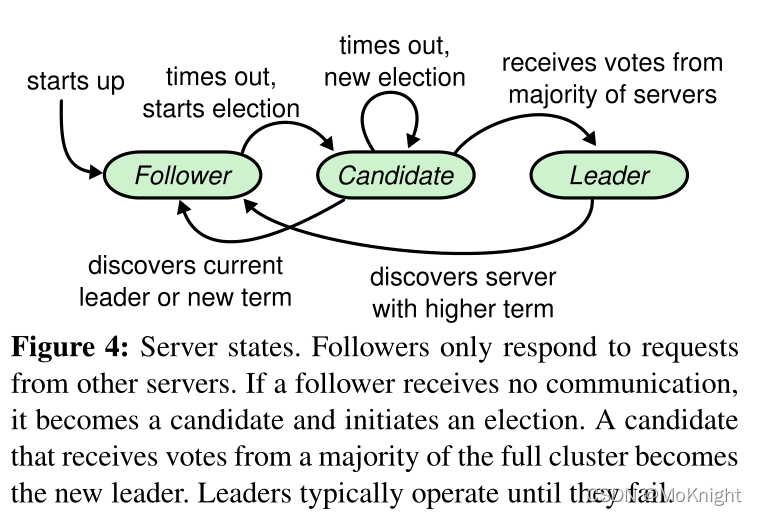
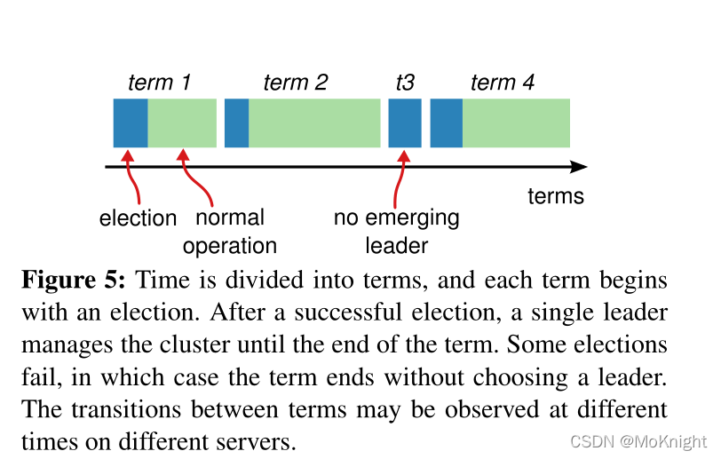

[toc]

# Raft 共识算法

共识算法允许一组节点像一个整体一样一起工作，即使其中一些节点出现故障也能够继续工作下去

Raft是一种用于替代Paxos的**共识算法**，相比于Paxos，Raft更容易理解。主要贡献可分为两点

1. **问题分解**：Raft将共识算法分成了三个子问题，分别是领导者选举，日志复制和安全性
2. **状态简化**：对算法有一定限制，减少状态数量和可能产生的变动

## 复制状态机（Replicated state machine）

**相同的初始状态 + 相同的输入 = 相同的结束状态**，也就是说多个节点上，从相同的初始状态开始，执行相同的一串命令，会产生相同的最终状态

共识算法就是为了实现复制状态机。在一个分布式场景下，各节点通过共识算法来保证**命令序列的一致**，从而保证**状态的一致**，实现高可用

复制状态机的功能也可以用更多的领域，比如两个副本一个采用行存储，一个采用列存储，只要初始数据一致，并后续发送的命令也是一致的，那么同一时刻从两个副本中读取到的结果也是相同的

## 状态简化

三种状态：leader，follower，candidate。在任何时刻，服务器节点只会是这三个状态**<u>之一</u>**，因此Raft只需要考虑状态的切换，而Paxos则需要考虑状态之间的共存和相互影响

1. 正常操作时间中只会有一个leader
2. 任何服务器节点在启动时都是follower
3. follower无法发出请求，只能回应leader和candidate的请求
4. leader处理所有客户端请求
5. candidate用于选举出下一个leader

Raft还将时间分割成任意长度的**任期（term）**，用连续的整数进行标记。

每个任期都以选举开始，其中一个或多个candidate尝试成为 leader，如果一个候选者赢得了选举，那么他将在余下的任期内担任 leader 。在某些情况下，选举会导致分裂投票（两个节点收到了相同的票数），在这种情况下，任期将在没有领导者的情况下结束；新的任期（有新的选举）将很快开始，Raft 会确保在给定的任期内最多有一个 leader。

Raft使用RPC进行通信，只有两种主要的RPC：

* **RequestVote RPC（请求投票）**：由candidate在选举期间发起
* **AppendEntries RPC（追加条目）**：由leader发起，用来复制日志和提供心跳机制

### 主要通信方式

1. 任期在 Raft 中充当逻辑时钟 ，每个服务器存储一个当前的任期编号，随着时间的推移单调递增。 
2. 每当服务器进行通信时都会交换当前任期；如果一台服务器的当前任期小于另一台服务器的当前期限，则将当前任期更新为较大的值。 
3. 如果candidate或 leader 发现其任期已过时（收到了来自更大任期服务器的消息），它会立即恢复到 follower 状态。如果服务器收到带有过期任期号的请求，它会拒绝该请求。

## 领导者选举

**心跳机制**：如果存在leader，那么它会周期性地向所有follower发送心跳，如果follower一段时间没有收到心跳，那么就会认为当前系统中不存在leader，从而开始进行选举

### 选举过程

1. follower增加自己的当前任期号，并转换到candidate状态
2. 投票给自己，将自身票数加1
3. 并行地向集群中其他服务器节点发送RequestVote RPC

### 选举结果

1. 当前节点获得超过半数选票赢得选举：自己成为新leader并且向其他节点发送周期性的心跳
2. 其他节点赢得选举：收到新leader的心跳后，如果新leader的任期号不小于自己当前的任期号，退回到follower状态
3. 一段时间没有获胜者：每个candidate在一段时间（150 ～ 300ms）之后增加任期号并开始新一轮的选举

### 投票过程

每个服务器节点收到RequestVote RPC时，会先比较收到的任期号是否比自己的任期号大，如果更大的话，则采用**先来先得**的原则进行投票，每个节点**只有一张选票**

请求格式（Request）：由candidate发出，其中包含当前任期号，candidate自己的ID，最后的日志号和日志任期

回复格式（Response）：由follower发出，其中包含自己的任期号以及是否投票给当前candidate

## 日志复制

客户端确定leader的方法：

1. 客户端请求的节点恰好为leader
2. 客户端请求的节点为follower，可以通过心跳知道leader
3. 客户端请求的节点宕机，可以再次请求，直到找到可用节点

Leader接收到客户端指令时，会将指令作为新条目追加到日志中。一条日志含有三个信息：1）**状态机指令**；2）**leader的任期号**；3）当前日志中的**日志号**（日志索引）

Leader会**并行**发送AppendEntries RPC给follower，让其复制新条目

当**超过半数**的follower复制后，leader可以在**本地执行该指令并把结果返回给客户端**，这一过程被称为**提交**

*注意：leader随时可能发生宕机，因此可能出现超过半数复制成功，但并没有提交成功*

### 三种情况

1. follower缓慢：follower因为某些原因没有给leader响应，leader会不断重发追加条目请求，即使leader<u>已经回复了客户端</u>
2. follower宕机：follower崩溃后需要恢复，Raft会检查追加条目的**一致性**，保证follower能按照正确顺序恢复
3. leader宕机：崩溃的leader可能有已复制给部分follower但没有提交的日志条目，而新选出的leader可能不具备这些日志，从而造成部分follower和新leader日志不相同的情况。Raft通过**强制follower复制新leader日志**来解决不一致的问题

Raft 维护了以下属性，它们共同构成了图 3 中的日志匹配属性：

* 如果不同服务器日志中的两个条目具有相同的索引和任期，则它们存储相同的命令。 
* 如果不同服务器日志中的两个条目具有相同的索引和任期，则该日志在所有前面的条目中都是相同的。 

第一个属性，即 leader 在给定任期内创建的每一个日志条目都是独一无二的，并且日志条目永远不会改变它们在日志中的位置。 第二个属性由 AppendEntries 执行的简单一致性检查保证。在发送 AppendEntries RPC 时，leader 在其日志中一定包含紧接在**新条目之前的特定任期和索引号的条目**，因此如果 follower 在其日志中没有找到具有相同索引和任期的条目，则它拒绝新条目，leader收到follower拒绝后，会发送前一个日志条目，从而逐渐向前定位到follower缺失的第一个日志，从而保证了数据的完整性和一致性

## 安全性

领导者选举和日志复制无法完全保证每一个状态机会按照相同**顺序**执行相同命令，可能会出现**有空洞**的日志条目

### Leader宕机

如果一个follower落后leader若干条日志，但没有落后一整个任期，那么下次选举中，如果不加任何限制，它依旧可能当选新leader。然而一旦它当选的话，就无法补上那部分缺失的日志，从而造成状态机的不一致

**选举限制**：为了解决不一致，需要保证被选出来的leader一定包含了之前各任期的**所有被提交**的日志条目

执行要求：比较请求和自己日志的**新旧**，如果自己的更**新**会拒绝掉这个投票请求

* 如果两份日志最后条目任期号不同，那么任期号大的更“新”
* 如果两份日志最后条目任期号相同，那么日志较长的那个更“新”

Leader在提交某个日志条目前崩溃，新leader会试图完成该日志条目的**复制**

**Raft 从不通过计算副本数来提交之前任期的日志条目，通过计算副本数仅提交来自 leader 当前任期的日志条目**

而当前任期的某个日志以这种方式提交后，那么由于日志匹配特性，之前的所有日志条目也会被间接提交

### Follower和candidate宕机

Raft RPC 是**幂等**的，在编程中一个**幂等**操作的特点是其任意多次执行所产生的影响均与一次执行的影响相同

如果follower或candidate宕机，Raft通过**无限的重试**来处理这种失败。

如果服务器在完成 RPC 之后但在响应之前崩溃，那么它会在重新启动后再次收到相同的 RPC。

### 时间与可用性

Raft算法整体不依赖客观时间，即哪怕后发的RPC先到，也不会影响Raft的正确性

需要满足的要求：**广播时间（broadcastTime）<< 选举超时时间（electionTimeout）<< 平均故障时间（MTBF）**

## 集群成员变更

在需要改变集群配置时（增减节点，替换宕机机器或改变复制程度），Raft可以进行**配置变更自动化**

最大难点 - **脑裂问题**：转换过程同一任期内出现超过一个的leader，出现原因：转换期间整个集群可能划分为两个独立的大多数

为了确保安全，配置更改必须使用**两阶段**方法，有多种方法可以实现这两个阶段，例如一些系统使用第一阶段禁用旧配置，使其无法处理客户端请求；然后第二阶段启用新配置

在 Raft 中，集群首先切换到我们称之为**联合共识（ joint consensus）**的过渡配置；一旦达成联合共识，系统就会转换到新的配置。联合共识结合了新旧配置： 

1. 日志条目被复制到两种配置中的所有服务器。 
2. 任一配置中的任何服务器都可以充当 leader。 
3. 达成协议（用于选举和日志条目提交）需要与新配置和旧配置不同的多数派。（目标是使联合共识的服务器达到大多数） 

联合共识允许单个服务器在不同时间在配置之间转换，而不会影响安全性。此外联合共识允许集群在整个配置更改期间继续为客户端请求提供服务

**联合共识状态下的集群所有RPC都要在新旧两种配置中都达到大多数才算成功**

**新配置状态下的集群所有RPC只要在新配置下达到大多数就算成功**

### 单节点变更

除了之前所提到的联合共识方法， 另一种方法是限制每次增减节点数量只能为一，这样新老配置之间的大多数一定是有重合的，而重合的节点才能当选为新leader，因此就不需要联合共识状态

然而这种方法存在缺陷：

1. 联合共识方法支持一步完成机器的替换，如{a,b,c}变为{b,c,d}。然而单节点变更无法实现
2. 单节点变更必然经历偶数节点的状态，会**降低集群的高可用性** - <u>选择节点数时多数会选择奇数，保证容易达到多数派（Quorum）</u>
3. 连续两次变更，第一次变更过程出现leader宕机切主，下次变更可能出现错误

## 不同类型的共识算法

按照复制状态机需要同步的**数据量**进行分类：

1. 数据量非常小，如对集群成员，配置文件，分布式锁紧型存储和管理或实现小容量的分布式队列。外部命令比较稀疏，集群内部信息可通过比日志粒度更小的命令来传递 - **无leader**的共识算法（basic Paxos）
2. 数据量较大但可拆分为不相干的部分，写入较连续 - **有leader**的共识算法（multi Paxos， Raft）
3. 数据量大且数据之间存在关联，一个共识算法集群无法容纳所有数据，需要将数据分片（partition）到多个状态机中，通过两阶段提交保证一致性 - **支持分布式事务的分布式数据库**（Spanner，OceanBase，TiDB）

### 共识算法特性

1. 共识算法可以保证在**非拜占庭**情况下的正确性。拜占庭问题是指发送错误消息，存储不可靠等，这类问题Raft是无法解决的
2. 共识算法可以保证在**大多数机器正常**情况下集群的高可用性
3. **不依赖外部时间**来保证日志的一致性，但受网络影响很大 - 异地容灾场景需要专门设计

### Raft特点

1. Strong leader：日志只能从leader流向其他服务器
2. Leader election：使用随机计时器进行leader选举
3. Memebership changes：使用联合共识的方法来处理集群成员变更的问题，保证变更期间可以正常运行

## 日志压缩（Log Compaction）

随着Raft集群运行，日志会越来越大，因此需要一种机制能安全地清理日志

**关键问题**：如何判断哪些日志可以清理？

Raft采用**快照技术**，在每个节点达到一定条件后，将当前日志写入快照中，然后将已存入快照的日志删除。因为快照使用的是键值对存储，因此只会保存最新的一份

Raft采用**直接向follower发送自己快照**来实现leader到follower的同步

## 读操作

**线性一致性读（强一致性读）**：读到的结果是读请求发出时已经完成提交的结果

直接从leader的状态机取值，可能并不是线形一致性读的结果。需要让这个读的过程或结果，也在大多数节点上达到共识

最简单的方法：将读也当作一条日志，然后取出相应的结果

### 优化规则

1. 线性一致性读一定要**发往leader**。
2. 如果一个leader在他的任期内还没有提交一个日志，那么它需要提交一个日志后才能反馈client请求（可以通过**no-op**补丁来优化）

**no-op补丁**：新leader在任期开始时，立刻一条无日志体内容的AppendEntries RCP，这样可以立刻提交之前任期的所有请求

3. 在进行读操作前，leader向所有节点发送心跳，并得到大多数节点反馈，已确认自己仍然是leader
4. leader将自己已提交的日志号设为readIndex，只要leader应用到了这个索引后，就可以返回状态机结果

## 影响因素

选举及维持leader所需要的代价 - 合理设置选举超时时间

优化方法：

1. **Batch**：一个日志可以包含多个命令，然后批量进行复制
2. **Pipeline**：leader不用等待follower的回复，可以继续发送下一个日志
3. leader收到请求之后，将发送RPC和写入磁盘并行执行