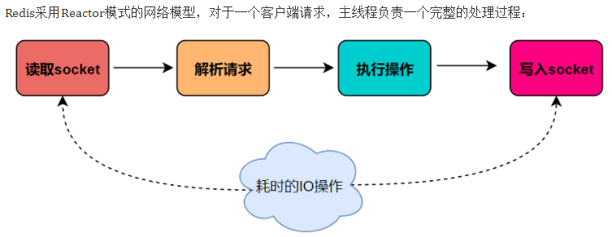

[toc]

<div STYLE="page-break-after:always;"></div>

# 基础

## 概述

Remote Dictionary Server (远程字典服务器) 是完全开源的，使用ANSIC语言编写遵守BSD协议，是一个高性能的Key-Value 数据库提供了丰富的数据结构，例如String、Hash、List、Set、SortedSet等等。数据是存在**内存**中的，同时Redis支持事务、持久化、LUA脚本、发布/订阅、缓存淘汰、流技术等多种功能特性提供了主从模式、Redis Sentinel和Redis Cluster集群架构方案

Redis 可作为分布式缓存，减轻 MySQL 压力


优势

- 读写性能极高
- 数据类型丰富，支持多种数据结构
- 支持数据持久化，可以将内存中的数据保持在磁盘中
- 支持数据备份


## Redis 配置

`redis.conf` 配置文件，改完后重启redis 服务，确保生效

- 默认daemonize no 改为 daemonize yes
- 默认protected-mode yes   改为 protected-mode no
- 默认bind 127.0.0.1       改为 直接注释掉(默认bind 127.0.0.1只能本机访问)或改成本机IP地址，否则影响远程IP连接
- 添加redis密码           改为 requirepass 你自己设置的密码

使用 `redis-server /myredis/redis.conf`  启动redis server

使用 `redis-cli -p [端口号] -a [密码]` 连接服务器

## Redis 常用命令

[官方文档](https://redis.io/docs/latest/commands/)

`keys *`：查看当前库所有key

`exists key`：判断key 是否存在

`type key`：查看key 对应的value 是什么类型

`del key`：删除指定key 的数据

`unlink key`：非阻塞删除，将key 从keyspace 原数据中删除，真正删除在后续异步中操作

`ttl key`：查看还有多少秒过去，-1 表示永不过期，-2 表示已过期

`expire key [时间]`：为给定key 设置过期时间

`move key dbindex [0-15]`：将当前数据库中的key 移动到指定数据库

`select dbindex`：切换数据库

`dbsize`：查看当前数据库key 的数量

`flushdb`：删除当前库

`flushall`：删除所有数据库

`help @[类型]`：获取对应类型的所有命令

## 数据类型

Key：字符串，Value：十大数据类型


### 字符串 - 单 key 单 value

`set key value`：设置键值对。提供了多个可选参数

-   `EX`：以秒为单位设置过期时间
-   `PX`：以毫秒为单位设置过期时间
-   `EXAT`：设置以秒为单位的 UNIX 时间戳所对应的时间为过期时间
-   `PXAT`：设置以毫秒为单位的 UNIX 时间戳所对应的时间为过期时间
-   `NX`：键不存在时设置键值
-   `XX`：键存在时设置键值
-   `KEEPTTL`：保留设置签的指定键的生存时间
-   `GET`：返回指定键原本的值，若键不存在时返回 `nil`

定义分布式锁

-   `setnx key value`：只有在 key 不存在时设置 key 的值

-   `setex key value time`：设置带过期时间的 key

`get key`：获取指定键的值

`MSET key value [key value]/MGET key [key]`：同时设置/获取多个键值

`MSETNX key value [key value]`：同时设置一个或多个 key-value 对，当且仅当所有给定 key 都不存在

`GETRANGE key x y`：获取指定区间范围 $[x, y]$ 内的值

`SETRANGE key x v`：设置指定范围内的值，即将 key 中的原本值从第 $x$ 位开始替换为 v

`INCR/DECR key`：递增/递减数字

`INCRBY/DECRBY key i`：每次增加/减少 i

`STRLEN key`：获取字符串长度

`APPEND key v`：追加字符串内容

`getset key value`：等价于 `set key value get`，将给定 key 的值设为 value ，并返回旧值

### 列表 - 单 key 多 value

底层实现为一个双端链表的结构

`lpush/rpush key value value`：设置指定 key 的多个 value

`lrange key x y`：获取指定范围 $[x,y]$ 的值。如果采用 `lpush` 则逆序数处，否则正序输出

`lpop/rpop`：从左/右弹出元素

`lindex`：按照索引下标获取元素（从上到下）

`llen`：获取列表中元素的个数

`lrem key n val`：删除 n 个等于 val 的元素

`ltrim key x y`：截取指定范围 $[x,y]$ 的值后再赋值给 key

`rpoplpush k1 k2`：移除 k1 中的最后一个元素，添加到 k2 中

`lset key index value`：设置 key 中的位于 index 位置的元素为 value

`linsert key before/after value`：在已有值前/后插入元素

### 哈希 - 单 key 单 value，value 为键值对

`hset key field value [field value]`：设置键值对

`hget key field`：获取 key 中 field 所存储的值

`hmset/hmget`：一次设置/获取多个值

`hgetall key`：获取 key 中所有的 field 和 value

`hdel key field`：删除 key 中 field 对应的值

`hlen key`：获取 key 中 field 的数量

`kexists key field`：判断 key 是否存在 field

`hkeys/hvals key`：获取 key 中所有的 field/value

`hincrby/hincrbyfloat key field i`：为 key 中 field 对应值增加 i

`hsetnx key field value`：key 中 field 不存在时设置值

### 集合 - 单 key 多 value，value 无重复

`sadd key member [member]`：添加元素

`smembers key`：遍历集合中的所有元素

`sismember key member`：判断元素是否在集合中

`srem key member [member]`：删除元素

`scard key`：获取集合中元素个数

`srandmember key [n]`：从集合中随机展现设置的 n 个元素（如果 n 为负数，则元素可重复）

`spop key [n]`：从集合中随机弹出 n 个元素

`smove k1 k2 v`：将 k1 里已存在的 v 赋值给 k2

`sdiff k1 k2`：属于 k1 但不属于 k2 的元素

`sunion k1 k2`：合并 k1 和 k2 的元素

`sinter k1 k2`：属于 k1 且属于 k2 的元素

`sintercard numkeys k1 k2`：返回给定集合的交集产生集合的基数

### 有序集合 - 单 key 多 value，每个 value 有 score

`zadd key score member [score member]`：添加元素和分数

`zrange key x y [withscores]`：按照元素分数从小到大顺序，返回索引 $[x,y]$ 的所有元素

`zrevrange key x y [withscores]`：按照元素分数从大到小排序，返回索引 $[x,y]$ 的所有元素

`zrangebyscore key a b [withscores]`：获取指定分数范围的元素，a 和 b 前可以添加 `(` 表示开区间

`zscore key member`：获取元素分数

`zcard key`：获取集合中的元素数量

`zrem key member`：删除元素和分数

`zincrby key inc member`：为某个元素增加 inc 分

`zcount key a b`：获得指定分数范围内的元素个数

`zmpop n key min/max`：弹出最小/最大分数的元素

`zrank/zrevrank key member`：正序/逆序获得下标值

### 位图 - 二进制位数组

用 String 类型作为底层数据结构实现的一种统计二值状态的数据类型，用于状态统计

`setbit key k value`：设置 key 的第 k 位的值

`getbit key k`：获取 key 的第 k 位的值

`strlen key`：统计字节数（一个字节8位）占用多少

`bitcount key`：全部值中 1 的个数

`bittop op dest k1 k2` ：对 k1 和 k2 进行位运算，结果放入 dest

### 基数统计 - 去重统计

统计一个集合中不重复的元素个数。只会根据输入元素来计算基数，而不会存储元素本身

`pfadd key element [element]`：添加元素

`pfcount key [key]`：返回指定键的基数估计

`pfmerge dest src [src]`：将 src 合并为一个，存储在 dest

### 地理空间 - 底层实现为 zset

将球体转换为平面，区块转换为一点，将一维的点块转换为二进制再通过 base32 编码

`geoadd key lng lat member`：添加经纬度和位置名称到指定的 key 中

`geopos key member`：从键里返回经纬度

`geohash key member`：返回坐标的哈希值

`geodist key m1 m2`：返回 m1 和 m2 之间的距离

`georadius key lng lat r`：返回与给定经纬度距离不超过 r 的所有位置元素

`georadiusbymember key member r`：返回与给定位置距离不超过 r 的所有位置元素

### 流 - Redis 版的 MQ 中间件 + 阻塞队列

实现消息队列，支持消息的持久化，支持自动生成全局唯一 ID，支持 ACK 确认消息的模式，支持消费组模式等。底层实现为一个消息链表，将所有加入的消息都串起来，每个消息都有一个唯一的 ID 和对应的内容

`xadd key`：添加消息到队列尾部。ID 格式为时间戳 + 当前时间戳的第几条消息

`xrange key start end`：用于获取消息列表

`xrevrange key end start`：逆序输出消息列表

`xdel key id`：删除消息

`xlen key`：获取队列中消息数量

`xtrim key maxlen|minid n`：对长度进行截取。maxlen 为允许的最大长度，minid 为允许的最小ID

`xread count n [block] streams key`：返回 n 条消息。使用 block 表示阻塞队列

`xgroup create key name $|0`：创建消费组。使用 `$` 和 `0` 分别表示从尾和从头消费

`xreadgroup group name streams key`：读取消费消息。同一个消费组消费者不能消费同一消息，不同消费组的消费者可消费同一消息

`xpending key name`：查询消费组内**已读取但未确认**的消息

`xack key name id`：向消息队列确认消息处理已完成

`xinfo stream key`：打印详细信息

### 位域 - 二进制数组

将字符串看作由二进制组成的数组，并能对变长位宽和任意没有字节对齐的整型位域进行寻址和修改

`bitfield key get type offset`：返回指定位域

`bitfield key set type offset value`：修改指定位域并返回原值

`bitfield key incrby type offset incr`：增加指定位域的值

溢出控制

-   `WRAP`：循环溢出，使用回绕方式处理有符号整数和无符号整数
-   `SAT`：使用饱和计算方式处理，下溢返回最小值，上溢返回最大值
-   `FAIL`：拒绝执行会导致溢出的计算，并向用户返回空值

## 持久化

将内存数据写进磁盘中。有两种方式：RDB 和 AOF


### RDB

在指定的时间间隔，执行数据集的时间点快照，即把某一时刻的数据和状态以文件的形式写到磁盘上，也就是**全量快照**。这样一来即使故障宕机，快照文件也不会丢失，数据的可靠性也就得到了保证


Redis 7 生成快照的三种默认设置

-   3600 秒以内至少有 1 次修改
-   300 秒以内至少有 100 次修改
-   60 秒以内至少有 10000 次修改

注意：执行 `flushall/flushdb/shutdown` 命令时也会产生 rdb 文件，但里面是空的

分机隔离：不可以把备份文件 dump.rdb 和生产 Redis 服务器放在同一台机器，必须分开各自存储，以防生产机物理损坏后备份文件也挂了

Redis 提供了两个命令用于手动生成 RDB 文件

-   SAVE：在主程序中执行，会阻塞当前 Redis 服务器，直到持久化工作完成
-   BGSAVE：Redis 在后台异步进行快照操作，不会阻塞，即快照同时还可以响应客户端请求

#### RDB 优点

-   适合大规模的数据恢复
-   可以按照业务要求定时备份
-   对数据完整性和一致性要求不高
-   RDB 文件在内存中的加载速度比 AOF 快得多

#### RDB 缺点

-   在快照间隔时间之内，宕机后会丢失最新数据
-   内存数据的全量同步，如果数据量太大会出现大量的 I/O ，严重影响服务器性能
-   RDB 依赖于主进程的 fork，在更大的数据集中，会导致服务请求的瞬间延迟

#### RDB 配置参数

-   stop-writes-on-bgsave-error：当生成快照时出错，是否停止写操作
-   rdbcompression：对磁盘中存储的快照是否进行压缩
-   rdbchecksum：存储快照后是否使用 CRC64 算法进行数据校验
-   rdb-del-sync-files：在没有持久性的情况下是否删除复制中使用的 RDB 文件

### AOF

以**日志**的形式来记录每个写操作，将 Redis 执行过的所有**写指令**记录下来（读操作不记录），只许追加文件但不可以改写文件，Redis 启动之初会读取该文件重新构建数据，换言之，Redis 重启的话就根据日志文件的内容将写指令从前到后执行一次以完成数据的恢复工作


#### 持久化流程

1.   客户作为命令来源
2.   命令到达 Redis Server 以后并不是直接写入 AOF 文件，会将其这些命令先放入 AOF 缓存中进行保存
     -   AOF 缓冲区实际上是内存中的一片区域，存在的目的是当这些命令达到一定量以后再写入磁盘，避免频繁的磁盘 IO 操作
3.   AOF 缓冲会根据AOF缓冲区**同步文件的三种写回策略**将命令写入磁盘上的 AOF 文件
     -   everysec（默认）：每个写命令执行完，先把日志写到 AOF 文件的内存缓冲区，每隔 1 秒写入磁盘
     -   always：同步写回，每个写命令执行完立刻同步将日志写回磁盘
     -   no：每个写命令执行完，先把日志写到 AOF 文件的内存缓冲区，由操作系统控制写回
4.   随着写入 AOF 内容的增加为避免文件膨胀，会根据规则进行命令的合并（又称 **AOF 重写**），从而起到 AOF 文件压缩的目的
5.   当 Redis Server 服务器重启的时候会从 AOF 文件载入数据


Redis 7 实现了 Multi-Part AOF，即生成多个 AOF 文件。同时为了管理 AOF 文件，引入 manifest 文件跟踪管理

-   BASE：表示基础 AOF， 它一般由子进程通过重写产生，该文件最多只有一个
-   INCR： 表示增量 AOF，它一般会在 AOFRW 开始执行时被创建，该文件可能存在多个
-   HISTORY：表示历史 AOF，它由 BASE 和 INCR AOF 变化而来，每次 AOFRW 成功完成时，本次 AOFRW 之前对应的 BASE 和 INCR AOF 都将变为 HISTORY，HISTORY 类型的 AOF 会被 Redis 自动删除

#### AOF 优点

-   使用 AOF Redis 更加持久：您可以有不同的 fsync 策略：根本不 fsync、每秒 fsync、每次查询时 fsync。使用每秒 fsync 的默认策略，写入性能仍然很棒。fsync 是使用后台线程执行的，当没有fsync正在进行时，主线程将努力执行写入，因此您只能丢失一秒钟的写入
-   AOF日志是一个仅附加日志，因此不会出现寻道问题，也不会在断电时出现损坏问题。即使由于某种原因（磁盘已满或其他原因）日志以写一半的命令结尾，redis-check-aof 工具也能够轻松修复
-   当 AOF 变得太大时，Redis 能够在后台自动重写 AOF。重写是完全安全的，因为当 Redis 继续附加到I文件时，会使用创建当前数据集所需的最少操作集生成一个全新的文件，一旦第二个文件准备就绪，Redis 就会切换两者并开始附加到新的那一个
-   AOF 以易于理解和解析的格式依次包含所有操作的日志。您甚至可以轻松导出 AOF 文件。例如，即使您不小心使用 FLUSHALL 命令刷新了所有内容，只要在此期间没有执行日志重写，您仍然可以通过停止服务器、删除最新命令并重新启动 Redis 来保存您的数据集

#### AOF 缺点

-   AOF 文件通常比相同数据集的等效 RDB 文件大
-   根据确切的 fsync 策略，AOF 可能比 RDB 慢。一般来说，将 fsync 设置为每秒性能仍然非常高，并且在禁用 fsync 的情况下，即使在高负载下它也应该与 RDB 一样快。即使在巨大的写入负载的情况下，RDB 仍然能够提供关于最大延迟的更多保

#### 重写机制

启动 AOF 文件的内容压缩，只保留可以恢复数据的最小指令集

自动触发：Redis 会记录上次重写的 AOF 大小，当 AOF 文件大小是上次重写后大小的一倍且文件大于一定大小时触发重写

手动触发：客户端向服务器发送 `bgrewriteaof` 命令

重写流程：

1.   在重写开始前，redis会创建一个“重写子进程”，这个子进程会读取现有的 AOF 文件，并将其包含的指令进行分析压缩并写入到一个临时文件中
2.   与此同时，主进程会将新接收到的写指令一边累积到内存缓冲区中，一边继续写入到原有的 AOF 文件中，这样做是保证原有的 AOF 文件的可用性，避免在重写过程中出现意外
3.   当“重写子进程”完成重写工作后，它会给父进程发一个信号，父进程收到信号后就会将内存中缓存的写指令追加到新 AOF 文件中
4.   当追加结束后，Redis 就会用新 AOF 文件来代替旧 AOF 文件，之后再有新的写指令，就都会追加到新的 AOF 文件中
5.   重写 AOF 文件的操作，并没有读取旧的 AOF 文件，而是将整个内存中的数据库内容用命令的方式重写了一个新的 AOF 文件，这点和快照有点类似

AOF 配置参数

| 配置指令                    | 配置含义                   | 配置示例                        |
| --------------------------- | -------------------------- | ------------------------------- |
| appendonly                  | 是否开启 AOF               | appendonly yes                  |
| appendfilename              | 文件名称                   | appendfilename "appendonly.aof" |
| appendfsync                 | 同步方式                   | everysec / always / no          |
| no-appendfsync-on-rewrite   | AOF 重写期间是否同步       | no-appendfsync-on-rewrite no    |
| auto-aof-rewrite-percentage | 重写触发配置，文件重写策略 | auto-aof-rewrite-percentage 100 |
| auto-aof-rewrite-min-size   | 重写触发配置，文件重写策略 | auto-aof-rewrite-min-size 64mb  |

### RDB + AOF

两种持久化方式混合使用。如果两者都开启，重启时只会加载 AOF 文件，不会加载 RDB 文件

RDB 数据不实时，因此同时使用两者时服务器重启加载 AOF 文件。但 RDB 更适合用于备份数据库（AOF 持续变化不好产生备份），因此采用混合方式最佳

**RDB 镜像做全量持久化，AOF 做增量持久化**

先使用 RDB 进行快照存储，然后使用 AOF 持久化记录所有的写操作，当重写策略满足或手动触发重写的时候，将最新的数据存储为新的 RDB 记录。因此混合持久化方式产生的文件一部分是 RDB 格式，一部分是 AOF 格式，即 RDB 头部 + AOF内容混写

## 事务

一次性执行多个命令，本质是一组命令的集合。一个事务的所有命令都会**序列化**，按顺序串行化执行而不会被其他命令插入，不允许加塞

| Redis 事务特性     | 解释                                                         |
| ------------------ | ------------------------------------------------------------ |
| 单独的隔离操作     | Redis 的事务仅仅是保证事务里的操作会被连续独占的执行，Redis 命令执行是**单线程**架构，在执行完事务内所有指令前是不可能再去同时执行其他客户端的请求的 |
| 没有隔离级别的概念 | 因为事务提交前任何指令都不会被实际执行，也就不存在”事务内的查询要看到事务里的更新，在事务外查询不能看到”这种问题了 |
| 不保证原子性       | Redis 的事务不保证原子性，也就是不保证所有指令同时成功或同时失败，只有决定是否开始执行全部指令的能力，没有执行到一半进行回滚的能力 |
| 排它性             | Redis 会保证一个事务内的命令依次执行，而不会被其它命令插入   |

### 常见命令

`MULTI`：标记事务的开始

`EXEC`：执行事务内的命令

`DISCARD`：取消事务

`WATCH key`：监视指定的 key，如果在事务执行前该 key 被其他命令所改动，那么事务就被打断

`UNWATCH`：取消所有对 key 的监视

## 管道

Redis 是一种基于客户端-服务端模型以及请求/响应协议的 **TCP 服务**。一个请求会遵循以下步骤

1.   客户端向服务端发送命令分四步(发送命令→命令排队→命令执行→返回结果)，并监听 Socket返回，通常以阻塞模式等待服务端响应
2.   服务端处理命令，并将结果返回给客户端

上述所花费的时间为 Round Trip Time（简称 RTT，数据包往返于两端的时间）

如果同时需要执行大量的命令，那么就要等待上一条命令应答后再执行，这中间不仅仅多了 RTT（Round Time Trip），而且还频繁调用系统 I/O，发送网络请求，同时需要 Redis 调用多次 read() 和 write() 系统方法，系统方法会将数据从用户态转移到内核态，这样就会对进程上下文有比较大的影响了，造成性能瓶颈，因此 Redis 引入了管道

管道（Pipeline）可以**一次性发送多条命令**给服务端，服务端依次处理完完毕后，通过一条响应一次性将结果返回，通过减少客户端与 Redis 的通信次数来实现降低往返延时时间。Pipeline 实现的原理是队列，先进先出特性保证了数据的顺序性

### 对比

**与原生批量命令对比**

-   原生命令具有原子性，管道是非原子性的
-   原生命令一次只能执行一种命令，管道支持批量执行不同命令
-   原生命令是服务端实现，管道需要服务端和客户端共同完成

**与事务对比**

-   事务是一条一条发，在接收到 EXEC 命令后才会执行，管道一次性将多条命令发送到服务器
-   执行事务会阻塞其他命令，执行管道不会

## 发布订阅

发送者发送消息，订阅者接收消息，可以实现进程间的消息传递

发布/订阅其实是一个轻量的队列，只不过数据不会被持久化，一般用来处理实时性较高的异步消息

### 常用命令

`SUBSCRIBE channel`：订阅给定频道的消息

`PUBLISH channel msg`：将消息发送到指定频道

`PSUBSCRIBE pattern`：订阅符合给定模式的频道

`PUBSUB subcommand`：查看订阅与发布系统状态

`UNSUBSCRIBE channel`：退订给定频道

`PUNSUBSCRIBE patter`：退订符合给定模式的频道

## 主从复制

高可用的解决方案，主服务器以写为主，从服务器以读为主

可用于实现读写分离、容灾恢复、数据备份和水平扩容支持高并发

如果主服务器配置了密码登陆，从服务器需要配置 masterauth 来设置校验密码，否则主服务器会拒绝从服务器的访问请求

### 基本命令

`info replication`：查看复制节点的主从关系和配置信息

`replicaof master_ip master_port`：配置主库

`slaveof master_ip master_port`：设置新的主库

`slaveof no one`：从库转为主库

### 注意事项

从机不可以执行写命令，只能读

从机会从头开始复制主机的内容，从机宕机后重启也会复制主机的所有数据

从机不动，原地待命，从机数据可以正常使用；等待主机重启动归来，并且重启后恢复主从关系

使用命令 `slaveof` 指定主机，宕机后主从关系丢失

### 原理

Slave 启动成功连接到 Master 后会发送一个 sync 命令。首先连接采用全量复制，即 Master 收到命令后会开始在后台保存 RDB 快照，同时将所有接收到的用于修改数据集命令缓存起来，Master 节点执行完 RDB 持久化后，将快照和所有缓存的命令发送给 Slave

Slave 本身的数据会被 Master 清除或覆盖

Master 会将新的修改命令自动依次传给 Slave，完成同步

### 限制

-   由于所有的写操作都是先在 Master 上操作，然后同步更新到 Slave 上，所以从 Master 同步到 Slave 机器有一定的延迟，当系统很繁忙的时候，延迟问题会更加严重，Slave 机器数量的增加也会使这个问题更加严重
-   Master 宕机后，从机不会自动升级为主机，因此整个系统几乎处于瘫痪状态，只能读不能写

## 哨兵

哨兵巡查监控后台 Master 主机是否故障，如果发生故障根据**投票数**自动将某一个从库转换为新主库，继续对外提供写服务

哨兵的作用：

1.   监控 Redis 运行状态，包括 Master 和 Slave
2.   当 Master 宕机，能自动将 Slave 切换成新 Master
3.   消息通知，可将故障转移的结果发送给客户端
4.   客户端通过连接哨兵来获得当前 Redis 服务的主节点地址

### 配置参数

`sentinel monitor <master-name> <ip> <port> <quorum>`：设置要监控的 Master 服务器。quorum 表示最少有几个哨兵认可客观下线，同意故障迁移的法定票数

`sentinel auth-pass <master-name> <password>`：设置连接 Master 的密码

`sentinel down-after-milliseconds <master-name> <milliseconds>`：指定多少毫秒之后，主节点没有应答哨兵，此时哨兵主观上认为主节点下线

 `sentinel parallel-syncs <master-name> <nums>`：表示允许并行同步的 Slave 个数，当Master 挂了后，哨兵会选出新的 Master，此时，剩余的 Slave 会向新的 Master 发起同步数据

 `sentinel failover-timeout <master-name> <milliseconds>`：故障转移的超时时间，进行故障转移时，如果超过设置的毫秒，表示故障转移失败

 `sentinel notification-script <master-name> <script-path>`：配置当某一事件发生时所需要执行的脚本

 `sentinel client-reconfig-script <master-name> <script-path>`：客户端重新配置主节点参数脚本

### 可能出现的问题

1.   Server closed the connection
2.   Broken pipe

在配置正确的情况下，依然可能报如上的错误，等待一段时间即可

### 更新配置文件

文件的内容，在运行期间会被 sentinel 动态进行更改，即 Master-Slave 切换后，master_redis.conf、slave_redis.conf 和 sentinel.conf 的内容都会发生改变，即 master_redis.conf 中会多一行 `replicaof` 的配置，sentinel.conf 的监控目标会随之调换

### 运行流程

1.   主观下线：单个哨兵在发送心跳后，一定时间内未收到 Master 的回复，达到主观下线的条件
2.   客观下线：多个哨兵都认为 Master 下线，达到客观下线的条件
3.   选举哨兵兵王：Master 客观下线后，哨兵节点进行协商，选举出哨兵节点的领导者（兵王）并由该领导者开始故障迁移
4.   选举新 Master：哨兵领导者开启选举，得到新 Master。选择条件为1）优先级最高；2）偏移量最大；3）Run ID 最小

## 集群

由于数据量过大，单个 Master 复制集难以承担，因此需要对多个复制集进行集群，形成水平扩展。每个复制集只负责存储整个数据集的**一部分**，这就是 Redis 的集群，其作用是提供在多个 Redis 节点间共享数据的程序集


集群的作用

1.   支持多个 Master，每个 Master 可挂载多个 Slave
2.   集群自带哨兵的故障转移机制，内置高可用支持，无需使用哨兵功能
3.   客户端只需与集群中的一个 Redis 可用节点
4.   槽位 slot 负责分配到各个物理服务节点，由对应集群负责维护

### 集群算法

#### 槽位 slot

集群中最多有 16384 个槽位，每个 key 通过 CRC16 校验后进行取模运算确定放置的槽位（实际最多节点数量为 1000）

解决均匀分配的问题，在数据和节点之间又加入了一层，把这层称为哈希槽（slot），用于管理数据和节点之间的关系，现在就相当于节点上放的是槽，槽里放的是数据

槽解决的是粒度问题，相当于把粒度变大了，这样便于数据移动。哈希解决的是映射问题，使用key的哈希值来计算所在的槽，便于数据分配

**为什么槽位最多为 16384**

1.   正常的心跳数据包带有节点的完整配置，可以用幂等方式用旧的节点替换旧节点，以便更新旧的配置。这意味着它们包含原始节点的插槽配置，16k 的插槽心跳包的大小为 2k ，但是 65k 的插槽会使用 8k 的空间
2.   由于其他设计折衷，Redis 集群不太可能扩展到 1000 个以上的主节点

因此 16k 处于正确的范围内，以确保每个主机具有足够的插槽，最多可容纳 1000 个矩阵，但数量足够少，可以轻松地将插槽配置作为原始位图传播。请注意，在小型群集中，位图将难以压缩，因为当 N 较小时，位图将设置的 slot/N 位占设置位的很大百分比

#### 分片

使用 Redis 集群时我们会将存储的数据分散到多台 Redis 机器上，这称为分片。简言之，集群中的每个 Redis 实例都被认为是整个数据的一个分片

为了找到给定 key 的分片，我们对 key 进行 CRC16(key) 算法处理并通过对总分片数量取模。然后，使用**确定性哈希函数**，这意味着给定的 key 将多次始终映射到同一个分片，从而推断将来读取特定 key 的位置

槽位和分片最大优势：**方便扩缩容和数据分派查找**

### 扩容

1.   将新 Master 节点加入原集群：`redis-cli -a [密码] --cluster add-node [new master ip] [old master ip]`
2.   重新分配槽位号，得到写权限：`redis-cli -a [密码] --cluster reshard [old master ip]`
3.   为 Master 节点分配 Slave 节点：`redis-cli -a 111111 --cluster add-node [new slave ip] [new master ip] --cluster-slave --cluster-master-id [new master node id]`

### 缩容

1.   删除从节点：`redis-cli -a [密码] --cluster del-node [slave ip] [slave node id]`
2.   清除主节点槽位号，重新分配：`redis-cli -a [密码] --cluster reshard [another master ip]`
3.   删除主节点：`redis-cli -a [密码] --cluster del-node [master ip] [master node id]`

## Spring boot 集成

### Jedis

Jedis Client 是 Redis 官网推荐的面向 Java 客户端，库文件实现对各类 API 进行封装调用

```java
package com.atguigu.redis7.test;

import redis.clients.jedis.Jedis;

import java.util.*;

public class JedisDemo
{
    public static void main(String[] args)
    {
        // 连接本地的 Redis 服务，自己的ip和端口和密码
        Jedis jedis = new Jedis("192.168.111.181",6379);
        // 如果 Redis 服务设置了密码，需要下面这行，没有就不需要
        jedis.auth("111111");

        // key
        Set<String> keys = jedis.keys("*");
        for (Iterator iterator = keys.iterator(); iterator.hasNext();) {
            String key = (String) iterator.next();
            System.out.println(key);
        }
        System.out.println("jedis.exists====>"+jedis.exists("k2"));
        System.out.println(jedis.ttl("k1"));
        // String
        // jedis.append("k1","myreids");
        System.out.println(jedis.get("k1"));
        jedis.set("k4","k4_redis");
        System.out.println("----------------------------------------");
        jedis.mset("str1","v1","str2","v2","str3","v3");
        System.out.println(jedis.mget("str1","str2","str3"));
        // list
        System.out.println("----------------------------------------");
        // jedis.lpush("mylist","v1","v2","v3","v4","v5");
        List<String> list = jedis.lrange("mylist",0,-1);
        for (String element : list) {
            System.out.println(element);
        }
      
        // set
        jedis.sadd("orders","jd001");
        jedis.sadd("orders","jd002");
        jedis.sadd("orders","jd003");
        Set<String> set1 = jedis.smembers("orders");
        for (Iterator iterator = set1.iterator(); iterator.hasNext();) {
            String string = (String) iterator.next();
            System.out.println(string);
        }
        jedis.srem("orders","jd002");
        System.out.println(jedis.smembers("orders").size());
      
        // hash
        jedis.hset("hash1","userName","lisi");
        System.out.println(jedis.hget("hash1","userName"));
        Map<String,String> map = new HashMap<String,String>();
        map.put("telphone","138xxxxxxxx");
        map.put("address","atguigu");
        map.put("email","zzyybs@126.com");//课后有问题请给我发邮件
        jedis.hmset("hash2",map);
        List<String> result = jedis.hmget("hash2", "telphone","email");
        for (String element : result) {
            System.out.println(element);
        }

        // zset
        jedis.zadd("zset01",60d,"v1");
        jedis.zadd("zset01",70d,"v2");
        jedis.zadd("zset01",80d,"v3");
        jedis.zadd("zset01",90d,"v4");

        List<String> zset01 = jedis.zrange("zset01", 0, -1);
        zset01.forEach(System.out::println);
    }
}
```

### Lettuce

Lettuce 是一个 Redis 的 Java 驱动包，底层使用 Netty，当有多个线程都需要连接 Redis 服务器的时候，可以保证只创建一个 Lettuce 连接，使所有的线程共享这—个 Lettuce 连接，从而保证线程安全

```java
package com.atguigu.redis7.test;

import io.lettuce.core.RedisClient;
import io.lettuce.core.RedisFuture;
import io.lettuce.core.RedisURI;
import io.lettuce.core.SortArgs;
import io.lettuce.core.api.StatefulRedisConnection;
import io.lettuce.core.api.async.RedisAsyncCommands;
import io.lettuce.core.api.sync.RedisCommands;
import lombok.extern.slf4j.Slf4j;

import java.util.HashMap;
import java.util.List;
import java.util.Map;
import java.util.Set;
import java.util.concurrent.ExecutionException;


@Slf4j
public class LettuceDemo
{
    public static void main(String[] args)
    {
        //使用构建器 RedisURI.builder
        RedisURI uri = RedisURI.builder()
                .redis("192.168.111.181")
                .withPort(6379)
                .withAuthentication("default","111111")
                .build();
        //创建连接客户端
        RedisClient client = RedisClient.create(uri);
        StatefulRedisConnection conn = client.connect();
        //操作命令api
        RedisCommands<String,String> commands = conn.sync();

        //keys
        List<String> list = commands.keys("*");
        for(String s : list) {
            log.info("key:{}",s);
        }
      
        //String
        commands.set("k1","1111");
        String s1 = commands.get("k1");
        System.out.println("String s ==="+s1);

        //list
        commands.lpush("myList2", "v1","v2","v3");
        List<String> list2 = commands.lrange("myList2", 0, -1);
        for(String s : list2) {
         System.out.println("list ssss==="+s);
        }
      
        //set
        commands.sadd("mySet2", "v1","v2","v3");
        Set<String> set = commands.smembers("mySet2");
        for(String s : set) {
         System.out.println("set ssss==="+s);
        }
      
        //hash
        Map<String,String> map = new HashMap<>();
            map.put("k1","138xxxxxxxx");
            map.put("k2","atguigu");
            map.put("k3","zzyybs@126.com");//课后有问题请给我发邮件

        commands.hmset("myHash2", map);
        Map<String,String> retMap = commands.hgetall("myHash2");
        for(String k : retMap.keySet()) {
         System.out.println("hash  k="+k+" , v=="+retMap.get(k));
        }

        //zset
        commands.zadd("myZset2", 100.0,"s1",110.0,"s2",90.0,"s3");
        List<String> list3 = commands.zrange("myZset2",0,10);
        for(String s : list3) {
         System.out.println("zset ssss==="+s);
        }

        //sort
        SortArgs sortArgs = new SortArgs();
        sortArgs.alpha();
        sortArgs.desc();

        List<String> list4 = commands.sort("myList2",sortArgs);
        for(String s : list4) {
         System.out.println("sort ssss==="+s);
        }

        //关闭
        conn.close();
        client.shutdown();
    }
}
```

### RedisTemplate

**单机连接**

前期工作：在 pom 文件中引入依赖，配置 yml 文件

```yaml
========================redis单机=====================
spring.redis.database=0
# 修改为自己真实IP
spring.redis.host=192.168.111.185
spring.redis.port=6379
spring.redis.password=111111
spring.redis.lettuce.pool.max-active=8
spring.redis.lettuce.pool.max-wait=-1ms
spring.redis.lettuce.pool.max-idle=8
spring.redis.lettuce.pool.min-idle=0
```

Service

```java
package com.atguigu.redis7.service;

import lombok.extern.slf4j.Slf4j;
import org.springframework.data.redis.core.RedisTemplate;
import org.springframework.stereotype.Service;

import javax.annotation.Resource;
import java.util.UUID;
import java.util.concurrent.ThreadLocalRandom;


@Service
@Slf4j
public class OrderService
{
    public static final String ORDER_KEY = "order:";

    @Resource
    private RedisTemplate redisTemplate;

    public void addOrder()
    {
        int keyId = ThreadLocalRandom.current().nextInt(1000)+1;
        String orderNo = UUID.randomUUID().toString();
        redisTemplate.opsForValue().set(ORDER_KEY+keyId,"京东订单"+ orderNo);
        log.info("=====>编号"+keyId+"的订单流水生成:{}",orderNo);
    }

    public String getOrderById(Integer id)
    {
        return (String)redisTemplate.opsForValue().get(ORDER_KEY + id);
    }
}
```

Controller

```java
package com.atguigu.redis7.controller;

import com.atguigu.redis7.service.OrderService;

import io.swagger.annotations.Api;
import io.swagger.annotations.ApiOperation;
import lombok.extern.slf4j.Slf4j;
import org.springframework.web.bind.annotation.PathVariable;
import org.springframework.web.bind.annotation.RequestMapping;
import org.springframework.web.bind.annotation.RequestMethod;
import org.springframework.web.bind.annotation.RestController;

import javax.annotation.Resource;
import java.util.concurrent.ThreadLocalRandom;

@Api(tags = "订单接口")
@RestController
@Slf4j
public class OrderController
{
    @Resource
    private OrderService orderService;

    @ApiOperation("新增订单")
    @RequestMapping(value = "/order/add",method = RequestMethod.POST)
    public void addOrder()
    {
        orderService.addOrder();
    }


    @ApiOperation("按orderId查订单信息")
    @RequestMapping(value = "/order/{id}", method = RequestMethod.GET)
    public String findUserById(@PathVariable Integer id)
    {
        return orderService.getOrderById(id);
    }
}
```

解决 RedisTemplate 默认序列化带来的问题

1.   将 RedisTemplate 转为 StringRedisTemplate

2.   配置 RedisConfig

     ```java
     package com.atguigu.redis7.config;
     
     import org.springframework.context.annotation.Bean;
     import org.springframework.context.annotation.Configuration;
     import org.springframework.data.redis.connection.lettuce.LettuceConnectionFactory;
     import org.springframework.data.redis.core.RedisTemplate;
     import org.springframework.data.redis.serializer.GenericJackson2JsonRedisSerializer;
     import org.springframework.data.redis.serializer.StringRedisSerializer;
     
     @Configuration
     public class RedisConfig
     {
         /**
          * redis序列化的工具配置类，下面这个请一定开启配置
          * 127.0.0.1:6379> keys *
          * 1) "ord:102"  序列化过
          * 2) "\xac\xed\x00\x05t\x00\aord:102"   野生，没有序列化过
          * this.redisTemplate.opsForValue(); //提供了操作string类型的所有方法
          * this.redisTemplate.opsForList(); // 提供了操作list类型的所有方法
          * this.redisTemplate.opsForSet(); //提供了操作set的所有方法
          * this.redisTemplate.opsForHash(); //提供了操作hash表的所有方法
          * this.redisTemplate.opsForZSet(); //提供了操作zset的所有方法
          * @param lettuceConnectionFactory
          * @return
          */
         @Bean
         public RedisTemplate<String, Object> redisTemplate(LettuceConnectionFactory lettuceConnectionFactory)
         {
             RedisTemplate<String,Object> redisTemplate = new RedisTemplate<>();
     
             redisTemplate.setConnectionFactory(lettuceConnectionFactory);
             //设置key序列化方式string
             redisTemplate.setKeySerializer(new StringRedisSerializer());
             //设置value的序列化方式json，使用GenericJackson2JsonRedisSerializer替换默认序列化
             redisTemplate.setValueSerializer(new GenericJackson2JsonRedisSerializer());
     
             redisTemplate.setHashKeySerializer(new StringRedisSerializer());
             redisTemplate.setHashValueSerializer(new GenericJackson2JsonRedisSerializer());
     
             redisTemplate.afterPropertiesSet();
     
             return redisTemplate;
         }
     }
     ```

**集群连接**

常见故障：Redis Cluster 集群部署采用了 3 主 3 从拓扑结构，数据读写访问 master 节点， slave 节点负责备份。当 master 宕机主从切换成功，Redis 手动 OK，但 Java 微服务出现故障（Lettuce 默认不会刷新节点拓扑，Master 宕机后新拓扑需要被感知）

解决方案：设置 yml 配置文件

```yaml
========================redis集群=====================
spring.redis.password=111111
# 获取失败 最大重定向次数
spring.redis.cluster.max-redirects=3
spring.redis.lettuce.pool.max-active=8
spring.redis.lettuce.pool.max-wait=-1ms
spring.redis.lettuce.pool.max-idle=8
spring.redis.lettuce.pool.min-idle=0
# 支持集群拓扑动态感应刷新,自适应拓扑刷新是否使用所有可用的更新，默认false关闭
spring.redis.lettuce.cluster.refresh.adaptive=true
# 定时刷新
spring.redis.lettuce.cluster.refresh.period=2000
# 配置集群
spring.redis.cluster.nodes=192.168.111.175:6381,192.168.111.175:6382,192.168.111.172:6383,192.168.111.172:6384,192.168.111.174:6385,192.168.111.174:6386
```

# 高阶

## Redis 线程

Redis 的网络 IO 和键值对读写是由一个线程来完成的，Redis 在处理客户端的请求时包括获取（socket 读）、解析、执行、内容返回（socket 写）等都由一个顺序串行的主线程处理，这就是所谓的“**单线程**”。这也是 Redis 对外提供键值存储服务的主要流程



但 Redis 的其他功能，比如持久化 RDB、AOF、异步删除、集群数据同步等等，其实是由额外的线程执行的。

**Redis 命令工作线程是单线程的，但整个 Redis 是多线程的**

### 为什么工作线程使用单线程

1.   基于内存操作：Redis 的所有数据都存在内存中，因此所有的运算都是内存级别的，所以性能比较高
2.   数据结构简单：Redis 的数据结构是专门设计的，而这些简单的数据结构的查找和操作的时间大部分复杂度都是 $O(1)$，因此性能比较高
3.   多路复用和非阻塞 I/O：Redis 使用  I/O 多路复用功能来监听多个 socket 连接客户端，这样就可以使用一个线程连接来处理多个请求，減少线程切换带来的开销，避免 I/O 阻塞操作
4.   避免上下文切换：因为是单线程模型，因此就避免了不必要的上下文切换和多线程竞争，省去了多线程切换带来的时间和性能上的消耗，而且单线程不会导致死锁问题发生

### 多线程的引入

单线程 Redis 删除 BigKey 时会造成主线程阻塞，因为需要完成操作之后才能进行下一步

使用惰性删除可有效避免 Redis 卡顿问题：把某些开销（主要时间复制度，占用主线程cpu时间片）较高删除操作，从 Redis 主线程剥离让 BIO 子线程来处理，极大地减少主线阻塞时间。从而减少删除导致性能和稳定性问题

影响 Redis 性能的主要瓶颈在于**网络带宽**（或者内存）而并非 CPU，因此采用多个 I/O 线程来处理网络请求，提高网络请求处理的并行度

### Redis 多线程

主线程和 I/O 线程通过四个阶段协作完成请求处理

1.   主线程负责接收建立连接请求。当有客户端清求和实例建立 Socket 连接时，主线程会创建和客户端的连接，并把 Socket 放入全局等待队列中。紧接着，主线程通过轮询方法把 Socket 连接分配给 I/O 线程
2.   主线程一旦把 Socket 分配給 I/O 线程，就会进入阻塞状态，等待 I/O 线程完成客户端请求读取和解析。因为有多个 I/O 线程在并行处理，所以，这个过程很快就可以完成
3.   等到 I/O 线程解析完请求，主线程还是会以单线程的方式执行这些命令操作
4.   当主线程执行完请求操作后，会把需要返回的结果写入缓冲区，然后，主线程会阻塞等待 I/O 线程，把这些结果回写到 Socket 中，并返回给客户端。和 I/O 线程读取和解析清求一样，I/O 线程回写 Socket 时，也是有多个线程在并发执行，所以回写 Socket 的速度也很快。等到 I/O 线程回写 Socket 完毕，主线程会清空全局队列，等待客户端的后续请求


总结：将主线程的 I/O 读写任务拆分给一组独立的线程去执行，这样就可以使多个 socket 的读写可以并行化了，采用多路 I/O 复用技术可以让单个线程高效的处理多个连接请求（尽量减少网络I/O的时间消耗），将最耗时的Socket的读取、请求解析、写入单独外包出去，剩下的命令执行仍然由主线程串行执行

**Redis 快的根本原因：I/O 多路复用 + epoll 机制**

## BigKey 与 MoreKey

### MoreKey 案例

使用 `pipe` 向 Redis 插入大量数据：`cat /tmp/redisTest.txt | /opt/redis-7.0.0/src/redis-cli -h 127.0.0.1 -p 6379 -a 111111 --pipe`

在大数据集上，`key *` / `flushall` / `flushdb` 均为危险命令，会造成 Redis 服务阻塞。可通过设置配置文件中的 SECURITY 部分禁用危险命令 `rename-command keys/flushall/flushdb ""` 

在大数据集上，需要使用 `scan` 命令进行遍历操作

-   `scan` 命令是一个基于游标的迭代器，每次被调用之后， 都会向用户返回一个新的游标， 用户在下次迭代时需要使用这个新游标作为 `scan` 命令的游标参数， 以此来延续之前的迭代过程
-   `scan` 返回一个包含两个元素的数组， 第一个元素是用于进行下一次迭代的新游标， 第二个元素则是一个数组， 这个数组中包含了所有被迭代的元素。如果新游标返回零表示迭代已结束
-   采用了高位进位加法进行遍历

### BigKey 案例

String 类型 value 大于 10KB，list、hash、set 和 zset 中元素个数超过 5000 可以认为是 BigKey 情况

BigKey 会造成1）内存不均，集群迁移困难，2）删除超时、困难，3）网络流量阻塞等问题

#### 发现 BigKey 的命令

-   `redis-cli --bigkeys`：给出每种数据结构 Top 1 BigKey，同时给出每种数据类型的键值个数+平均大小
-   `memory usage [key]`：给出指定 key 和它的值在 RAM 中所占用的字节数

#### 删除 BigKey

-   String 类型：`del` 或 `unlink`
-   Hash 类型：渐进式删除 - `hscan` 扫描得到所有 field，`hdel` 删除 field，`del` 删除 key
-   List 类型：同上渐进式删除，第一步使用 `ltrim` 删除部分范围
-   Set 类型：同上渐进式删除，第一步使用 `sscan` 获取部分元素
-   Zset 类型：同上渐进式删除，第一步使用 `zscan` 获取部分元素

#### BigKey 调优

配置文件中 `lazyfree-lazy-server-del` 、`replica-lazy-flush` 和 `lazyfree-lazy-user-del` 设置为 yes，开启非阻塞删除

## 缓存双写一致性

缓存同步策略

-   同步直写：写数据库后也同步写 Redis 缓存，缓存和数据库中的数据一致
-   异步缓写：数据库数据变动后，一定时间后才作用于 Redis。出现异常情况时，需要借助消息队列实现重试重写

### 双检加锁

多个线程同时去查询数据库的这条数据，那么我们可以在第一个查询数据的请求上使用一个 **互斥锁**来锁住它。其他的线程走到这一步拿不到锁就等待，等第一个线程查询到了数据，然后做缓存，后面的线程进来发现已经有缓存了，就直接通过缓存获取结果即可

```java
public User findUserById2(Integer id)
{
    User user = null;
    String key = CACHE_KEY_USER+id;

    // 1. 先从redis里面查询，如果有直接返回结果，如果没有再去查询mysql，
    // 第1次查询redis，加锁前
    user = (User) redisTemplate.opsForValue().get(key);
    if(user == null) {
        // 2. 大厂用，对于高QPS的优化，进来就先加锁，保证一个请求操作，让外面的redis等待一下，避免击穿mysql
        synchronized (UserService.class){
            //第2次查询redis，加锁后
            user = (User) redisTemplate.opsForValue().get(key);
            // 3. 二次查redis还是null，可以去查mysql了(mysql默认有数据)
            if (user == null) {
                // 4. 查询mysql拿数据(mysql默认有数据)
                user = userMapper.selectByPrimaryKey(id);
                if (user == null) {
                    return null;
                }else{
                    // 5. mysql里面有数据的，需要回写redis，完成数据一致性的同步工作
                    redisTemplate.opsForValue().setIfAbsent(key,user,7L,TimeUnit.DAYS);
                }
            }
        }
    }
    return user;
}
```

### 更新策略

以 MySQL 数据库中数据为准，更新数据时常采用的策略为**先更新数据库，再删除缓存**。选择理由在于

1.   先删除缓存值再更新数据库，有可能导致请求因缓存缺失而访问数据库，给数据库带来压力导致打满 MySQL
2.   如果业务应用中读取数据库和写缓存的时间不好估算，那么，延迟双删中的等待时间就不好设置

可能出现的问题：假如数据库更新中或者缓存删除失败，此时新请求再次访问时 Redis 缓存命中，读取到的是缓存旧值

为保证**最终一致性**，可采取的解决方案

1.   可以把要删除的缓存值或者是要更新的数据库值暂存到消息队列中（例如使用 Kafka/RabbitMQ 等）
2.   当程序没有能够成功地删除缓存值或者是更新数据库值时，可以从消息队列中重新读取这些值，然后再次进行删除或更新
3.   如果能够成功地删除或更新，将这些值从消息队列中去除，以免重复操作。此外也可以保证数据库和缓存的数据一致了，否则还需要再次进行重试
4.   如果重试超过的一定次数后还是没有成功，需要向业务层发送报错信息了，通知运维人员

<table>
  <thead>
    <tr>
      <th>策略</th>
      <th>高并发多线程条件下</th>
      <th>问题</th>
      <th>现象</th>
      <th>解决方案</th>
    </tr>
  </thead>
  <tbody>
    <tr>
      <td rowspan="2">先删除 Redis 缓存，再更新 MySQL</td>
      <td>无</td>
      <td>缓存删除成功但数据库更新失败</td>
      <td>Java 程序从数据库中读到旧值</td>
      <td>再次更新数据库，重试</td>
    </tr>
    <tr>
      <td>有</td>
      <td>缓存删除成功但数据库更新中，有并发读请求</td>
      <td>并发请求从数据库读到旧值并回写到 Redis，导致后续都读旧值</td>
      <td>延迟双删</td>
    </tr>
    <tr>
      <td rowspan="2">先更新 MySQL，再删除 Redis 缓存</td>
      <td>无</td>
      <td>数据库更新成功，但缓存删除失败</td>
      <td>Java 程序从 Redis 中读到旧值</td>
      <td>再次删除缓存，重试</td>
    </tr>
    <tr>
      <td>有</td>
      <td>数据库更新成功但缓存删除中，有并发读请求</td>
      <td>并发请求从 Redis 中读到旧值</td>
      <td>等待 Redis 删除完成，短暂存在数据不一致</td>
    </tr>
  </tbody>
</table>

### Canal

业界工程中使用 Canal/Debezium 实现 **MySQL 增量订阅与消费**，目的在于当数据库中数据更新时（binlog 更新），捕获数据的变更事件，并将这些变更推送给下游系统

MySQL的主从复制将经过如下步骤：

1.   当 Master 主服务器上的数据发生改变时，则将其改变写入二进制事件日志文件中
2.   Slave 从服务器会在一定时间间隔内对 Master 主服务器上的二进制日志进行探测，探测其是否发生过改变，如果探测到 Master 主服务器的二进制事件日志发生了改变，则开始一个 I/O Thread 请求 Master 二进制事件日志
3.   同时 Master 主服务器为每个 I/O Thread 启动一个dump Thread，用于向其发送二进制事件日志
4.   Slave 从服务器将接收到的二进制事件日志保存至自己本地的中继日志文件中
5.   salve 从服务器将启动 SQL Thread 从中继日志中读取二进制日志，在本地重放，使得其数据和主服务器保持一致
6.   最后 I/O Thread 和 SQL Thread 将进入睡眠状态，等待下一次被唤醒

#### 工作原理

1.   Canal模拟 MySQL slave 的交互协议，伪装自己为 MySQL slave，向 MySQL master 发送 dump 协议
2.   MySQL master 收到 dump 请求，开始推送 binary log 给 slave（即 Canal）
3.   Canal 解析 binary log 对象（原始为byte 流）

## 大数据

### 四种统计

聚合统计：统计多个集合元素的聚合结果，即集合的交并差

排序统计：按指定要求排序显示统计结果

二值统计：集合元素取值只有两种情况（通常为 0 和 1）

基数统计：统计一个集合中不重复的元素个数

### HyperLogLog

**评判标准**

UV（Unique Visitor）：独立访客

PV（Page View）：页面浏览量

DAU（Daily Active User）：日活跃用户量

MAU（Monthly Active User）：月活跃用户量

通过牺牲准确率来换取空间，对于不要求绝对准确率的场景下可以使用，因为**概率算法**不直接存储数据本身

概率算法：通过一定的概率统计方法预估基数值，同时保证误差在一定范围内，由于又不储存数据故此可以大大节约内存

**HyperLogLog 用于基数统计，是一种概率算法的实现**

### 布隆过滤器

一个初始值均为零的 bit 数组和多个哈希函数构成，用于快速判断集合中是否存在某个元素。与 Redis Bitmap 结合解决缓存穿透的问题


因为哈希冲突，所以如果判断元素存在时，元素不一定存在。但如果判断元素不存在时，元素一定不存在

当实际元素数量超过初始化数量时，应对布隆过滤器进行重建，重新分配一个更大的过滤器。因此使用时最好不要让实际元素数量远大于初始数量，避免扩容带来额外的开销

**优点**

1.   高效插入和查询
2.   内存占用空间少

**缺点**

1.   不能删除元素
2.   存在误判不能精准过滤

## 缓存四大问题

| 缓存问题     | 产生原因               | 解决方案                               |
| ------------ | ---------------------- | -------------------------------------- |
| 缓存更新方式 | 数据变更、缓存时效性   | 同步更新、失效更新、异步更新、定时更新 |
| 缓存不一致   | 同步更新失败、异步更新 | 增加重试、补偿任务、最终一致           |
| 缓存雪崩     | 缓存挂掉               | 快速失败熔断、主从模式、集群模式      |
| 缓存穿透     | 恶意攻击               | 空对象缓存、布隆过滤器              |
| 缓存击穿     | 热点 Key 失效          | 互斥更新、随机退避、差异失效时间      |


### 缓存预热

在系统启动或上线前，提前将热点数据加载到 Redis 缓存中，以避免系统刚启动时由于缓存未命中而导致数据库压力骤增或响应时间变长

需要预热的理由

1.   **避免冷启动问题**：初始访问全部打到数据库，造成压力
2.   **提升访问性能**：热点数据提前缓存，用户请求可直接命中缓存
3.   **防止缓存穿透**：预热时可加载空值标记，避免缓存未命中打穿数据库
4.   **提高系统稳定性**：预热后系统响应速度更快，稳定性更高

### 缓存雪崩

可分为两方面：1）硬件运维 - Redis 主机宕机，全盘崩溃；2）软件开发 - Redis 中有大量的 key 同时过期，大面积失效

预防解决方案：

1.   **设置合理的过期时间**：Redis 中 key 设置为永不过期或过期时间错开
2.   **实现高可用集群**：使用 Redis 集群，开启 Redis 持久化机制，提高集群恢复能力
3.   **多缓存结合**：ehcache 本地缓存和 Redis 缓存结合
4.   **服务降级**：暂停或限制提供服务

### 缓存穿透

请求的数据既不在 Redis 缓存中，也不在 MySQL 数据库中，导致每次请求都穿透缓存去查询数据库，进而可能造成数据库压力激增，甚至被攻击利用

解决方案：

1.   **缓存空值或缺省值**：对于数据库中查询返回 null 的请求，也缓存一个空值或缺省值，设置短过期时间
2.   **布隆过滤器**

### 缓存击穿

某个**热点 Key** 在某一时刻过期了，恰好有大量请求同时访问该 Key，由于缓存失效，这些请求全部穿透到数据库，可能导致数据库瞬时压力过大甚至崩溃

解决方案：

1.   差异化失效时间，设置双缓存
2.   对于频繁访问的热点 key，可不设置过期时间
3.   互斥更新，采用双检加锁策略

## Redis 分布式锁

单机版同一个 JVM 虚拟机内，可以使用 synchronized 或者 Lock 接口加锁。但分布式多个不同 JVM 虚拟机，单机的线程锁机制不再起作用，资源需要在不同的服务器之间共享，因此就需要分布式锁

### 分布式锁的要求

1.   **独占性**：任何时刻有且仅有一个线程持有
2.   **高可用**：不能因某一个节点宕机而出现锁故障，并且高并发请求下，保障性能
3.   **防死锁**：杜绝死锁，有超时控制或撤销操作
4.   **不乱抢**：只能自己加锁自己释放。设置的过期时间内未完成业务，新业务的新锁可能会被旧业务删除
5.   **重入性**：同一个节点的同一个线程获得锁之后，可再次获取这个锁

### Lua 脚本

轻量小巧的脚本语言，其设计目的是为了嵌入应用程序中，从而为应用程序提供灵活的扩展和定制功能

Redis 调用 Lua 脚本通过 eval 命令**保证多条 Redis 代码执行的原子性**，返回脚本执行后的结果值

```lua
-- 三条 Redis 命令，最终返回 k1 值
eval "redis.call('set', 'k1', 'v1') redis.call('expire', 'k1', '30') return redis.call('get', 'k1')" 0
```

```lua
-- 动态编码
eval "return redis.call('mset', KEYS[1], ARGV[1], KEYS[2], ARGV[2])" 2 k1 k2 v1 v2
```

```lua
-- 判断语法：if then [elseif then] else end
eval "if redis.call('get',KEYS[1])==ARGV[1] then return redis.call('del',KEYS[1]) else return 0 end" 1 RedisLock 1111-2222-3333
```

### 可重入锁

可重入锁（递归锁）：在同一个线程在外层方法获取锁的时候，再进入该线程的内层方法会自动获取锁（前提，锁对象得是同一个对象），不会因为之前已经获取过还没释放而阻塞

**可重入锁一定程度上可避免死锁**

分类：

1.   隐式锁：每个锁对象拥有一个锁计数器和一个指向持有该锁的线程的指针，例如Java 多线程编码中的 synchronized 关键字
2.   显式锁：重入多少次就需要解锁多少次，例如Java 多线程编码中的 ReentrantLock 对象

`setnx` 命令只能作为基本的分布式锁，无法解决可重入问题，因此需要使用 `hset` 作为 Redis 分布式锁的实现

#### 加锁

1.   使用 `exists` 判断 Redis 分布式锁是否存在
2.   如果不存在，使用 `hset` 新建当前线程的锁
3.   如果存在，使用 `hexists` 判断锁是否属于当前线程
4.   如果属于当前线程，则自增 1 次表示重入

```lua
-- v1
if redis.call('exists', 'key') == 0 then
  redis.call('hset', 'key', 'uuid:threadid', 1)
  redis.call('expire', 'key', 30)
  return 1
elseif redis.call('hexists', 'key', 'uuid:threadid') == 1 then
  redis.call('hincrby', 'key', 'uuid:threadid', 1)
  redis.call('expire', 'key', 30)
  return 1
else
  return 0
end

-- v2: 合并相同代码
if redis.call('exists', 'key') == 0 or redis.call('hexists', 'key', 'uuid:threadid') == 1 then
  redis.call('hincrby', 'key', 'uuid:threadid', 1)
  redis.call('expire', 'key', 30)
  return 1
else
  return 0
end

-- v3: 动态编码
if redis.call('exists', KEYS[1]) == 0 or redis.call('hexists', KEYS[1], ARGV[1]) == 1 then 
  redis.call('hincrby', KEYS[1], ARGV[1], 1) 
  redis.call('expire', KEYS[1], ARGV[2]) 
  return 1 
else
  return 0
end
```

#### 解锁

1.   使用 `hexists` 判断当前线程是否有锁
2.   如果锁存在，使用 `hincrby` 命令解锁（自增值设置为 -1）
3.   如果锁值为 0，使用 `del` 删除锁

```lua
-- v1
if redis.call('HEXISTS', lock, uuid:threadID) == 0 then
 	return nil
elseif redis.call('HINCRBY', lock, uuid:threadID, -1) == 0 then
 	return redis.call('del', lock)
else 
 	return 0
end

-- v2: 动态编码
if redis.call('HEXISTS', KEYS[1], ARGV[1]) == 0 then
 	return nil
elseif redis.call('HINCRBY', KEYS[1], ARGV[1],-1) == 0 then
 	return redis.call('del', KEYS[1])
else
 	return 0
end
```

### Redlock

单实例实现的 Redis 分布式锁会存在单点故障问题，即分布式锁的 Redis 节点宕机

Redis 提供了 Redlock 算法，用来实现**基于多个实例的**分布式锁，即锁变量由多个实例维护，即使有实例发生了故障，锁变量仍然是存在的，客户端还是可以完成锁操作

Redlock 算法是实现高可靠分布式锁的一种有效解决方案，可以在实际开发中使用

**最低保证分布式锁的有效性及安全性的要求**：

1.   互斥：任何时刻只能有一个 client 获取锁

2.   释放死锁：即使锁定资源的服务崩溃或者分区，仍然能释放锁

3.   容错性：只要多数 Redis 节点（一半以上）在使用，client 就可以获取和释放锁

#### 加锁

1.   获取当前时间，以毫秒为单位
2.   依次尝试从5个实例，使用相同的 key 和随机值（例如 UUID）获取锁。当向 Redis 请求获取锁时，客户端应该设置一个超时时间，这个超时时间应该小于锁的失效时间。例如你的锁自动失效时间为 10 秒，则超时时间应该在 5-50 毫秒之间。这样可以防止客户端在试图与一个宕机的 Redis 节点对话时长时间处于阻塞状态。如果一个实例不可用，客户端应该尽快尝试去另外一个 Redis 实例请求获取锁
3.   客户端通过当前时间减去步骤 1 记录的时间来计算获取锁使用的时间。当且仅当从大多数（N/2+1，这里是 3 个节点）的 Redis 节点都取到锁，并且获取锁使用的时间小于锁失效时间时，锁才算获取成功
4.   如果取到了锁，其真正有效时间等于初始有效时间减去获取锁所使用的时间（步骤 3 计算的结果）
5.   如果由于某些原因未能获得锁（无法在至少 N/2 + 1 个 Redis 实例获取锁、或获取锁的时间超过了有效时间），客户端应该在所有的 Redis 实例上进行解锁（即便某些Redis实例根本就没有加锁成功，防止某些节点获取到锁但是客户端没有得到响应而导致接下来的一段时间不能被重新获取锁）

#### 解锁

1.   如果释放锁的线程与当前有锁的线程不一样，返回空值，表示解锁失败
2.   通过递减 1 的操作，释放一次锁。如果剩余值大于 0，则证明为重入锁，需要刷新其过期时间
3.   如果剩余次数等于 0，删除锁并发布释放锁的消息，此时解锁成功

## 缓存过期

Redis maxmemory 默认设置为0，表示不限制 Redis 内存使用（64 位系统）或者 3GB（32 位系统）

通过修改配置文件中的 maxmemory 或使用 `config set maxmemory` 修改最大内存，推荐设置为最大物理内存的四分之三

### 数据删除策略

1.   **立即删除**：能保证内存中数据的最大新鲜度，但是对 CPU 最不友好，产生大量性能消耗，会影响数据的读取操作
2.   **惰性删除**：数据到达过期时间，不做处理。等下次访问该数据时，如果未过期，返回数据；发现已过期，删除，返回不存在。因此对内存最不友好（无用数据可能占用大量内存）
3.   **定期删除**：每隔一段时间随机抽取一部分 key 进行检查，执行一次删除过期键操作并通过限制删除操作执行时长和频率来减少删除操作对 CPU 时间的影响

### 淘汰策略

**LRU（Least Recently Used）**：最近最少使用页面置换算法。看页面最后一次被使用到发生调度的时间长短，淘汰最长时间未被使用的页面

**LFU（Least Frequently Used）**：最近最不常用页面置换算法。看一定时间段内页面被使用的频率，淘汰一定时期内被访问次数最少的页

8 种策略，可通过修改配置文件或使用 `config set` 命令进行修改

1.   **noeviction**：不会驱逐任何 key，表示即使内存达到上限也不进行置换，所有能引起内存增加的命令都会返回 error
2.   **allkeys-lru**：对所有 key 使用 LRU 算法进行删除，优先删除掉最近最不经常使用的 key，用以保存新数据（推荐）
3.   **volatile-lru**：对所有设置了过期时间的 key 使用 LRU 算法进行删除
4.   **allkeys-lfu**：对所有 key 使用 LFU 算法进行删除
5.   **volatile-lfu**：对所有设置了过期时间的 key 使用 LFU 算法进行删除
6.   **allkeys-random**：对所有 key 随机删除
7.   **volatile-random**：对所有设置了过期时间的 key 随机删除
8.   **volatile-ttl**：删除马上要过期的 key

**优化建议**

1.   避免存储 BigKey
2.   配置 `lazyfree-lazy-eviction=yes` 开始惰性淘汰

## Redis 深度解析

Redis 是 key-value 存储系统，其中 key 一般是 String 类型的字符串对象，value 是 Redis 对象，即字符串对象或集合数据类型对象（list、hash、set 或 zset 对象）

Redis 源码实现


Redis 6 底层实现


Redis 7 压缩列表（ziplist）被替换为紧凑列表（listpack），并且 Redis List 列表类型底层实现为快速列表（quicklist）

RedisObject 源码各字段含义

-   4 位的 type 表示具体的数据类型
-   4 位的 encoding 表示该类型的物理编码方式，注意同一种数据类型可能有不同的编码方式
-   lru 字段表示当内存超限时采用 LRU 算法清除内存中的对象
-   refcount 表示对象的引用计数
-   ptr 指针指向真正的底层数据结构的指针

可设置 `enable-debug-command local` 开启 debug 模式，然后使用 `debug object key` 查看相关信息

-   value at：内存地址
-   refcount：引用次数
-   encoding：物理编码类型
-   serializedlength：序列化后的长度（注意这里的长度是序列化后的长度，保存为 RDB 文件时使用了该算法，不是真正存贮在内存的大小）,会对字串做一些可能的压缩以便底层优化
-   lru：记录最近使用时间戳
-   lru_seconds_idle：空闲时间

### String 数据结构

物理编码方式：

1.   int：保存 long 类型的 64 位有符号整数
2.   embstr：保存长度小于 44 字节的字符串
3.   raw：保存长度大于 44 字节的字符串或修改后的 embstr 编码对象

#### 简单动态字符串 SDS

Redis 基于 C 语言实现，但 C 语言没有 Java 里面的 String 类型，而是依靠 char[] 实现字符串在 C 语言中的存储方式。因此想要获取 Redis 的长度，需要从头开始遍历，直到遇到 '\0' 为止

Redis 没有直接使用 C 语言传统的字符串标识，而是自己构建了一种名为简单动态字符串 SDS（simple dynamic string）的抽象类型，并将 SDS 作为 Redis 的默认字符串。SDS 包含四个字段

-   len：当前字符数组的长度。在 $O(1)$ 时间获取字符串长度
-   alloc：当前字符数组总共分配的内存大小。用于预分配内存空间
-   flags：当前字符数组的属性，标识 SDS 类型
-   buf[]：字符串真正有效的数据

|                    | C语言                                                        | SDS                                                          |
| ------------------ | ------------------------------------------------------------ | ------------------------------------------------------------ |
| **字符串长度处理** | 需要从头开始遍历，直到遇到 '\0' 为止，时间复杂度O(N)         | 记录当前字符串的长度，直接读取即可，时间复杂度 O(1)          |
| **内存重新分配**   | 分配内存空间超过后，会导致数组下标越级或者内存分配溢出       | **空间预分配**<br />SDS 修改后，len 长度小于 1M，那么将会额外分配与 len 相同长度的未使用空间。如果修改后长度大于 1M，那么将分配1M的使用空间。<br />**惰性空间释放**<br />有空间分配对应的就有空间释放。SDS 缩短时并不会回收多余的内存空间，而是使用 free 字段将多出来的空间记录下来。如果后续有变更操作，直接使用 free 中记录的空间，减少了内存的分配。 |
| **二进制安全**     | 二进制数据并不是规则的字符串格式，可能会包含一些特殊的字符，比如 '\0' 等。前面提到过，C中字符串遇到 '\0' 会结束，那 '\0' 之后的数据就读取不上了 | 根据 len 长度来判断字符串结束的，二进制安全的问题就解决了    |

### Hash 数据结构

物理编码格式：

1.   hashtable
2.   ziplist（Redis 6）/ listpack（Redis 7）

Redis 6 中关于 hash 的配置

-   **hash-max-ziplist-entries**：使用压缩列表保存时哈希集合中的最大元素个数
-   **hash-max-ziplist-value**：使用压缩列表保存时哈希集合中单个元素的最大长度

Hash 类型键的字段个数小于 hash-max-ziplist-entries 并且每个字段名和字段值的长度小于 hash-max-ziplist-value 时，Redis 使用 OBJ_ENCODING_ZIPLIST 来存储该键，前述条件任意一个不满足则会转换为 OBJ_ENCODING_HT 的编码方式

#### 压缩列表 ziplist

Ziplist 是一种紧凑编码格式，总体思想是**以多花时间来换取节约空间**，即以部分读写性能为代价，来换取极高的内存空间利用率。只用在字段个数少，字段值小的场景里面使用

Ziplist 是一个经过特殊编码连续存储的**双向链表**，它存储上一个节点长度和当前节点长度而不是指向前一个链表节点 prev 和指向下一个链表节点的指针 next

Ziplist 各字段

-   zlbytes：记录整个压缩列表占用的内存字节数
-   zltail：记录压缩列表表尾节点距离压缩列表的起始地址有多少字节
-   zllen：记录压缩列表包含的节点数量
-   zlentry：压缩列表中包含的各个节点。每个 zlentry 由前一个节点的长度、encoding 和 entry-data 三部分组成
-   zlend：特殊值，标记压缩列表的尾端

Redis 7 引入了紧凑列表 listpack

-   **hash-max-listpack-entries**：使用压缩列表保存时哈希集合中的最大元素个数
-   **hash-max-listpack-value**：使用压缩列表保存时哈希集合中单个元素的最大长度

Hash 类型键的字段个数小于 hash-max-listpack-entries 并且每个字段名和字段值的长度小于 hash-max-listpack-value 时，Redis 使用 OBJ_ENCODING_LISTPACK 来存储该键，前述条件任意一个不满足则会转换为 OBJ_ENCODING_HT 的编码方式

#### 紧凑列表 listpack

压缩列表 ziplist 新增某个元素或修改某个元素时，如果空间不不够，压缩列表占用的内存空间就需要重新分配。而当新插入的元素较大时，可能会导致后续元素的 prevlen（前一个节点长度）占用空间都发生变化，从而引起**连锁更新**问题，导致每个元素的空间都要重新分配，造成访问压缩列表性能的下降。也就是说**压缩列表每个节点正因为需要保存前一个节点的长度字段，就会有连锁更新的隐患**

紧凑列表 listpack 是 Redis 设计用来取代掉 ziplist 的数据结构，它通过每个节点记录自己的长度且放在节点的尾部，来彻底解决掉了 ziplist 存在的连锁更新的问题

Listpack 各字段

-   tot-bytes：记录整个 listpack 的空间大小
-   size：记录 listpack 中的元素个数
-   lpentry：紧凑列表中的具体元素。每个 lpentry 由 encoding（记录内容的类型和长度）、content（实际数据）和 len（总长度）三部分组成
-   lpend：结束标志

### List 数据结构

物理编码格式

-   quicklist
-   ziplist（Redis 6）/ listpack（Redis 7）

使用快速列表 quicklist 来存储，quicklist 存储了一个双向链表，每个节点是一个 ziplist（Redis 6）或者 listpack（Redis 7）

#### 快速列表 quicklist

相关配置（以 Redis 6 为例，Redis 7 只是将 ziplist 转为 listpack）

-   ziplist 压缩配置：`list-compress-depth 0`。表示一个 quicklist 两端不被压缩的节点个数。这里的节点是指 quicklist 双向链表的节点，而不是指ziplist里面的数据项个数

    参数 list-compress-depth 的取值含义如下：

    -   0: 是个特殊值，表示都不压缩。这是 Redis 的默认值
    -   1: 表示 quicklist 两端各有 1 个节点不压缩，中间的节点压缩
    -   2: 表示 quicklist 两端各有 2 个节点不压缩，中间的节点压缩
    -   3: 表示 quicklist 两端各有 3 个节点不压缩，中间的节点压缩

-   ziplist 中 entry 配置：`list-max-ziplist-size -2`。当取正值的时候，表示按照数据项个数来限定每个 quicklist 节点上的 ziplist 长度。比如，当这个参数配置成 5 的时候，表示每个 quicklist 节点的 ziplist 最多包含 5 个数据项。当取负值的时候，表示按照占用字节数来限定每个 quicklist 节点上的 ziplist 长度。这时，它只能取 -1 到 -5 这五个值，每个值含义如下：

    -   -5: 每个 quicklist 节点上的 ziplist 大小不能超过 64 Kb（注：1kb => 1024 bytes）
    -   -4: 每个 quicklist 节点上的 ziplist 大小不能超过 32 Kb
    -   -3: 每个 quicklist 节点上的 ziplist 大小不能超过 16 Kb
    -   -2: 每个 quicklist 节点上的 ziplist 大小不能超过 8 Kb（-2 是 Redis 给出的默认值）
    -   -1: 每个 quicklist 节点上的 ziplist 大小不能超过 4 Kb

### Set 数据结构

物理编码格式

-   intset
-   hashtable

Redis 用 intset 或 hashtable 存储 set。如果元素都是整数类型，就用 intset 存储。如果不是整数类型，就用 hashtable（数组+链表的存来储结构），其中 key 就是元素的值，value 为 null

### Zset 数据结构

物理编码格式

-   skiplist
-   ziplist（Redis 6）/ listpack（Redis 7）

相关配置（以 Redis 6 为例）

-   **zset_max_ziplist_entries**：最大元素个数
-   **zset_max_ziplist_value**：单个元素最大长度

当有序集合中包含的元素数量超过服务器属性 `server.zset_max_ziplist_entries` 的值（默认值为 128 ）或者有序集合中新添加元素的 member 的长度大于服务器属性 `server.zset_max_ziplist_value` 的值（默认值为 64 ）时，Redis 会使用跳跃表作为有序集合的底层实现，否则会使用ziplist作为有序集合的底层实现

#### 跳表 skiplist

skiplist 是一种以空间换取时间的结构。由于链表，无法进行二分查找，因此借鉴数据库索引的思想，提取出链表中关键节点（索引），先在关键节点上查找，再进入下层链表查找，提取多层关键节点，就形成了跳表。但是由于索引也要占据一定空间的，所以，索引添加的越多，空间占用的越多

**跳表（链表+多级索引）是可实现二分查找的有序链表**

跳表的时间复杂度为 $O(logN)$，空间复杂度为 $O(N)$
